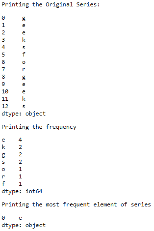
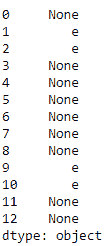

# 熊猫系列中最常出现的数值如何显示？

> 原文:[https://www . geeksforgeeks . org/如何显示最常见的熊猫价值系列/](https://www.geeksforgeeks.org/how-to-display-most-frequent-value-in-a-pandas-series/)

在本文中，我们的基本任务是打印系列中最频繁出现的值。我们可以使用 [value_counts()](https://www.geeksforgeeks.org/python-pandas-series-value_counts/) 方法找到元素出现的次数。通过使用[模式()](https://www.geeksforgeeks.org/python-pandas-series-mode/)方法可以访问最频繁的元素。

**例 1 :**

```
# importing the module
import pandas as pd

# creating the series
series = pd.Series(['g', 'e', 'e', 'k', 's', 
                    'f', 'o', 'r', 
                    'g', 'e', 'e', 'k', 's'])
print("Printing the Original Series:")
display(series)

# counting the frequency of each element
freq = series.value_counts()
print("Printing the frequency")
display(freq)

# printing the most frequent element
print("Printing the most frequent element of series")
display(series.mode());
```

**输出:**


**例 2 :** 将除最频繁元素外的所有元素替换为无。

```
# importing the module
import pandas as pd

# creating the series
series = pd.Series(['g', 'e', 'e', 'k', 's', 
                    'f', 'o', 'r', 
                    'g', 'e', 'e', 'k', 's'])

# counting the frequency of each element
freq = series.value_counts()

# replacing everything else as Other
series[~series.isin(freq .index[:1])] = None
print(series)
```

**输出:**
