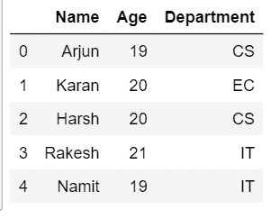
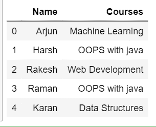
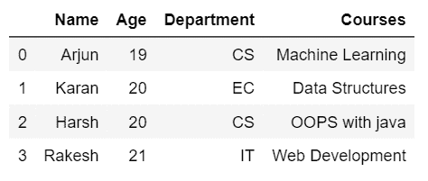
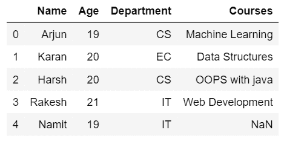
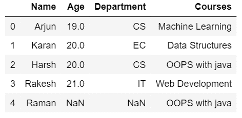
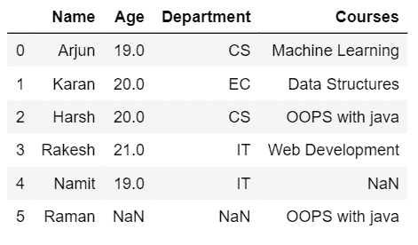

# 如何用熊猫用 Python 做一个 vLookup

> 原文:[https://www . geesforgeks . org/how-do-a-vlookup-in-python-use-pandas/](https://www.geeksforgeeks.org/how-to-do-a-vlookup-in-python-using-pandas/)

Vlookup 主要用于垂直排列的数据。Vlookup 是一种操作，用于根据某些条件合并两个不同的数据表，其中两个表之间必须至少有一个公共属性(列)。执行此操作后，我们会得到一个包含两个表中所有数据的表，这些数据与之匹配。
我们可以使用 merge()函数在熊猫中执行 Vlookup。合并函数的工作与 SQL 中的连接相同。我们可以对表 1 或表 2 执行合并操作。合并这两个表可以有不同的方法。

> **语法:** dataframe.merge(dataframe1，dataframe2，how，on，copy，indicator，后缀，validate)
> **参数:**
> **datafram1:** 要合并的 dataframe 对象。
> **数据框 2:** 要合并的数据框对象。
> **如何:**{左、右、内、外}指定合并将如何进行
> **on:** 指定用于执行联接的列名或索引名。
> **后缀:**后缀用于重叠列。对于异常，使用值(假，假)。
> **验证:**如果指定，检查合并的种类。合并的类型可以是(一对一、一对多、多对一、多对多)。

让我们考虑要对其执行操作的两个表。第一个表包含学生的信息，第二列包含他们注册的相应课程的信息。下面的代码说明了这两个表中包含的信息。

## 蟒蛇 3

```py
# import pandas
import pandas as pd

# read csv data
df1 = pd.read_csv('Student_data.csv')
df2 = pd.read_csv('Course_enrolled.csv')

print(df1)
print(df2)
```

**输出**T2】

 

#### 在不同类型的连接上执行虚拟查找

*   **内部连接:**内部连接仅产生在两行中都满足条件的那些行的输出数据帧。要执行内部连接，您可以在 how 中指定**内部**作为关键字。
    **例:**

## 蟒蛇 3

```py
# import pandas
import pandas as pd

# read csv data
df1 = pd.read_csv('Student_data.csv')
df2 = pd.read_csv('Course_enrolled.csv')

inner_join = pd.merge(df1, 
                      df2, 
                      on ='Name', 
                      how ='inner')
inner_join
```

*   **输出**
    

*   **左连接:**左连接操作提供第一个数据帧的所有行和第二个数据帧的匹配行。如果行在第二个数据帧中不匹配，则它们将被 NaN 替换。
    **例:**

## 蟒蛇 3

```py
# import pandas
import pandas as pd

# read csv data
df1 = pd.read_csv('Student_data.csv')
df2 = pd.read_csv('Course_enrolled.csv')

Left_join = pd.merge(df1, 
                     df2, 
                     on ='Name', 
                     how ='left')
Left_join
```

*   **输出:**
    

*   **右连接:**右连接有点类似于左连接，在左连接中，输出数据帧将由第二个数据帧的所有行和第一个数据帧的匹配行组成。如果第一行中的行不匹配，则它们将被 NaN
    替换

## 蟒蛇 3

```py
# import pandas
import pandas as pd

# read csv data
df1 = pd.read_csv('Student_data.csv')
df2 = pd.read_csv('Course_enrolled.csv')

Right_join = pd.merge(df1, 
                      df2, 
                      on ='Name',
                      how ='right')
Right_join
```

*   **输出**
    

*   **外部连接:**外部连接提供由两个数据帧中的行组成的输出数据帧。如果行匹配，将显示值；否则，对于不匹配的行，将显示 NaN。
    **例:**

## 蟒蛇 3

```py
# import pandas
import pandas as pd

# read csv data
df1 = pd.read_csv('Student_data.csv')
df2 = pd.read_csv('Course_enrolled.csv')

Outer_join = pd.merge(df1, 
                      df2, 
                      on ='Name', 
                      how ='outer')
Outer_join
```

*   **输出**
    