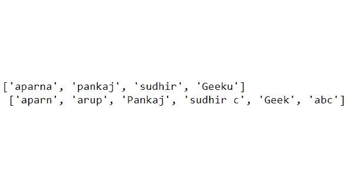
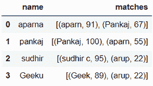
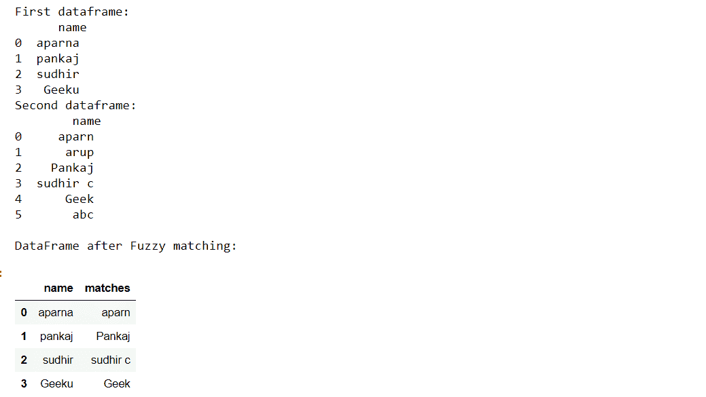
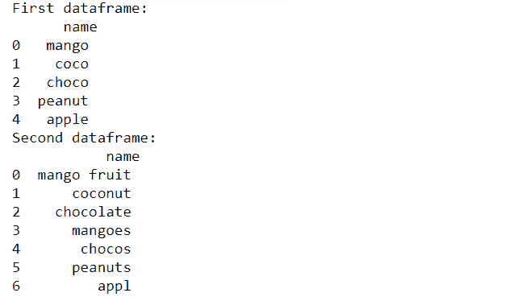
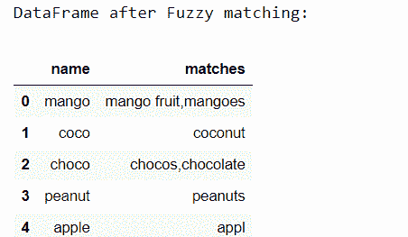
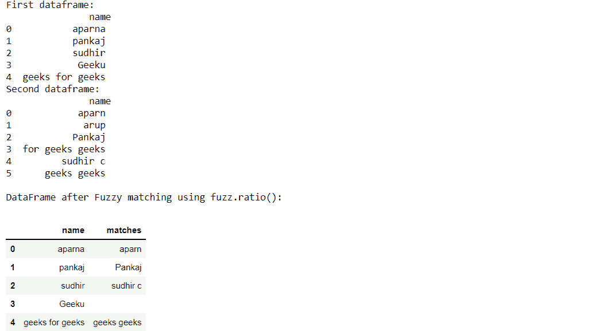
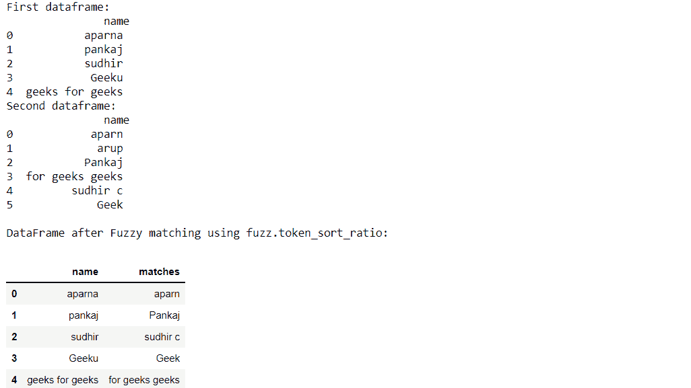
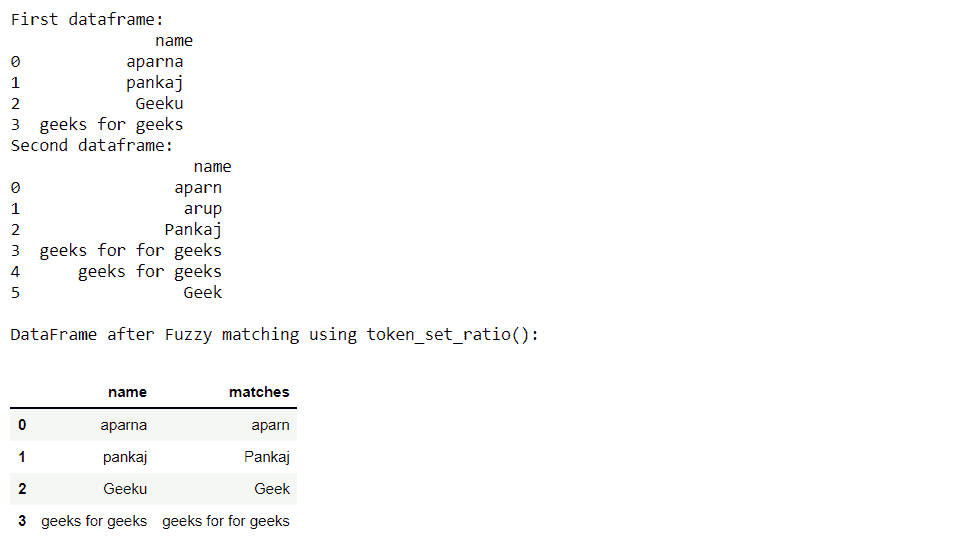

# 如何用 Python 对熊猫数据帧列进行模糊匹配？

> 原文:[https://www . geesforgeks . org/how-do-fuzzy-matching on-pandas-data frame-column-use-python/](https://www.geeksforgeeks.org/how-to-do-fuzzy-matching-on-pandas-dataframe-column-using-python/)

**先决条件:** [**模糊不清**](https://www.geeksforgeeks.org/fuzzywuzzy-python-library/)

在本教程中，我们将学习如何使用 Python 对熊猫数据框列进行模糊匹配。模糊匹配是一个过程，它让我们识别不精确的匹配，但在我们的目标项目中找到一个给定的模式。模糊匹配是搜索引擎的基础。这就是为什么我们在任何浏览器中键入搜索查询时都会得到许多推荐或建议。

### **使用的功能**

*   **pd。数据帧:**将 python 字典转换为熊猫数据帧
*   **dataframe['column_name']。tolist():** 用 python 将熊猫数据框的特定列转换为项目列表
*   **追加():**向列表追加项目
*   **process.extract(查询、选择、限制):**模糊库的处理模块附带的一个函数，用于从**选项**列表中提取与给定的**查询**匹配的项目。提取的最接近选项的数量由我们设置的**限制**决定。
*   **process . extraction one(查询，选择，** **计分器):**从**选择**列表中提取与给定的**查询**和**计分器**匹配的唯一最接近的匹配是可选参数，以使其使用特定的计分器，如 fuzz.token_sort_ratio，fuzz.token_set_ratio
*   **fuzz.ratio:** 根据 Levenshtein 距离计算两个字符串之间的相似度
*   **fuzz.partial_ratio:** 计算最小字符串与长字符串的所有 n 长度子字符串之间的部分字符串比率
*   **fuzz.token_sort_ratio:** 对每个字符串中的标记进行排序后计算相似度
*   **fuzz.token_set_ratio:** 它试图排除字符串中的差异，在 python 中计算三个特定子字符串集的比率后，它返回最大比率

### 例子

**例 1:(基本方法)**

*   首先，我们将创建两本词典。然后，我们将把它转换成 pandas 数据帧，并创建两个空列表，用于存储比如下所示更晚的匹配:

## 蟒蛇 3

```
from fuzzywuzzy import fuzz
from fuzzywuzzy import process
import pandas

dict1 = {'name': ["aparna", "pankaj", 
                  "sudhir", "Geeku"]}

dict2 = {'name': ["aparn", "arup", "Pankaj",
                  "sudhir c", "Geek", "abc"]}

# converting to pandas dataframes
dframe1 = pd.DataFrame(dict1)
dframe2 = pd.DataFrame(dict2)

# empty lists for storing the
# matches later
mat1 = []
mat2 = []

# printing the pandas dataframes
dframe1.show()
dframe2.show()
```

**dframe1：**


**dframe2：**


*   然后我们将使用 tolist()函数将数据帧转换成列表。
*   我们取阈值=80，这样模糊匹配只有在字符串彼此至少接近 80%以上时才会发生。

## 蟒蛇 3

```
list1 = dframe1['name'].tolist()
list2 = dframe2['name'].tolist()

# taking the threshold as 80
threshold = 80
```

**输出:**



*   然后我们将遍历列表 1 中的项目，从列表 2 中提取它们最接近的匹配项。
*   这里我们使用处理模块中的 process.extract()函数来提取元素。
*   Limit=2 意味着它将提取两个最接近的元素及其精度比率，如果我们现在打印它，那么我们可以看到比率值。
*   然后我们将每个最接近的匹配附加到列表 mat1
*   并将匹配列表存储在第一数据帧即数据帧 1 的“匹配”列下

## 蟒蛇 3

```
# iterating through list1 to extract 
# it's closest match from list2
for i in list1:
    mat1.append(process.extract(i, list2, limit=2))
dframe1['matches'] = mat1

dframe1.show()
```

**输出:**



*   然后，我们将再次遍历外部循环中的 matches 列，在内部循环中，我们遍历每组匹配项
*   k[1] >= threshold 表示它将只选择那些阈值大于或等于 80 的项目，并将它们追加到列表 p 中。
*   使用“，”。join()函数如果特定列项有多个匹配项，则将匹配项用逗号分隔，并将其追加到列表 mat2 中。我们再次将列表 p 设置为空，用于存储第一个 dataframe 列中下一行项目的匹配项。
*   然后，我们将结果最接近的匹配存储回 dframe1，以获得最终输出。

## 蟒蛇 3

```
# iterating through the closest
# matches to filter out the
# maximum closest match
for j in dframe1['matches']:
    for k in j:

        if k[1] >= threshold:
            p.append(k[0])

    mat2.append(",".join(p))
    p = []

# storing the resultant matches 
# back to dframe1
dframe1['matches'] = mat2

dframe1.show()
```

**输出:**



**例 2:**

在此示例中，步骤与示例一中的相同。唯一的区别是有多个匹配的特定行项目，如“芒果”和“巧克力”。我们将阈值设置为 82，以提高模糊匹配的准确性。

## 蟒蛇 3

```
import pandas as pd
from fuzzywuzzy import fuzz
from fuzzywuzzy import process

# creating the dictionaries
dict1 = {'name': ["mango", "coco", "choco", "peanut", "apple"]}
dict2 = {'name': ["mango fruit", "coconut", "chocolate",
                  "mangoes", "chocos", "peanuts", "appl"]}

# converting to pandas dataframes
dframe1 = pd.DataFrame(dict1)
dframe2 = pd.DataFrame(dict2)

# empty lists for storing the matches later
mat1 = []
mat2 = []
p = []

# printing the pandas dataframes
print("First dataframe:\n", dframe1, 
      "\nSecond dataframe:\n", dframe2)

# converting dataframe column to list
# of elements
# to do fuzzy matching
list1 = dframe1['name'].tolist()
list2 = dframe2['name'].tolist()

# taking the threshold as 82
threshold = 82

# iterating through list1 to extract 
# it's closest match from list2
for i in list1:
    mat1.append(process.extract(i, list2, limit=2))
dframe1['matches'] = mat1

# iterating through the closest matches
# to filter out the maximum closest match
for j in dframe1['matches']:
    for k in j:
        if k[1] >= threshold:
            p.append(k[0])
    mat2.append(",".join(p))
    p = []

# storing the resultant matches back to dframe1
dframe1['matches'] = mat2
print("\nDataFrame after Fuzzy matching:")
dframe1
```

**输出:**

 

现在我们将使用 process.extractOne()方法只匹配两个数据帧之间最接近的一个。在该方法中，我们将应用如下不同的模糊匹配函数:

**实施例 3:使用模糊比()**

## 蟒蛇 3

```
import pandas as pd
from fuzzywuzzy import fuzz
from fuzzywuzzy import process

# creating the dictionaries
dict1 = {'name': ["aparna", "pankaj", "sudhir",
                  "Geeku", "geeks for geeks"]}

dict2 = {'name': ["aparn", "arup", "Pankaj",
                  "for geeks geeks", "sudhir c",
                  "geeks geeks"]}

# converting to pandas dataframes
dframe1 = pd.DataFrame(dict1)
dframe2 = pd.DataFrame(dict2)

# empty lists for storing the matches 
# later
mat1 = []
mat2 = []
p = []

# printing the pandas dataframes
print("First dataframe:\n", dframe1,
      "\nSecond dataframe:\n", dframe2)

# converting dataframe column to 
# list of elements
# to do fuzzy matching
list1 = dframe1['name'].tolist()
list2 = dframe2['name'].tolist()

# taking the threshold as 80
threshold = 80

# iterating through list1 to extract 
# it's closest match from list2
for i in list1:
    mat1.append(process.extractOne(i, list2, scorer=fuzz.ratio))
dframe1['matches'] = mat1

# iterating through the closest matches
# to filter out the maximum closest match
for j in dframe1['matches']:
    if j[1] >= threshold:
        p.append(j[0])
    mat2.append(",".join(p))
    p = []

# storing the resultant matches back to dframe1
dframe1['matches'] = mat2
print("\nDataFrame after Fuzzy matching using fuzz.ratio():")
dframe1
```

**输出:**



**实施例 4:使用 fuzz.partial_ratio()**

## 蟒蛇 3

```
import pandas as pd
from fuzzywuzzy import fuzz
from fuzzywuzzy import process

# creating the dictionaries
dict1 = {'name': ["aparna", "pankaj", "sudhir", 
                  "Geeku", "geeks for geeks"]}

dict2 = {'name': ["aparn", "arup", "Pankaj",
                  "for geeks geeks", "sudhir c", 
                  "geeks geeks"]}

# converting to pandas dataframes
dframe1 = pd.DataFrame(dict1)
dframe2 = pd.DataFrame(dict2)

# empty lists for storing the matches 
# later
mat1 = []
mat2 = []
p = []

# printing the pandas dataframes
print("First dataframe:\n", dframe1,
      "\nSecond dataframe:\n", dframe2)

# converting dataframe column to 
# list of elements
# to do fuzzy matching
list1 = dframe1['name'].tolist()
list2 = dframe2['name'].tolist()

# taking the threshold as 80
threshold = 80

# iterating through list1 to extract 
# it's closest match from list2
for i in list1:
    mat1.append(process.extractOne(
      i, list2, scorer=fuzz.partial_ratio))
dframe1['matches'] = mat1

# iterating through the closest matches
# to filter out the maximum closest match
for j in dframe1['matches']:
    if j[1] >= threshold:
        p.append(j[0])
    mat2.append(",".join(p))
    p = []

# storing the resultant matches back to dframe1
dframe1['matches'] = mat2
print("\nDataFrame after Fuzzy matching using fuzz.partial_ratio:")
dframe1
```

**输出:**


**示例 5:使用 fuzz.token_sort_ratio()**

## 蟒蛇 3

```
import pandas as pd
from fuzzywuzzy import fuzz
from fuzzywuzzy import process

# creating the dictionaries
dict1 = {'name': ["aparna", "pankaj", "sudhir", 
                  "Geeku", "geeks for geeks"]}

dict2 = {'name': ["aparn", "arup", "Pankaj",
                  "for geeks geeks", "sudhir c",
                  "Geek"]}

# converting to pandas dataframes
dframe1 = pd.DataFrame(dict1)
dframe2 = pd.DataFrame(dict2)

# empty lists for storing the matches
# later
mat1 = []
mat2 = []
p = []

# printing the pandas dataframes
print("First dataframe:\n", dframe1,
      "\nSecond dataframe:\n", dframe2)

# converting dataframe column to 
# list of elements
# to do fuzzy matching
list1 = dframe1['name'].tolist()
list2 = dframe2['name'].tolist()

# taking the threshold as 80
threshold = 80

# iterating through list1 to extract
# it's closest match from list2
for i in list1:
    mat1.append(process.extractOne(
      i, list2, scorer=fuzz.token_sort_ratio))
dframe1['matches'] = mat1

# iterating through the closest matches
# to filter out the maximum closest match
for j in dframe1['matches']:
    if j[1] >= threshold:
        p.append(j[0])
    mat2.append(",".join(p))
    p = []

# storing the resultant matches back 
# to dframe1
dframe1['matches'] = mat2
print("\nDataFrame after Fuzzy matching using fuzz.token_sort_ratio:")
dframe1
```

**输出:**



**示例 6:使用 fuzz.token_set_ratio()**

## 蟒蛇 3

```
import pandas as pd
from fuzzywuzzy import fuzz
from fuzzywuzzy import process

# creating the dictionaries
dict1 = {'name': ["aparna", "pankaj", "Geeku", 
                  "geeks for geeks"]}

dict2 = {'name': ["aparn", "arup", "Pankaj",
                  "geeks for for geeks", 
                  "geeks for geeks", "Geek"]}

# converting to pandas dataframes
dframe1 = pd.DataFrame(dict1)
dframe2 = pd.DataFrame(dict2)

# empty lists for storing the matches
# later
mat1 = []
mat2 = []
p = []

# printing the pandas dataframes
print("First dataframe:\n", dframe1,
      "\nSecond dataframe:\n", dframe2)

# converting dataframe column 
# to list of elements
# to do fuzzy matching
list1 = dframe1['name'].tolist()
list2 = dframe2['name'].tolist()

# taking the threshold as 80
threshold = 80

# iterating through list1 to extract
# it's closest match from list2
for i in list1:
    mat1.append(process.extractOne(
      i, list2, scorer=fuzz.token_set_ratio))
dframe1['matches'] = mat1

# iterating through the closest matches
# to filter out the maximum closest match
for j in dframe1['matches']:
    if j[1] >= threshold:
        p.append(j[0])
    mat2.append(",".join(p))
    p = []

# storing the resultant matches back 
# to dframe1
dframe1['matches'] = mat2
print("\nDataFrame after Fuzzy matching using token_set_ratio():")
dframe1
```

**输出:**

