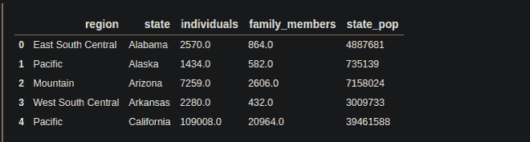

# 如何对熊猫进行多指标分组？

> 原文:[https://www . geesforgeks . org/how-do-group by on a-multi-index-in-pandas/](https://www.geeksforgeeks.org/how-to-do-groupby-on-a-multiindex-in-pandas/)

在本文中，我们将展示如何在**熊猫**的**多索引**数据框中使用 **groupby** 。在数据科学中，当我们执行探索性数据分析时，我们经常使用 groupby 将一列的数据基于另一列进行分组。因此，我们能够分析一列的数据是如何分组的，或者是如何依赖于另一列的。除了 groupby 还有一个选择，我们也可以使用**透视表**。

一个 **groupby** 操作包括拆分对象、应用函数和组合结果的一些组合。这可用于对这些组中的大量数据和计算操作进行分组。任何 groupby 操作都涉及对原始数据帧的以下操作之一。它们是

1.  拆分对象。
2.  组合输出。
3.  应用函数。

> **语法:**data frame . group by(by =无，axis=0，level =无，as _ index =真，sort =真，group _ keys =真，挤压=假，**kwargs)
> 
> **参数**:
> 
> *   **by** :映射、函数、标签或表格列表
> *   **轴** : { 0 或'索引'，1 或'列' }，默认 0
> *   **等级:**等级名称
> *   **排序**:布尔，默认真
> 
> **返回**:数据帧组比

我们必须将**列表**中的索引名称传递给 groupby 函数中的**级别**参数。‘地区’指数为**级(0)** 指数，‘州’指数为**级(1)** 指数。在本文中，我们将使用 [**这个**](https://drive.google.com/file/d/1Ir60hFNZfC2Jb08IVE_gjFdk85DlqU5w/view?usp=sharing) CSV 文件。

#### 让我们看看 CSV 文件

## 蟒蛇 3

```
# importing pandas library 
# as alias pd
import pandas as pd

# storing the data in the df dataframe
# using pandas 'read_csv()'.
df = pd.read_csv('homelessness.csv')

print(df.head())
```

**输出:**



#### 数据框中的列

我们可以通过熊猫**列**属性知道数据框的列。

## 蟒蛇 3

```
# using pandas columns attribute.
col = df.columns

print(col)
```