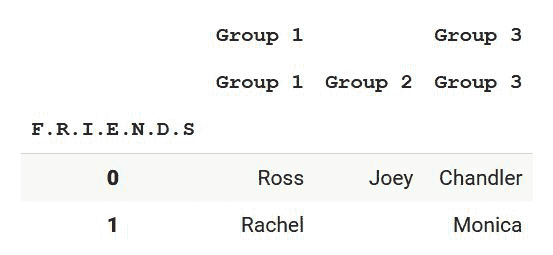

# 如何从熊猫数据框的多级列索引中删除一级？

> 原文:[https://www . geeksforgeeks . org/如何从多级栏中删除一级索引熊猫-数据框/](https://www.geeksforgeeks.org/how-to-drop-a-level-from-a-multi-level-column-index-in-pandas-dataframe/)

在本文中，我们将学习如何从多级列索引中删除一个级别。但在此之前，我们需要知道什么是多级指数。一个**多级索引数据框**是一种包含**多级或分级索引**的数据框。
在本文中，我们将创建一个我们自己选择的带有多列索引的数据框架，然后我们将放下一个层次索引。

### 逐步实施

让我们借助一个例子，通过逐步实现来理解这一点。

**步骤 1:导入所有需要的库。**

## 蟒蛇 3

```
# importing all important libraries
import pandas as pd
```

**步骤 2:创建多级列索引 Pandas Dataframe 并显示。**

我们正在使用[**multi index . from _ tuples()**](https://www.geeksforgeeks.org/python-pandas-multiindex-from_tuples/)**创建一个多索引列，这有助于我们一个接一个地创建多个索引，并且是按列创建的。之后用 pd。Dataframe()我们正在创建数据，并将其转换为以列名作为多级索引的表格格式。此外，我们正在使用 df.index 更改表的索引名。**

## **蟒蛇 3**

```
# Creating a multilevel index 
index = pd.MultiIndex.from_tuples([("Group 1", "Group 1"), 
                                   ("Group 1", "Group 2"),
                                   ("Group 3","Group 3")])

# Creating a pandas dataframe with 
# multilevel-column indexing
df = pd.DataFrame([["Ross","Joey","Chandler"],
                   ["Rachel","","Monica"]], 
                  columns=index)

# Labelling the dataframe index.
index = df. index
index. name = "F.R.I.E.N.D.S"

# Showing the above multi-index column
# dataframe
print(df)
```

****输出:****

****

****第三步:降低数据框的级别****

**现在使用 python 创建了一个多级列索引 dataframe。现在让我们实现上面的概念。我们需要降一级。我们可以使用**df . columns . drop level(level = 0)**来实现。这有助于我们从索引 0 的顶部降低索引级别。**

## **蟒蛇 3**

```
# Dropping a level down
df.columns = df.columns.droplevel(0)
```

****第四步:显示所需结果****

## **蟒蛇 3**

```
print(df)
```

****输出:****

****

**因此，我们成功地删除了一级索引列。**

**让我们看看基于上述方法的更多示例。**

****例 1:****

**在下一个示例中，我们将从多级列索引中的特定索引中删除一个级别。这可以使用我们之前使用的相同语法[**df . columns . drop level(level = 0)**]来完成，其中如果我们指定了级别号，则根据从零开始的索引删除以下索引。因此，让我们开始实施这一概念。**

## **蟒蛇 3**

```
# importing all important libraries
import pandas as pd

# Creating a multilevel index 
index = pd.MultiIndex.from_tuples([("Company A", "Company B","Company C"), 
                                   ("Company A", "Company A","Company B"),
                                   ("Company A","Company B","Company C")])

# Creating a pandas dataframe with 
# multilevel-column indexing
df = pd.DataFrame([["Atreyi","Digangana","Sohom"],
                   ["Sujit","Bjon","Rajshekhar"],
                   ["Debosmita","Shatabdi",""]], 
                  columns=index)

# Labelling the dataframe index.
index = df. index
index. name = "ECE Placement"

# Showing the above multi-index column
# dataframe
print(df)
```