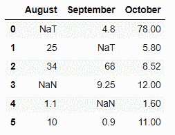
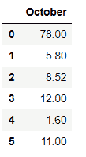
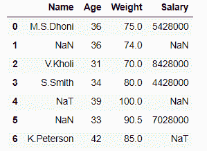
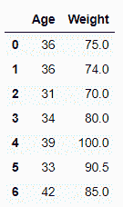
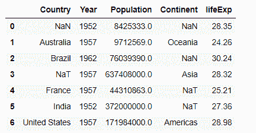
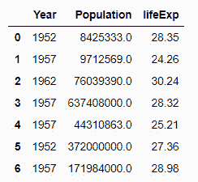
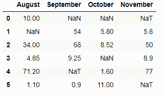
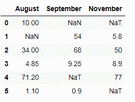

# 如何删除熊猫数据框中 NaN 值的列？

> 原文:[https://www . geesforgeks . org/how-drop-columns-with-nan-values-in-pandas-data frame/](https://www.geeksforgeeks.org/how-to-drop-columns-with-nan-values-in-pandas-dataframe/)

Nan(非数字)是一个浮点值，不能转换为其他数据类型，只能浮点。在数据分析中，Nan 是为了正确分析数据集而必须删除的不必要的值。在本文中，我们将讨论如何删除熊猫数据框中具有 Nan 值的列。我们有一个被称为 [**熊猫的功能。data frame . drop na()**](https://www.geeksforgeeks.org/python-pandas-dataframe-dropna/)**为具有 Nan 值的降列。**

> ****语法:** DataFrame.dropna(轴=0，how='any '，thresh=None，subset=None，inplace=False)**

****示例 1:** 删除具有任何 NaN/NaT 值的所有列。**

## **蟒蛇 3**

```
# Importing libraries
import pandas as pd
import numpy as np

# Creating a dictionary
dit = {'August': [pd.NaT, 25, 34, np.nan, 1.1, 10],
       'September': [4.8, pd.NaT, 68, 9.25, np.nan, 0.9],
       'October': [78, 5.8, 8.52, 12, 1.6, 11], }

# Converting it to data frame
df = pd.DataFrame(data=dit)

# DataFrame
df
```

****输出:****

****

## **蟒蛇 3**

```
# Dropping the columns having NaN/NaT values
df = df.dropna(axis=1)

df
```

****输出:****

****

**在上面的示例中，我们删除了“八月”和“九月”列，因为它们包含 Nan 和 NaT 值。**

****示例 2:** 删除具有任何 NaN/NaT 值的所有列，然后使用 **df.reset_index()** 功能重置索引。**

## **蟒蛇 3**

```
# Importing libraries
import pandas as pd
import numpy as np

# Initializing the nested list with Data set
player_list = [['M.S.Dhoni', 36, 75, 5428000], 
               [np.nan, 36, 74, np.nan],
               ['V.Kholi', 31, 70, 8428000],
               ['S.Smith', 34, 80, 4428000], 
               [pd.NaT, 39, 100, np.nan],
               [np.nan, 33, 90.5, 7028000],
               ['K.Peterson', 42, 85, pd.NaT]]

# creating a pandas dataframe
df = pd.DataFrame(player_list, columns=['Name', 'Age', 
                                        'Weight', 'Salary'])

df
```

****输出:****

****

## **蟒蛇 3**

```
# Dropping the columns having NaN/NaT values
df = df.dropna(axis=1)

# Resetting the indices using df.reset_index()
df = df.reset_index(drop=True)

df
```

****输出:****

****

**在上面的示例中，我们删除了“姓名”和“工资”列，然后重置了索引。**

****例 3:****

## **蟒蛇 3**

```
# Importing libraries
import pandas as pd
import numpy as np

# creating and initializing a nested list
age_list = [[np.nan, 1952, 8425333, np.nan, 28.35], 
            ['Australia', 1957, 9712569, 'Oceania', 24.26],
            ['Brazil', 1962, 76039390, np.nan, 30.24],
            [pd.NaT, 1957, 637408000, 'Asia', 28.32], 
            ['France', 1957, 44310863, pd.NaT, 25.21],
            ['India', 1952, 3.72e+08, pd.NaT, 27.36], 
            ['United States', 1957, 171984000, 'Americas', 28.98]]

# creating a pandas dataframe
df = pd.DataFrame(age_list, columns=[
                  'Country', 'Year', 'Population', 'Continent', 'lifeExp'])

df
```

****输出:****

****

## **蟒蛇 3**

```
# Dropping the columns having NaN/NaT values
df = df.dropna(axis=1)

# Resetting the indices using df.reset_index()
df = df.reset_index(drop=True)

df
```

****输出:****

****

**在上面的示例中，我们删除了“国家”和“大陆”列，因为它们包含 Nan 和 NaT 值。**

****示例 4:** 使用“**子集**属性删除某个标签索引下具有任何 NaN/NaT 值的所有列。**

## **蟒蛇 3**

```
# Importing libraries 
import pandas as pd 
import numpy as np 

# Creating a dictionary 
dit = {'August': [10, np.nan, 34, 4.85, 71.2, 1.1], 
       'September': [np.nan, 54, 68, 9.25, pd.NaT, 0.9], 
        'October': [np.nan, 5.8, 8.52, np.nan, 1.6, 11],
       'November': [pd.NaT, 5.8, 50, 8.9, 77, pd.NaT] }

# Converting it to data frame
df = pd.DataFrame(data=dit)

# data frame
df
```

****输出:****

****

## **蟒蛇 3**

```
# Dropping the columns having NaN/NaT values
# under certain label index using  'subset' attribute
df = df.dropna(subset=[3], axis=1)

# Resetting the indices using df.reset_index()
df = df.reset_index(drop=True)

df
```

****输出:****

****

**在上面的示例中，我们使用子集属性删除了索引为 3 的列，即“十月”。**