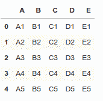
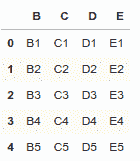
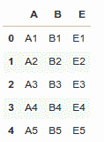
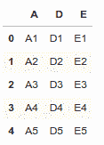
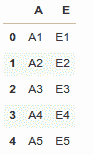
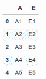
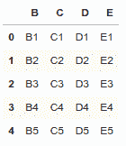

# 如何在熊猫数据框中放置一列或多列

> 原文:[https://www . geeksforgeeks . org/如何删除熊猫中的一列或多列-数据框/](https://www.geeksforgeeks.org/how-to-drop-one-or-multiple-columns-in-pandas-dataframe/)

让我们讨论一下如何在熊猫[数据框](https://www.geeksforgeeks.org/python-pandas-dataframe/)中删除一列或多列。从数据框中删除一列或多列可以通过多种方式实现。

用列表字典创建一个简单的数据框架，比如列名是 **A，B，C，D，E** 。

```py
# Import pandas package 
import pandas as pd

# create a dictionary with five fields each
data = {
    'A':['A1', 'A2', 'A3', 'A4', 'A5'], 
    'B':['B1', 'B2', 'B3', 'B4', 'B5'], 
    'C':['C1', 'C2', 'C3', 'C4', 'C5'], 
    'D':['D1', 'D2', 'D3', 'D4', 'D5'], 
    'E':['E1', 'E2', 'E3', 'E4', 'E5'] }

# Convert the dictionary into DataFrame 
df = pd.DataFrame(data)

df
```

**输出:**


**方法#1:** 使用 [`drop()`](https://www.geeksforgeeks.org/python-delete-rows-columns-from-dataframe-using-pandas-drop/) 方法从数据框中删除列。

删除特定的单列。

```py
# Import pandas package 
import pandas as pd

# create a dictionary with five fields each 
data = {
    'A':['A1', 'A2', 'A3', 'A4', 'A5'], 
    'B':['B1', 'B2', 'B3', 'B4', 'B5'], 
    'C':['C1', 'C2', 'C3', 'C4', 'C5'], 
    'D':['D1', 'D2', 'D3', 'D4', 'D5'], 
    'E':['E1', 'E2', 'E3', 'E4', 'E5'] }

# Convert the dictionary into DataFrame 
df = pd.DataFrame(data)

# Remove column name 'A'
df.drop(['A'], axis = 1)
```

**输出:**


移除特定的多列。

```py
# Import pandas package 
import pandas as pd

# create a dictionary with five fields each
data = {
    'A':['A1', 'A2', 'A3', 'A4', 'A5'], 
    'B':['B1', 'B2', 'B3', 'B4', 'B5'], 
    'C':['C1', 'C2', 'C3', 'C4', 'C5'], 
    'D':['D1', 'D2', 'D3', 'D4', 'D5'], 
    'E':['E1', 'E2', 'E3', 'E4', 'E5'] }

# Convert the dictionary into DataFrame 
df = pd.DataFrame(data)

# Remove two columns name is 'C' and 'D'
df.drop(['C', 'D'], axis = 1)

# df.drop(columns =['C', 'D'])
```

**输出:**


根据列索引删除列。

```py
# Import pandas package 
import pandas as pd

# create a dictionary with five fields each
data = {
    'A':['A1', 'A2', 'A3', 'A4', 'A5'], 
    'B':['B1', 'B2', 'B3', 'B4', 'B5'], 
    'C':['C1', 'C2', 'C3', 'C4', 'C5'], 
    'D':['D1', 'D2', 'D3', 'D4', 'D5'], 
    'E':['E1', 'E2', 'E3', 'E4', 'E5'] }

# Convert the dictionary into DataFrame 
df = pd.DataFrame(data)

# Remove three columns as index base
df.drop(df.columns[[0, 4, 2]], axis = 1, inplace = True)

df
```

**输出:**


**方法 2:** 使用 [`iloc[]`](https://www.geeksforgeeks.org/python-extracting-rows-using-pandas-iloc/) 和`drop()`方法从数据框中删除列。

删除特定列与另一列之间的所有列。

```py
# Import pandas package 
import pandas as pd
# create a dictionary with five fields each 
data = {
    'A':['A1', 'A2', 'A3', 'A4', 'A5'], 
    'B':['B1', 'B2', 'B3', 'B4', 'B5'], 
    'C':['C1', 'C2', 'C3', 'C4', 'C5'], 
    'D':['D1', 'D2', 'D3', 'D4', 'D5'], 
    'E':['E1', 'E2', 'E3', 'E4', 'E5'] }

# Convert the dictionary into DataFrame 
df = pd.DataFrame(data)

# Remove all columns between column index 1 to 3
df.drop(df.iloc[:, 1:3], inplace = True, axis = 1)

df
```

**输出:**


**方法 3:** 使用`ix()`和`drop()`方法从数据框中删除列。

删除特定列名与另一列名之间的所有列。

```py
# Import pandas package 
import pandas as pd

# create a dictionary with five fields each 
data = {
    'A':['A1', 'A2', 'A3', 'A4', 'A5'], 
    'B':['B1', 'B2', 'B3', 'B4', 'B5'], 
    'C':['C1', 'C2', 'C3', 'C4', 'C5'], 
    'D':['D1', 'D2', 'D3', 'D4', 'D5'], 
    'E':['E1', 'E2', 'E3', 'E4', 'E5'] }

# Convert the dictionary into DataFrame 
df = pd.DataFrame(data)

# Remove all columns between column name 'B' to 'D'
df.drop(df.ix[:, 'B':'D'].columns, axis = 1)
```

**输出:**


**方法#4:** 使用 [`loc[]`](https://www.geeksforgeeks.org/python-pandas-extracting-rows-using-loc/) 和`drop()`方法从数据框中删除列。

删除特定列名与另一列名之间的所有列。

```py
# Import pandas package 
import pandas as pd

# create a dictionary with five fields each 
data = {
    'A':['A1', 'A2', 'A3', 'A4', 'A5'], 
    'B':['B1', 'B2', 'B3', 'B4', 'B5'], 
    'C':['C1', 'C2', 'C3', 'C4', 'C5'], 
    'D':['D1', 'D2', 'D3', 'D4', 'D5'], 
    'E':['E1', 'E2', 'E3', 'E4', 'E5'] }

# Convert the dictionary into DataFrame 
df = pd.DataFrame(data)

# Remove all columns between column name 'B' to 'D'
df.drop(df.loc[:, 'B':'D'].columns, axis = 1)
```

**输出:**

**注:**不同`loc()`和`iloc()`是`iloc()`排除最后一列范围元素。

**方法#5:** 通过迭代方式从数据框中删除列。

删除特定列名与另一列名之间的所有列。

```py
# Import pandas package 
import pandas as pd

# create a dictionary with five fields each 
data = {
    'A':['A1', 'A2', 'A3', 'A4', 'A5'], 
    'B':['B1', 'B2', 'B3', 'B4', 'B5'], 
    'C':['C1', 'C2', 'C3', 'C4', 'C5'], 
    'D':['D1', 'D2', 'D3', 'D4', 'D5'], 
    'E':['E1', 'E2', 'E3', 'E4', 'E5'] }

# Convert the dictionary into DataFrame 
df = pd.DataFrame(data)
for col in df.columns:
    if 'A' in col:
        del df[col]

df
```

**输出:**
