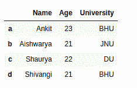
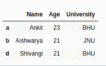
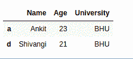
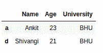
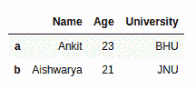

# 如何通过索引标签删除熊猫数据框中的行？

> 原文:[https://www . geesforgeks . org/如何删除熊猫中的行-按索引标记的数据框/](https://www.geeksforgeeks.org/how-to-drop-rows-in-pandas-dataframe-by-index-labels/)

熊猫为数据分析师提供了一种使用 [**删除和过滤数据帧的方法。**降()](https://www.geeksforgeeks.org/python-delete-rows-columns-from-dataframe-using-pandas-drop/)法。使用此方法，可以使用索引标签或列名删除行。

> **语法:**
> DataFrame.drop(标签=无，轴=0，索引=无，列=无，级别=无，inplace=False，错误='raise')
> **参数:**
> **标签:**引用行或列名称的字符串或字符串列表。
> **轴:** int 或 string 值，0 'index '代表行，1 'columns '代表列。
> **索引或列:**单个标签或列表。索引或列是 axis 的替代项，不能一起使用。
> **级别:**用于指定数据帧有多级索引时的级别。
> **在位:**如果为真，则对原始数据框进行更改。
> **错误:**如果列表中没有任何值，则忽略错误，并在错误= '忽略'
> **时丢弃其余值。返回类型:**具有丢弃值的数据框

现在，让我们创建一个示例数据框

## 蟒蛇 3

```
# import pandas library
import pandas as pd

# dictionary with list object in values
details = {
    'Name' : ['Ankit', 'Aishwarya', 'Shaurya','Shivangi'],
    'Age' : [23, 21, 22,21],
    'University' : ['BHU', 'JNU', 'DU', 'BHU'],
}

# creating a Dataframe object
df = pd.DataFrame(details,columns = ['Name','Age','University'],
                  index = ['a', 'b', 'c', 'd'])

df
```

**输出:**



**示例#1:按行索引标签删除数据框中的单个行**

## 蟒蛇 3

```
# import pandas library
import pandas as pd

# dictionary with list object in values
details = {
    'Name' : ['Ankit', 'Aishwarya', 'Shaurya', 'Shivangi'],
    'Age' : [23, 21, 22, 21],
    'University' : ['BHU', 'JNU', 'DU', 'BHU'],
}

# creating a Dataframe object
df = pd.DataFrame(details, columns = ['Name', 'Age', 'University'],
                  index = ['a', 'b', 'c', 'd'])

# return a new dataframe by dropping a
# row 'c' from dataframe
update_df = df.drop('c')

update_df
```

**输出:**



**示例#2:通过索引标签删除数据框中的多行**

## 蟒蛇 3

```
# import pandas library
import pandas as pd

# dictionary with list object in values
details = {
    'Name' : ['Ankit', 'Aishwarya', 'Shaurya', 'Shivangi'],
    'Age' : [23, 21, 22, 21],
    'University' : ['BHU', 'JNU', 'DU', 'BHU'],
}

# creating a Dataframe object
df = pd.DataFrame(details, columns = ['Name', 'Age', 'University'],
                  index = ['a', 'b', 'c', 'd'])

# return a new dataframe by dropping a row
# 'b' & 'c' from dataframe
update_df = df.drop(['b', 'c'])

update_df
```

**输出:**



**示例#3:按数据框中的索引位置删除多行**

## 蟒蛇 3

```
# import pandas library
import pandas as pd

# dictionary with list object in values
details = {
    'Name' : ['Ankit', 'Aishwarya', 'Shaurya', 'Shivangi'],
    'Age' : [23, 21, 22, 21],
    'University' : ['BHU', 'JNU', 'DU', 'BHU'],
}

# creating a Dataframe object
df = pd.DataFrame(details, columns = ['Name', 'Age', 'University'],
                  index = ['a', 'b', 'c', 'd'])

# return a new dataframe by dropping a row
# 'b' & 'c' from dataframe using their
# respective index position
update_df = df.drop([df.index[1], df.index[2]])

update_df
```

**输出:**



**示例#4:就地删除数据框中的行**

## 蟒蛇 3

```
# import pandas library
import pandas as pd

# dictionary with list object in values
details = {
    'Name' : ['Ankit', 'Aishwarya', 'Shaurya', 'Shivangi'],
    'Age' : [23, 21, 22, 21],
    'University' : ['BHU', 'JNU', 'DU', 'BHU'],
}

# creating a Dataframe object
df = pd.DataFrame(details, columns = ['Name', 'Age', 'University'],
                  index = ['a', 'b', 'c', 'd'])

# dropping a row 'c' & 'd' from actual dataframe
df.drop(['c', 'd'], inplace = True )

df
```

**输出:**

