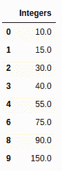
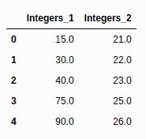
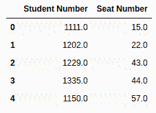
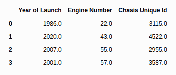
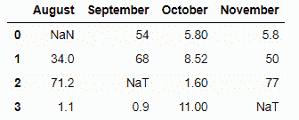

# 如何删除熊猫数据框中 NaN 值的行？

> 原文:[https://www . geeksforgeeks . org/how-drop-row-with-nan-values-in-pandas-data frame/](https://www.geeksforgeeks.org/how-to-drop-rows-with-nan-values-in-pandas-dataframe/)

NaN 代表 Not A Number，是表示数据中缺失值的常用方法之一。它是一个特殊的浮点值，不能转换为除浮点以外的任何其他类型。NaN 值是数据分析中的主要问题之一。为了得到预期的结果，与 NaN 打交道是非常必要的。在本文中，我们将讨论如何删除具有 NaN 值的行。
我们可以使用 [dropna()](http://geeksforgeeks.org/python-pandas-dataframe-dropna/) 函数删除熊猫数据框中具有 NaN 值的行

```
 df.dropna() 
```

对于特定的列，也可以使用以下语句删除具有 NaN 值的行:

```
df.dropna(subset, inplace=True)
```

将“原地”设置为“真”，将“子集”设置为列名列表，以删除这些列下带有 NaN 的所有行。

**例 1:**

## 蟒蛇 3

```
# importing libraries
import pandas as pd
import numpy as np

num = {'Integers': [10, 15, 30, 40, 55, np.nan,
                    75, np.nan, 90, 150, np.nan]}

# Create the dataframe
df = pd.DataFrame(num, columns =['Integers'])

# dropping the rows having NaN values
df = df.dropna()

# printing the result
df
```

**输出:**



**注意:**我们也可以使用 [reset_index()](https://www.geeksforgeeks.org/python-pandas-dataframe-reset_index/) 方法重置指数

```
df = df.reset_index(drop=True)
```

**例 2:**

## 蟒蛇 3

```
# importing libraries
import pandas as pd
import numpy as np

nums = {'Integers_1': [10, 15, 30, 40, 55, np.nan,
                       75, np.nan, 90, 150, np.nan],
           'Integers_2': [np.nan, 21, 22, 23, np.nan,
                          24, 25, np.nan, 26, np.nan,
                          np.nan]}

# Create the dataframe
df = pd.DataFrame(nums, columns =['Integers_1', 'Integers_2'])

# dropping the rows having NaN values
df = df.dropna()

# To reset the indices
df = df.reset_index(drop = True)

# Print the dataframe
df
```

**输出:**



**例 3:**

## 蟒蛇 3

```
# importing libraries
import pandas as pd
import numpy as np

nums = {'Student Number': [ 1001, 1111, 1202, 1229, 1330,
                           1335, np.nan, 1400, 1150, np.nan],
           'Seat Number': [np.nan, 15, 22, 43, np.nan, 44,
                           55, np.nan, 57, np.nan]}

# Create the dataframe
df = pd.DataFrame(nums, columns =['Student Number', 'Seat Number'])

# dropping the rows having NaN values
df = df.dropna()

# To reset the indices
df = df.reset_index(drop = True)

# Print the dataframe
df
```

**输出:**



**例 4:**

## 蟒蛇 3

```
# importing libraries
import pandas as pd
import numpy as np

car = {'Year of Launch': [ 1999, np.nan, 1986, 2020, np.nan,
                          1991, 2007, 2011, 2001, 2017],
           'Engine Number': [np.nan, 15, 22, 43, 44, np.nan,
                             55, np.nan, 57, np.nan],
        'Chasis Unique Id': [4023, np.nan, 3115, 4522, 3643,
                             3774, 2955, np.nan, 3587, np.nan]}

# Create the dataframe
df = pd.DataFrame(car, columns =['Year of Launch', 'Engine Number',
                                 'Chasis Unique Id'])

# dropping the rows having NaN values
df = df.dropna()

# To reset the indices
df = df.reset_index(drop = True)

# Print the dataframe
df
```

**输出:**



**例 5:**

## 蟒蛇 3

```
# Importing libraries
import pandas as pd
import numpy as np

# Creating a dictionary
dit = {'August': [10, np.nan, 34, 4.85, 71.2, 1.1],
       'September': [np.nan, 54, 68, 9.25, pd.NaT, 0.9],
       'October': [np.nan, 5.8, 8.52, np.nan, 1.6, 11],
       'November': [pd.NaT, 5.8, 50, 8.9, 77, pd.NaT]}

# Converting it to data frame
df = pd.DataFrame(data=dit)

# Dropping the rows having NaN/NaT values
# when threshold of nan values is 2
df = df.dropna(thresh=2)

# Resetting the indices using df.reset_index()
df = df.reset_index(drop=True)

df
```

**输出:**


在上面的例子中，我们在 df.dropna()函数中使用了 **thresh = 2** ，这意味着它将删除 Nan/NaT 值为 2 或大于 2 的所有行，其他行将保持不变。

**例 6:**

## 蟒蛇 3

```
# Importing libraries
import pandas as pd
import numpy as np

# Creating a dictionary
dit = {'August': [10, np.nan, 34, 4.85, 71.2, 1.1],
       'September': [np.nan, 54, 68, 9.25, pd.NaT, 0.9],
       'October': [np.nan, 5.8, 8.52, np.nan, 1.6, 11],
       'November': [pd.NaT, 5.8, 50, 8.9, 77, pd.NaT]}

# Converting it to data frame
df = pd.DataFrame(data=dit)

# Dropping the rowns having NaN/NaT values
# under certain label
df = df.dropna(subset=['October'])

# Resetting the indices using df.reset_index()
df = df.reset_index(drop=True)

df
```

**输出:**



在上面的例子中，我们在 df.dropna()函数中使用**子集= ['十月']** ，这意味着它将删除标签为'十月'的所有具有 Nan/NaT 值的行。