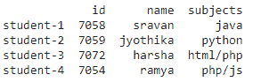
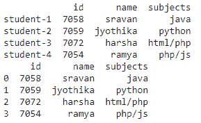

# 如何放下熊猫里的索引栏？

> 原文:[https://www . geesforgeks . org/如何删除熊猫索引栏/](https://www.geeksforgeeks.org/how-to-drop-the-index-column-in-pandas/)

在本文中，我们将讨论如何使用 Python 删除熊猫中的索引列。

首先，我们必须创建包含学生详细信息的数据框，并使用 [set_index()](https://www.geeksforgeeks.org/python-pandas-dataframe-set_index/) 函数设置索引

**语法**:

> dataframe.set_index([pandas。索引([index _ values ...]。])])

在哪里

*   数据帧是输入数据帧
*   Index_values 是作为数据框的索引给出的值

**示例**:设置数据集的索引列。最初的图确实显示了变化。

## 蟒蛇 3

```py
# import pandas module
import pandas as pd

# create dataframe with 3 columns
data = pd.DataFrame({
    "id": [7058, 7059, 7072, 7054],
    "name": ['sravan', 'jyothika', 'harsha', 'ramya'],
    "subjects": ['java', 'python', 'html/php', 'php/js']
}
)

# set the index values
data = data.set_index(
    [pd.Index(['student-1', 'student-2', 'student-3', 'student-4'])])

# display dataframe
print(data)
```

**输出:**



现在我们可以使用 reset_index()方法删除索引列。它将删除索引值，并将默认值从 0 设置为 n

**语法**:

> data frame . reset _ index(drop =真，inplace =真)

在哪里

*   数据帧是输入数据帧
*   “删除”被设置为“真”以删除索引值
*   就地是设置默认整数

**示例:**删除索引列

## 蟒蛇 3

```py
# import pandas module
import pandas as pd

# create dataframe with 3 columns
data = pd.DataFrame({
    "id": [7058, 7059, 7072, 7054],
    "name": ['sravan', 'jyothika', 'harsha', 'ramya'],
    "subjects": ['java', 'python', 'html/php', 'php/js']
}
)

# set the index values
data = data.set_index(
    [pd.Index(['student-1', 'student-2', 'student-3', 'student-4'])])

# display dataframe
print(data)

# drop the index columns
data.reset_index(drop=True, inplace=True)

# display
print(data)
```

**输出:**

