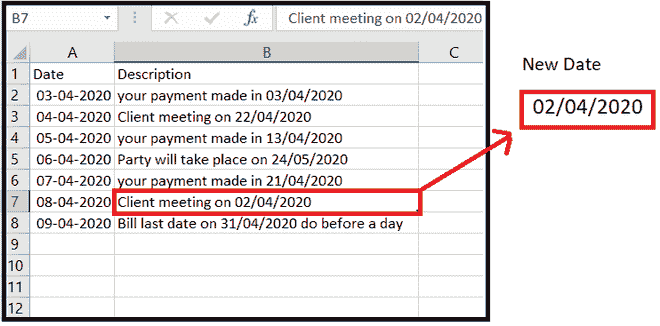
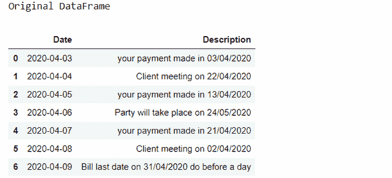

# 如何使用 Pandas 从 Excel 文件中提取日期？

> 原文:[https://www . geesforgeks . org/如何从 excel 文件中提取日期-使用-pandas/](https://www.geeksforgeeks.org/how-to-extract-date-from-excel-file-using-pandas/)

**先决条件:**[Python 中的正则表达式](https://www.geeksforgeeks.org/regular-expression-python-examples-set-1/)

在本文中，让我们看看如何从 Excel 文件中提取日期。假设我们的 Excel 文件如下图所示，那么我们必须从字符串中提取日期，并将其存储到一个新的 Dataframe 列中。



date_sample_data.xlsx

查看 Excel 文件[点击此处](https://drive.google.com/file/d/1GLdCID9kK7jkX6gTMRs1nI2CZJaRG8In/view)。

**进场:**

*   导入所需模块。
*   从 Excel 文件导入数据。
*   为新的日期多做一栏。
*   设置搜索索引。
*   定义日期格式的模式。
*   搜索日期并分配给数据框中的相应列。

让我们看看分步实施:

**第一步:**导入所需模块，从 Excel 文件中读取数据。

## 蟒蛇 3

```py
# import required module
import pandas as pd;
import re;

# Read excel file and store in to DataFrame
data = pd.read_excel("date_sample_data.xlsx");

print("Original DataFrame")
data
```

**输出:**



**第二步:**为新的日期多做一栏。

## 蟒蛇 3

```py
# Create column for Date
data['new_Date']= None
data
```