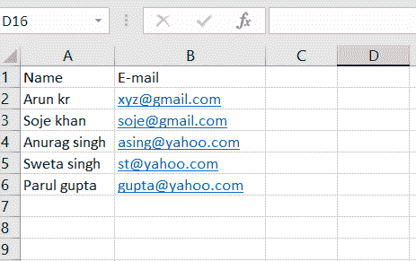

# 如何使用 Pandas 从 Excel 文件中提取 Email 列，找出邮件类型？

> 原文:[https://www . geesforgeks . org/如何从 excel 文件中提取电子邮件列并使用 pandas 找到邮件类型/](https://www.geeksforgeeks.org/how-to-extract-email-column-from-excel-file-and-find-out-the-type-of-mail-using-pandas/)

在本文中，让我们看看如何从 Excel 文件中提取电子邮件列，并使用 Pandas 找出邮件的类型。假设我们的 Excel 文件如下图所示，然后我们必须在数据框的不同列中存储不同类型的电子邮件。



查看 Excel 文件[点击此处](https://drive.google.com/file/d/1V5p-nPRMESRLyvL-jYo4K6IkACZpzpN2/view?usp=sharing)

**进场:**

> *   Import the required module.
> *   Import data from Excel file.
> *   Add a column for each different e-mail.
> *   Set each index required for searching.
> *   Define the mode of the mail.
> *   Search for email and assign it to the corresponding column in the data frame.

让我们看看分步实施:

**第一步:**导入所需模块，从 Excel 文件中读取数据。

## 蟒蛇 3

```
# import required module
import pandas as pd;
import re;

# Read excel file and store in to DataFrame
data = pd.read_excel("Email_sample.xlsx");

# show the dataframe
data
```

**输出:**


**步骤 2:** 为每封不同的电子邮件制作一个额外的栏。

## 蟒蛇 3

```
data['Google-mail'] = None

data
```