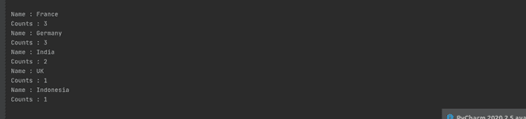
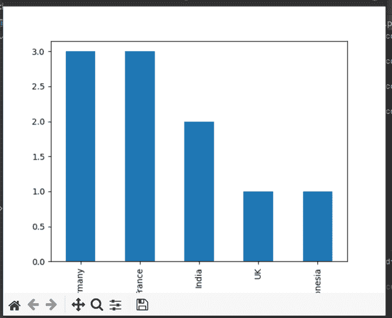

# 如何从 Pandas 中的 value_counts()中提取值名和计数？

> 原文:[https://www . geeksforgeeks . org/如何从熊猫的价值中提取价值名称和计数/](https://www.geeksforgeeks.org/how-to-extract-the-value-names-and-counts-from-value_counts-in-pandas/)

**先决条件:**

*   [熊猫](https://www.geeksforgeeks.org/pandas-tutorial/)
*   [matplotlib](https://www.geeksforgeeks.org/python-introduction-matplotlib/)

在本文中，我们将学习如何使用 values_count()从 panda 中提取名称和值。熊猫库配备了许多有用的功能，value_counts 就是其中之一。该函数返回熊猫数据帧中唯一项目的计数。

**语法:**

> <object>。value_count()</object>

### **进场:**

*   导入必需模块。
*   制作数据框
*   使用 value_count()进行处理
*   显示数据

**示例 1:** 打印列表中所有唯一的国家和第一个国家名称。

> **tolist()** 函数返回一个值列表。
> 
> **语法:** Index.tolist()
> **参数:** None
> **返回:**列表

## 蟒蛇 3

```
import pandas as pd
import matplotlib.pyplot as plt

# Make example dataframe
df = pd.DataFrame([(1, 'Germany'),
                   (2, 'France'),
                   (3, 'Indonesia'),
                   (4, 'France'),
                   (5, 'France'),
                   (6, 'Germany'),
                   (7, 'UK'),
                   (8, 'India'),
                   (9, 'India'),
                   (10, 'Germany')
                   ],
                  columns=['groupid', 'country'],
                  index=['a', 'b', 'c', 'd', 'e', 'f', 'g', 'h', 'i', 'j'])

# print all unique country name in the list
su1 = df['country'].value_counts().index.tolist()
print(su1)

# print 1st unique country name present in a list
su2 = df['country'].value_counts().index.tolist()[0]
print(su2)
```

**输出:**


**示例 2:** 打印该列的所有唯一值和该列的第一个值。

> **value_count()** 统计列中值的唯一出现次数
> 
> **语法** : Index.value_count()
> **参数:**
> **返回:**该列中每个唯一值的出现次数。

## 蟒蛇 3

```
import pandas as pd
import matplotlib.pyplot as plt

# Make example dataframe
df = pd.DataFrame([(1, 'Germany'),
                   (2, 'France'),
                   (3, 'Indonesia'),
                   (4, 'France'),
                   (5, 'France'),
                   (6, 'Germany'),
                   (7, 'UK'),
                   (8, 'India'),
                   (9, 'India'),
                   (10, 'Germany')
                   ],
                  columns=['groupid', 'country'],
                  index=['a', 'b', 'c', 'd', 'e', 'f', 'g', 'h', 'i', 'j'])

# print country name and counts
su3 = df['country'].value_counts()
print(su3)

# print 1st country count in a list
su4 = df['country'].value_counts()[0]
print(su4)
```

**输出:**


**示例 3:** 使用列表中的循环打印我们的数据。

## 蟒蛇 3

```
import pandas as pd
import matplotlib.pyplot as plt

# Make example dataframe
df = pd.DataFrame([(1, 'Germany'),
                   (2, 'France'),
                   (3, 'Indonesia'),
                   (4, 'France'),
                   (5, 'France'),
                   (6, 'Germany'),
                   (7, 'UK'),
                   (8, 'India'),
                   (9, 'India'),
                   (10, 'Germany')
                   ],
                  columns=['groupid', 'country'],
                  index=['a', 'b', 'c', 'd', 'e', 'f', 'g', 'h', 'i', 'j'])

# printing names and count using loop.
for idx, name in enumerate(df['country'].value_counts().index.tolist()):
    print('Name :', name)
    print('Counts :', df['country'].value_counts()[idx])
```

**输出:**



**示例 4:** 以条形图的形式打印我们的数据。

> **语法:**matplotlib . pyplot . plot(kind = ' ')
> **参数:** kind:图的类型，即线、条。
> **返回:**返回图形。

## 蟒蛇 3

```
import pandas as pd
import matplotlib.pyplot as plt

# Make example dataframe
df = pd.DataFrame([(1, 'Germany'),
                   (2, 'France'),
                   (3, 'Indonesia'),
                   (4, 'France'),
                   (5, 'France'),
                   (6, 'Germany'),
                   (7, 'UK'),
                   (8, 'India'),
                   (9, 'India'),
                   (10, 'Germany')
                   ],
                  columns=['groupid', 'country'],
                  index=['a', 'b', 'c', 'd', 'e', 'f', 'g', 'h', 'i', 'j'])

# Display data in a form of Graph
df['country'].value_counts().plot(kind='bar')
plt.show()
```

**输出:**

