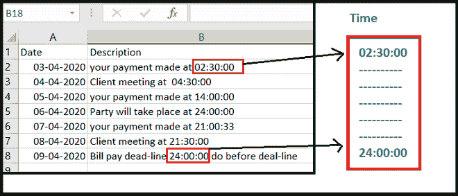
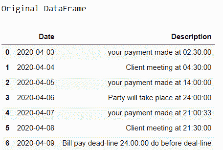
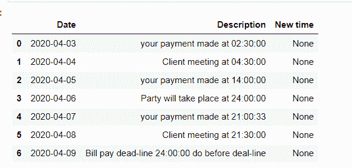
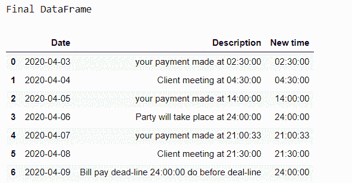
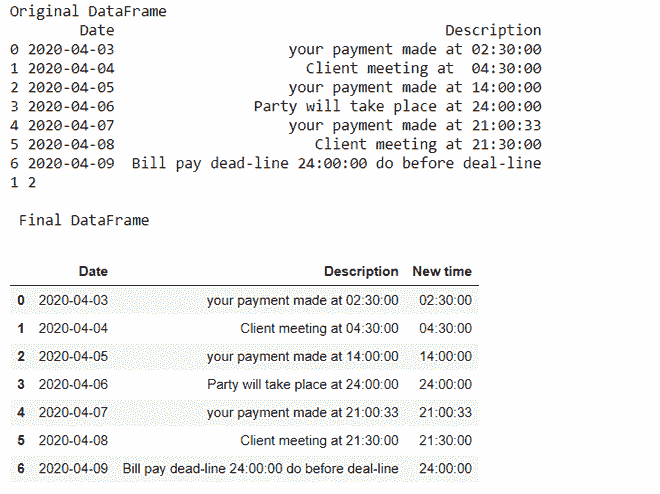

# 如何使用 Pandas 从 Excel 文件列中提取时间数据？

> 原文:[https://www . geesforgeks . org/如何使用 pandas 从 excel 文件中提取时间数据/](https://www.geeksforgeeks.org/how-to-extract-time-data-from-an-excel-file-column-using-pandas/)

**先决条件:**[Python 中的正则表达式](https://www.geeksforgeeks.org/regular-expression-python-examples-set-1/)

在这些文章中，我们将讨论如何使用 Pandas 从 Excel 文件列中提取时间数据。假设我们的 Excel 文件如下图所示，那么我们必须从 Excel 工作表列中提取时间，并将其存储到一个新的数据框列中。



查看 Excel 文件[点击此处](https://drive.google.com/file/d/1HykZY5LzHhA32oAOc0OaEFq4AGAxpiAe/view?usp=sharing)。

**进场:**

*   导入所需的模块。
*   从 Excel 文件导入数据。
*   为存储提取的时间制作一个额外的列。
*   设置索引以搜索提取列。
*   定义时间格式的模式(时:分:秒)。
*   搜索时间并分配给数据框中的相应列。

让我们看看分步实施:

**第一步:**导入所需模块，从 Excel 文件中读取数据。

## 蟒蛇 3

```py
# importing required module
import pandas as pd;
import re;

# Read excel file and store in to DataFrame
data = pd.read_excel("time_sample_data.xlsx");

print("Original DataFrame")
data
```

**输出:**



**步骤 2:** 制作一个额外的列来存储时间数据。

## 蟒蛇 3

```py
# Create column for Time
data['New time'] = None
data
```

**输出:**



**第三步:**设置搜索索引

## 蟒蛇 3

```py
# set index
index_set = data.columns.get_loc('Description')
index_time = data.columns.get_loc('New time')

print(index_set, index_time)
```

**输出:**

```py
1 2

```

**第 4 步:**为时间定义正则表达式(正则表达式)。

时间格式的正则表达式:

```py
[0-24]{2}\:[0-60]{2}\:[0-60]{2}.

```

## 蟒蛇 3

```py
# define time pattern
time_pattern = r'([0-24]{2}\:[0-60]{2}\:[0-60]{2})'
```

**步骤 5:** 搜索时间并分配给数据框中的相应列。

为了在字符串中使用正则表达式搜索时间，我们使用了 **re** 库的 [**re.search()**](https://www.geeksforgeeks.org/regular-expressions-python-set-1-search-match-find/?ref=lbp) 函数。

## 蟒蛇 3

```py
# searching the entire DataFrame
# with Time pattern
for row in range(0, len(data)):

    time = re.search(time_pattern,
                     data.iat[row,index_set]).group()

    data.iat[row, index_time] = time

print("Final DataFrame")    
data
```

**输出:**



**完整代码:**

## 蟒蛇 3

```py
# importing required module
import pandas as pd;
import re;

data = pd.read_excel("time_sample_data.xlsx");
print("Original DataFrame")
print(data)

# Create column for Date
data['New time']= None
print(data)

# set index
index_set= data.columns.get_loc('Description')
index_time=data.columns.get_loc('New time')
print(index_set,index_time)

# define the time pattern in HH:MM:SS
time_pattern= r'([0-24]{2}\:[0-60]{2}\:[0-60]{2})'

#searching dataframe with time pattern
for row in range(0, len(data)):
    time= re.search(time_pattern,data.iat[row,index_set]).group()
    data.iat[row,index_time] = time

print("\n Final DataFrame")    
data
```

**输出:**



**注意:**在运行这个程序之前，请确保您已经在 Python 环境中安装了 [**xlrd**](https://www.geeksforgeeks.org/reading-excel-file-using-python/) 库。