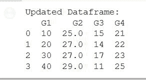
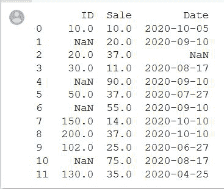
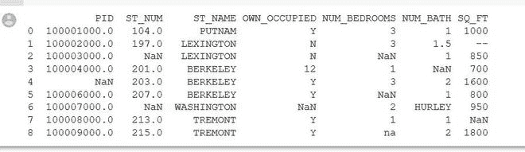
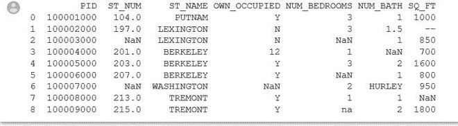
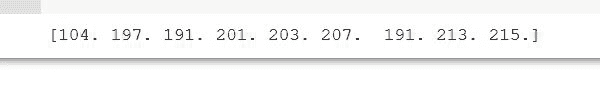

# 如何在熊猫中用平均值填充 NAN 值？

> 原文:[https://www . geesforgeks . org/如何用熊猫平均值填充 nan 值/](https://www.geeksforgeeks.org/how-to-fill-nan-values-with-mean-in-pandas/)

修改我们的数据是一个相当强制性的过程，因为计算机会显示一个**无效输入**的错误，因为处理带有“NaN”的数据是完全不可能的，并且手动将“NaN”更改为其平均值在实践中也是不太可能的。因此，为了解决这个问题，我们处理数据并使用各种函数，通过这些函数，从我们的数据中删除“NaN”，并用系统处理的特定平均值和就绪值替换它。

主要有两个步骤从数据中删除“NaN”

1.  使用熊猫图书馆的 Dataframe.fillna()。
2.  使用 sklearn . Current 中的 simple Current(这仅在数据以 csv 文件的形式存在时有用)

### 使用熊猫图书馆的 Dataframe.fillna()

借助熊猫库中的 [Dataframe.fillna()](https://www.geeksforgeeks.org/python-pandas-series-fillna/) ，我们可以轻松替换数据帧中的‘NaN’。

**程序:**

1.  为了计算平均值()，我们使用特定列的平均值函数
2.  现在，在 fillna()函数的帮助下，我们将改变那个特定列的所有“NaN”，我们有它的平均值。
3.  我们将打印更新的栏。

> **语法:** df.fillna(值=无，方法=无，轴=无，位置=假，限制=无，向下转换=无，**kwargs)
> 
> **参数:**
> 
> *   值:用于填充孔的值
> *   方法:用于填充重新索引系列填充/填充中的孔的方法
> *   坐标轴:{0 或' index'}
> *   原地:如果为真，填写原地。
> *   限制:如果指定了方法，这是向前/向后填充的连续 NaN 值的最大数量
> *   向下转换:dict，默认值为无

**例 1:**

1.  为了计算平均值()，我们使用特定列的平均值函数
2.  然后应用 fillna()函数，我们将更改特定列的所有“NaN”，并打印更新后的数据框。

## 蟒蛇 3

```
import numpy as np
import pandas as pd

# A dictionary with list as values
GFG_dict = { 'G1': [10, 20,30,40],
                'G2': [25, np.NaN, np.NaN, 29],
                'G3': [15, 14, 17, 11],
                'G4': [21, 22, 23, 25]}

# Create a DataFrame from dictionary
gfg = pd.DataFrame(GFG_dict)

#Finding the mean of the column having NaN
mean_value=gfg['G2'].mean()

# Replace NaNs in column S2 with the
# mean of values in the same column
gfg['G2'].fillna(value=mean_value, inplace=True)
print('Updated Dataframe:')
print(gfg)
```

**输出:**



**例 2:**

## 蟒蛇 3

```
import pandas as pd
import numpy as np

df = pd.DataFrame({
    'ID': [10, np.nan, 20, 30, np.nan, 50, np.nan,
           150, 200, 102, np.nan, 130],

    'Sale': [10, 20, np.nan, 11, 90, np.nan,
             55, 14, np.nan, 25, 75, 35],

    'Date': ['2020-10-05', '2020-09-10', np.nan,
             '2020-08-17', '2020-09-10', '2020-07-27', 
             '2020-09-10', '2020-10-10', '2020-10-10',
             '2020-06-27', '2020-08-17', '2020-04-25'],
})

df['Sale'].fillna(int(df['Sale'].mean()), inplace=True)
print(df)
```

**输出:**



### **使用 sklearn.impute 中的 SimpleImputer()**

此函数插补转换器用于完成缺失值，为插补缺失值提供基本策略。这些值可以通过提供常数值或使用缺失值所在的每一列的统计数据(平均值、中间值或最频繁值)来估算。该类还允许不同的缺失值编码。

> **语法:**class sklearn . importe . simple importer(*，missing_values=nan，strategy='mean '，fill_value=None，verbose=0，copy=True，add_indicator=False)
> 
> **参数:**
> 
> *   missing_values: int float、str、np.nan 或 None，默认值=np.nan
> *   策略字符串:默认值=“均值”
> *   fill_valuestring 或数值:默认值=无
> *   详细:整数，默认值=0
> *   复制:布尔值，默认值=真
> *   add_indicator:布尔值，默认值=False

**注:**以下示例中使用的数据为[此处为](https://github.com/dataoptimal/posts/blob/master/data%20cleaning%20with%20python%20and%20pandas/property%20data.csv)



**例 1:(PID 列上的计算)**

## 蟒蛇 3

```
import pandas as pd
import numpy as np

Dataset= pd.read_csv("property data.csv")
X = Dataset.iloc[:,0].values

# To calculate mean use imputer class
from sklearn.impute import SimpleImputer
imputer = SimpleImputer(missing_values=np.nan, strategy='mean')
imputer = imputer.fit(X)

X = imputer.transform(X)
print(X)
```

**输出:**



**例 2:(ST _ NUM 列上的计算)**

## 蟒蛇 3

```
from sklearn.impute import SimpleImputer
import pandas as pd
import numpy as np

Dataset = pd.read_csv("property data.csv")
X = Dataset.iloc[:, 1].values

# To calculate mean use imputer class
imputer = SimpleImputer(missing_values=np.nan, strategy='mean')
imputer = imputer.fit(X)
X = imputer.transform(X)
print(X)
```

**输出:**

