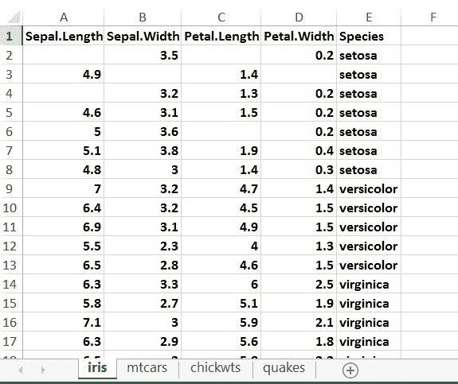
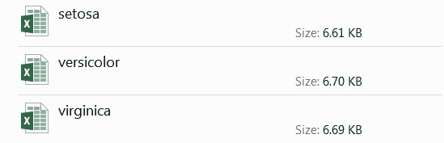

# 如何用 Python 熊猫在 Excel 中将数据过滤保存为新文件？

> 原文:[https://www . geeksforgeeks . org/如何使用 python-pandas 将数据过滤并保存为新的 excel 文件/](https://www.geeksforgeeks.org/how-to-filter-and-save-the-data-as-new-files-in-excel-with-python-pandas/)

**前提条件:** [Python 熊猫](https://www.geeksforgeeks.org/pandas-tutorial/)

**熊猫**主要受欢迎，因为导入和分析数据容易得多。熊猫速度快，对用户来说具有高性能&生产力。


在本文中，我们试图过滤 excel 工作表的数据，并将过滤后的数据保存为新的 Excel 文件。

**注:**您可以点击该文件名下载该表[数据集. xlsx](https://drive.google.com/file/d/1YPC5kr6pyYwFumbQl3CzWuMUHFFBuDyv/view?usp=sharing)

**使用的 Excel 工作表:**


在这个 excel 表中，我们在“物种”列中有三个类别-

1.  **【濑户内】**
2.  **Polystictus versicolor**
***   Virginia**

现在我们的目标是按物种类别过滤这些数据，并将过滤后的数据保存在不同的表中，文件名= species.subcategory name 即代码执行后，我们将获得以下名称的三个文件-
 **1.  西塞塔。xlsx(消歧义)** 

下面是实现。

```py
# Python code to filter and save the 
# data with different file names
import pandas

data = pandas.read_excel("datasets.xlsx")

speciesdata = data["Species"].unique()

for i in speciesdata:
    a = data[data["Species"].str.contains(i)]
    a.to_excel(i+".xlsx")
```

**输出:**


**说明:**

*   首先，我们导入了熊猫图书馆。
*   然后我们已经在数据对象中加载了 data.xlsx excel 文件。
*   为了从该物种列中获取唯一值，我们使用了`unique()`函数。为了检查物种列中的唯一值，我们在 speciesdata 对象中调用了 unique()。
*   然后我们将迭代 speciesdata 对象，因为我们将逐个存储 Species 列的唯一值(即 Setosa、Versicolor、Virginica)。
*   在对象“a”中，我们过滤掉与`Species.speciesdata`匹配的数据，即在每次迭代中，对象 a 将存储三种不同类型的数据，即 Setosa 类型的数据，然后是 Versicolor 类型的数据，最后是 Virginica 类型的数据。
*   现在将过滤后的数据一个一个保存在 excel 文件中，我们使用了 to_excel 函数，其中，文件将以 speciesdata 名称保存。