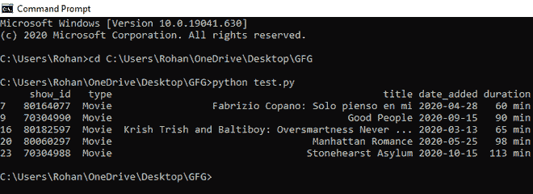
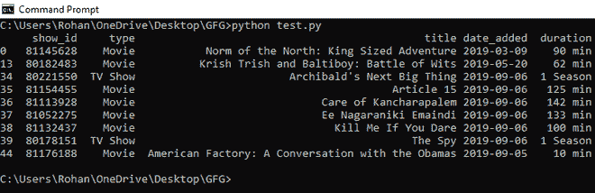

# 如何根据熊猫中的日期过滤数据框行？

> 原文:[https://www . geeksforgeeks . org/如何过滤-数据框-基于行的熊猫日期-2/](https://www.geeksforgeeks.org/how-to-filter-dataframe-rows-based-on-the-date-in-pandas-2/)

按日期过滤[数据框](https://www.geeksforgeeks.org/python-pandas-dataframe/)行会根据包含日期数据的列选择满足指定日期约束的所有行。例如，选择 2020 年 3 月 13 日至 2020 年 12 月 31 日之间的所有行，将返回日期值在该范围内的所有行。

使用带有索引语法[条件]的 [DataFrame.loc()](https://www.geeksforgeeks.org/python-pandas-dataframe-loc/) 仅从 DataFrame 中选择满足条件的行。定义条件以检查数据框中的日期列是否在约束范围内。它将为所有行创建一个布尔数组。将只打印具有真实值的行。

参考下面的例子。从[这里](https://drive.google.com/file/d/18q2uc2GyIS6_ZC5Tj6H9AIl7PTukLENi/view?usp=sharing)下载数据框。

**进场:**

*   将数据列转换为 python 支持的日期格式
*   根据日期筛选行
*   使用访问行。loc()函数，并将它们存储在 dataframe 中。

**例 1:**

## 蟒蛇 3

```py
# import pandas library
import pandas as pd

# load csv file
df = pd.read_csv(
    "C:\\Users\\Rohan\\OneDrive\\Desktop\\GFG\\netflix_titles.csv")

# convert date column into date format
df['date_added'] = pd.to_datetime(df['date_added'])

# filter rows on the basis of date
newdf = (df['date_added'] > '01-03-2020') & (df['date_added'] <= '31-12-2020')

# locate rows and access them using .loc() function
newdf = df.loc[newdf]

# print dataframe
print(newdf)
```

**输出:**



2020 年 3 月 13 日至 2020 年 12 月 31 日之间的所有电影都将被打印。

**例 2:**

## 蟒蛇 3

```py
# import pandas library
import pandas as pd

# load csv file
df = pd.read_csv(
    "C:\\Users\\Rohan\\OneDrive\\Desktop\\GFG\\netflix_titles.csv")

# convert date column into date format
df['date_added'] = pd.to_datetime(df['date_added'])

# filter rows on the basis of date
newdf = (df['date_added'] > '01-01-2019') & (df['date_added'] <= '31-12-2019')

# locate rows and access them using .loc() function
newdf = df.loc[newdf]

# print dataframe
print(newdf)
```

**输出:**



以上输出打印了 2019 年网飞新增的所有电影。