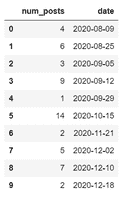
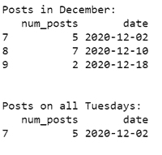
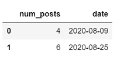

# 如何根据熊猫中的日期过滤数据框行？

> 原文:[https://www . geesforgeks . org/如何过滤数据框架-基于行的熊猫日期/](https://www.geeksforgeeks.org/how-to-filter-dataframe-rows-based-on-the-date-in-pandas/)

不同地区遵循不同的日期惯例(年-月-日、年-月-日、日/月/YY 等)。).很难在数据中处理这样的字符串。Pandas *to_datetime()* 函数允许将字符串格式的日期和时间转换为 datetime64。该数据类型有助于提取从“年”到“微秒”的日期和时间特征。

要根据日期筛选行，首先将数据框中的日期格式化为 datetime64 类型。然后使用熊猫包中的*data frame . loc【】*和*data frame . query【】*功能指定过滤条件。因此，获取数据子集，即过滤后的数据帧。让我们看一些同样的例子。

我们将使用一个包含特定日期帖子数量的示例数据框。将示例数据中的日期转换为 datetime64 类型，如下所示。

## 计算机编程语言

```
# Import Pandas package
import pandas as pd

# Create a sample dataframe
df = pd.DataFrame({'num_posts': [4, 6, 3, 9, 1, 14, 2, 5, 7, 2],
                   'date' : ['2020-08-09', '2020-08-25', '2020-09-05', 
                            '2020-09-12', '2020-09-29', '2020-10-15', 
                            '2020-11-21', '2020-12-02', '2020-12-10', 
                            '2020-12-18']})

# Convert the date to datetime64
df['date'] = pd.to_datetime(df['date'], format='%Y-%m-%d')

# Display dataframe
df
```



**例 1:**

使用 *DataFrame.loc[]* 函数基于日期过滤数据， *loc[]* 函数用于通过标签或布尔数组访问数据帧的一组行和列。在本例中， *loc[]* 中的条件语句返回一个布尔值数组，如果行满足条件(日期在 9 月 1 日到 15 日之间)，则返回真值，否则返回假值。然后 *loc[]* 函数只返回那些具有真值的行。

## 蟒蛇 3

```
# Import Pandas package
import pandas as pd

# Create a sample dataframe
df = pd.DataFrame({'num_posts': [4, 6, 3, 9, 1, 14, 2, 5, 7, 2],
                   'date': ['2020-08-09', '2020-08-25', 
                            '2020-09-05', '2020-09-12', 
                            '2020-09-29', '2020-10-15',
                            '2020-11-21', '2020-12-02', 
                            '2020-12-10', '2020-12-18']})

# Convert the date to datetime64
df['date'] = pd.to_datetime(df['date'], format='%Y-%m-%d')

# Filter data between two dates
filtered_df = df.loc[(df['date'] >= '2020-09-01')
                     & (df['date'] < '2020-09-15')]
# Display
filtered_df
```

**输出:**


**例 2:**

使用*日期时间索引(dt)* 访问单独的日期时间属性，如年、月、日、工作日、小时、分钟、秒、微秒等。作为条件在*loc【】*功能如下。

**注意:**日期值应为 datetime64 格式。

## 蟒蛇 3

```
# Import Pandas package
import pandas as pd

# Create a sample dataframe
df = pd.DataFrame({'num_posts': [4, 6, 3, 9, 1, 14, 2, 5, 7, 2],
                   'date': ['2020-08-09', '2020-08-25',
                            '2020-09-05', '2020-09-12',
                            '2020-09-29', '2020-10-15',
                            '2020-11-21', '2020-12-02',
                            '2020-12-10', '2020-12-18']})

# Convert the date to datetime64
df['date'] = pd.to_datetime(df['date'], format='%Y-%m-%d')

# Filter data between two dates
filtered_df = df.loc[(df['date'] >= '2020-09-01')
                     & (df['date'] < '2020-09-15')]

# Display
print("\nPosts in December:")
print(filtered_df)

# Filter data for specific weekday (tuesday)
filtered_df = df.loc[df['date'].dt.weekday == 2]

# Display
print("\nPosts on all Tuesdays:")
print(filtered_df)
```

**输出:**



**例 3:**

使用*数据框. query()* 函数根据日期过滤数据， *query()* 函数过滤熊猫数据框，并通过在引号内指定条件来选择行。如下图，*查询()*里面的条件是选择日期在 8 月份的数据(指定日期范围)。默认情况下，数据框的列放在查询命名空间中，因此无需索引即可访问日期列(只需指定列名)。

## 蟒蛇 3

```
# Import Pandas package
import pandas as pd

# Create a sample dataframe
df = pd.DataFrame({'num_posts': [4, 6, 3, 9, 1, 14, 2, 5, 7, 2],
                   'date': ['2020-08-09', '2020-08-25',
                            '2020-09-05', '2020-09-12',
                            '2020-09-29', '2020-10-15',
                            '2020-11-21', '2020-12-02',
                            '2020-12-10', '2020-12-18']})

# Convert the date to datetime64
df['date'] = pd.to_datetime(df['date'], format='%Y-%m-%d')

# Filter data between two dates
filtered_df = df.query("date >= '2020-08-01' \
                       and date < '2020-09-01'")

# Display
filtered_df
```

**输出:**

