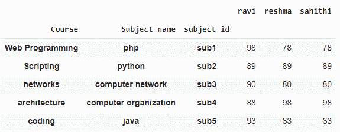
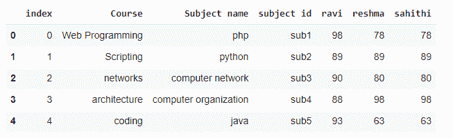
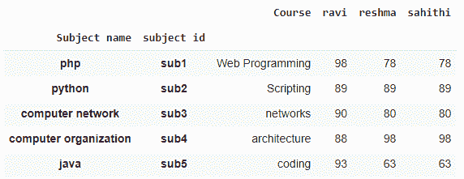
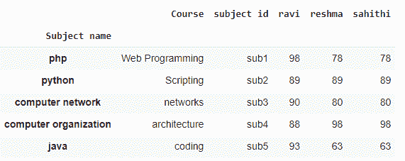
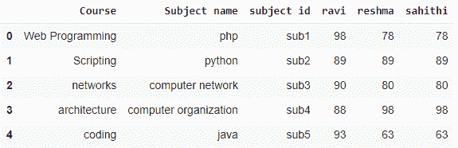

# 如何展平熊猫的多指标？

> 原文:[https://www . geeksforgeeks . org/如何展平熊猫中的多索引/](https://www.geeksforgeeks.org/how-to-flatten-multiindex-in-pandas/)

在本文中，我们将讨论如何在熊猫中展平多索引。

## **展平所有级别的多指标:**

在这种方法中，我们将通过使用 [reset_index()](https://www.geeksforgeeks.org/python-pandas-dataframe-reset_index/) 函数来平整数据帧的所有级别。

**语法**:

```
dataframe.reset_index(inplace=True)
```

**注意:** Dataframe 是输入数据帧，我们必须创建 dataframe MultiIndex。

**语法**:

```
MultiIndex.from_tuples([(tuple1),.......,(tuple n),names=[column_names])
```

**论据:**

*   元组是值
*   列名是每个元组值中的列名

**例**:

在这个例子中，我们将创建一个带有 multiIndex 的数据框架，并用 python 编程语言显示它。

## 蟒蛇 3

```
import pandas as pd

# create DataFrame muktiindexex
data = pd.MultiIndex.from_tuples([('Web Programming', 'php', 'sub1'),
                                  ('Scripting', 'python', 'sub2'),
                                  ('networks', 'computer network', 'sub3'),
                                  ('architecture', 'computer organization', 'sub4'),
                                  ('coding', 'java', 'sub5')],
                                 names=['Course', 'Subject name', 'subject id'])

# create dataframe with student marks
data = pd.DataFrame({'ravi': [98, 89, 90, 88, 93],
                     'reshma': [78, 89, 80, 98, 63], 
                     'sahithi': [78, 89, 80, 98, 63]},  
                    index=data)

# display
data
```

**输出:**



**现在，我们将所有级别的指数拉平:**

## 蟒蛇 3

```
import pandas as pd

# create DataFrame muktiindexex
data = pd.MultiIndex.from_tuples([('Web Programming', 'php', 'sub1'),
                                  ('Scripting', 'python', 'sub2'),
                                  ('networks', 'computer network', 'sub3'),
                                  ('architecture', 'computer organization', 'sub4'),
                                  ('coding', 'java', 'sub5')],
                                 names=['Course', 'Subject name', 'subject id'])

# create dataframe with student marks

data = pd.DataFrame({'ravi': [98, 89, 90, 88, 93], 
                     'reshma': [78, 89, 80, 98, 63],
                     'sahithi': [78, 89, 80, 98, 63]},
                    index=data)

# flatten the index of all levels
data.reset_index(inplace=True)

# display
data
```

**输出:**



## **展平特定级别的多指标**

通过使用特定的级别，我们可以使用以下语法:

```
dataframe.reset_index(inplace=True,level=['level_name'])
```

在哪里

*   数据帧是输入数据帧
*   level_name 是多索引级别的名称

**示例:**

在这个例子中，我们将创建一个数据框架，展平 multiIndex 的特定级别，并以 python 编程语言显示它。

## 蟒蛇 3

```
import pandas as pd

# create DataFrame muktiindexex
data = pd.MultiIndex.from_tuples([('Web Programming', 'php', 'sub1'),
                                  ('Scripting', 'python', 'sub2'),
                                  ('networks', 'computer network', 'sub3'),
                                  ('architecture', 'computer organization', 'sub4'),
                                  ('coding', 'java', 'sub5')],
                                 names=['Course', 'Subject name', 'subject id'])

# create dataframe with student marks

data = pd.DataFrame({'ravi': [98, 89, 90, 88, 93], 
                     'reshma': [78, 89, 80, 98, 63],
                     'sahithi': [78, 89, 80, 98, 63]},
                    index=data)

# flatten the index of level with course column
data.reset_index(inplace=True, level=['Course'])

# display
data
```

**输出:**



我们也可以指定多个级别；

## 蟒蛇 3

```
import pandas as pd

# create DataFrame muktiindexex
data = pd.MultiIndex.from_tuples([('Web Programming', 'php', 'sub1'),
                                  ('Scripting', 'python', 'sub2'),
                                  ('networks', 'computer network', 'sub3'),
                                  ('architecture', 'computer organization', 'sub4'),
                                  ('coding', 'java', 'sub5')],
                                 names=['Course', 'Subject name', 'subject id'])

# create dataframe with student marks

data = pd.DataFrame({'ravi': [98, 89, 90, 88, 93],
                     'reshma': [78, 89, 80, 98, 63], 
                     'sahithi': [78, 89, 80, 98, 63]}, 
                    index=data)

# flatten the index of level with course 
# and subject id columns
data.reset_index(inplace=True, level=['Course', 'subject id'])

# display
data
```

**输出:**



## **使用 to_records()方法**

这是一个 pandas 模块方法，用于将多索引数据帧转换成每个记录并显示。

**语法**:

```
dataframe.to_records()
```

**示例:**

## 蟒蛇 3

```
import pandas as pd

# create DataFrame muktiindexex
data = pd.MultiIndex.from_tuples([('Web Programming', 'php', 'sub1'),
                                  ('Scripting', 'python', 'sub2'),
                                  ('networks', 'computer network', 'sub3'),
                                  ('architecture', 'computer organization', 'sub4'),
                                  ('coding', 'java', 'sub5')],
                                 names=['Course', 'Subject name', 'subject id'])

# create dataframe with student marks

data = pd.DataFrame({'ravi': [98, 89, 90, 88, 93],
                     'reshma': [78, 89, 80, 98, 63],
                     'sahithi': [78, 89, 80, 98, 63]}, 
                    index=data)

pd.DataFrame(data.to_records())
```

**输出:**

