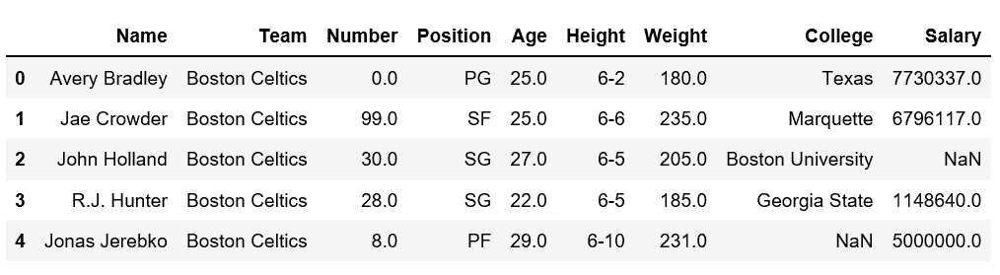
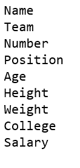
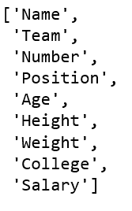
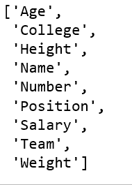

# 如何在熊猫数据框

中获取列名

> 原文:[https://www . geeksforgeeks . org/如何获取熊猫专栏名称-dataframe/](https://www.geeksforgeeks.org/how-to-get-column-names-in-pandas-dataframe/)

在分析实际数据集时，这些数据集的大小通常非常大，我们可能需要获取列名来执行某些操作。

我们来讨论一下如何在 Pandas [数据框](https://www.geeksforgeeks.org/python-pandas-dataframe/)中获取列名。

首先，让我们用`nba.csv`文件创建一个简单的数据帧。

```
# Import pandas package 
import pandas as pd 

# making data frame 
data = pd.read_csv("https://media.geeksforgeeks.org/wp-content/uploads/nba.csv") 

# calling head() method  
# storing in new variable 
data_top = data.head() 

# display 
data_top 
```


现在我们试着从上面的数据集获取列名。

**方法#1:** 简单地迭代列

```
# Import pandas package 
import pandas as pd 

# making data frame 
data = pd.read_csv("nba.csv") 

# iterating the columns
for col in data.columns:
    print(col)
```

**输出:**


**方法#2:** 使用带有数据框对象的列

```
# Import pandas package 
import pandas as pd 

# making data frame 
data = pd.read_csv("nba.csv") 

# list(data) or
list(data.columns)
```

**输出:**


**方法#3:** `column.values`方法返回一组索引。

```
# Import pandas package 
import pandas as pd 

# making data frame 
data = pd.read_csv("nba.csv") 

list(data.columns.values)
```

**输出:**


**方法#4:** 使用`tolist()`方法用给定的列列表取值。

```
# Import pandas package 
import pandas as pd 

# making data frame 
data = pd.read_csv("nba.csv") 

list(data.columns.values.tolist())
```

**输出:**


**方法#5:** 使用`sorted()`方法

Sorted()方法将返回按字母顺序排序的列列表。

```
# Import pandas package 
import pandas as pd 

# making data frame 
data = pd.read_csv("nba.csv") 

# using sorted() method
sorted(data)
```

**输出:**
