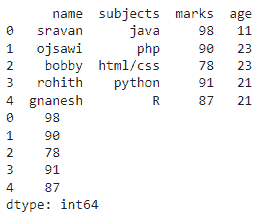

# 如何在 Python 中获取熊猫数据帧的最大值？

> 原文:[https://www . geesforgeks . org/如何从熊猫身上获得最大价值-python 中的数据框/](https://www.geeksforgeeks.org/how-to-get-the-maximum-value-from-the-pandas-dataframe-in-python/)

**蟒蛇熊猫** [**max()函数**](https://www.geeksforgeeks.org/get-the-maximum-element-of-an-object-in-r-programming-max-function/) 返回所请求轴上的最大值。

> **语法** : dataframe.max(轴)
> 
> 哪里，
> 
> *   axis=0 指定列
> *   axis=1 指定行

### 示例 1:获取数据框行中的最大值

要获取数据框行中的最大值，只需调用 max()函数，并将 axis 设置为 1。

> **语法** : dataframe.max(轴=1)

## 蟒蛇 3

```
# import pandas module
import pandas as pd

# create a dataframe
# with 5 rows and 4 columns
data = pd.DataFrame({
    'name': ['sravan', 'ojsawi', 'bobby', 
             'rohith', 'gnanesh'],
    'subjects': ['java', 'php', 'html/css',
                 'python', 'R'],
    'marks': [98, 90, 78, 91, 87],
    'age': [11, 23, 23, 21, 21]
})

# display dataframe
print(data)

# get the maximum in row
data.max(axis=1)
```

**输出:**



### 示例 2:获取列中的最大值

要获取列中的最大值，只需使用设置为 0 的轴调用 max()函数。

> **语法** : dataframe.max(轴=0)

## 蟒蛇 3

```
# import pandas module
import pandas as pd

# create a dataframe
# with 5 rows and 4 columns
data = pd.DataFrame({
    'name': ['sravan', 'ojsawi', 'bobby', 
             'rohith', 'gnanesh'],
    'subjects': ['java', 'php', 'html/css',
                 'python', 'R'],
    'marks': [98, 90, 78, 91, 87],
    'age': [11, 23, 23, 21, 21]
})

# display dataframe
print(data)

# get the maximum in column
data.max(axis=0)
```