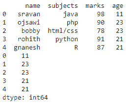
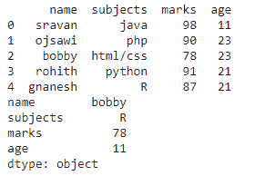
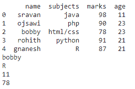

# 如何在 Python 中获取熊猫数据帧的最小值？

> 原文:[https://www . geesforgeks . org/如何从熊猫身上获得最低价值-python 中的数据框/](https://www.geeksforgeeks.org/how-to-get-the-minimum-value-from-the-pandas-dataframe-in-python/)

在本文中，我们将讨论如何用 Python 从 Pandas 数据帧中获取最小值。

我们可以使用 [min()](https://www.geeksforgeeks.org/python-min-function/) 函数得到最小值

**语法**:

```
dataframe.min(axis)
```

哪里，

*   axis=0 指定列
*   axis=1 指定行

## 获取数据框行中的最小值

要获取 dataframe 行中的最小值，只需调用 min()函数，并将 axis 设置为 1。

**语法**:

```
dataframe.min(axis=1)
```

**示例:**获取数据框行中的最小值

## 蟒蛇 3

```
# import pandas module
import pandas as pd

# create a dataframe
# with 5 rows and 4 columns
data = pd.DataFrame({
    'name': ['sravan', 'ojsawi', 'bobby', 'rohith', 'gnanesh'],
    'subjects': ['java', 'php', 'html/css', 'python', 'R'],
    'marks': [98, 90, 78, 91, 87],
    'age': [11, 23, 23, 21, 21]
})

# display dataframe
print(data)

# get the miniumum in row
data.min(axis=1)
```

**输出:**



## 获取列中的最小值

要获取列中的最小值，只需使用设置为 0 的轴调用 min()函数。

**语法:**

```
dataframe.min(axis=0)
```

**示例:**获取列中的最小值

## 蟒蛇 3

```
# import pandas module
import pandas as pd

# create a dataframe
# with 5 rows and 4 columns
data = pd.DataFrame({
    'name': ['sravan', 'ojsawi', 'bobby', 'rohith', 'gnanesh'],
    'subjects': ['java', 'php', 'html/css', 'python', 'R'],
    'marks': [98, 90, 78, 91, 87],
    'age': [11, 23, 23, 21, 21]
})

# display dataframe
print(data)

# get the miniumum in column
data.min(axis=0)
```

**输出:**



## 获取特定列中的最小值

要获取特定列中的最小值，请使用特定的列名和 min()函数调用 dataframe。

**语法**:

```
dataframe['column_name'].min()
```

**示例**:获取特定列中的最小值

## 蟒蛇 3

```
# import pandas module
import pandas as pd

# create a dataframe
# with 5 rows and 4 columns
data = pd.DataFrame({
    'name': ['sravan', 'ojsawi', 'bobby', 'rohith', 'gnanesh'],
    'subjects': ['java', 'php', 'html/css', 'python', 'R'],
    'marks': [98, 90, 78, 91, 87],
    'age': [11, 23, 23, 21, 21]
})

# display dataframe
print(data)

# get the miniumum in name  column
print(data['name'].min())

# get the miniumum in subjects  column
print(data['subjects'].min())

# get the miniumum in age  column
print(data['age'].min())

# get the miniumum in marks  column
print(data['marks'].min())
```

**输出:**

