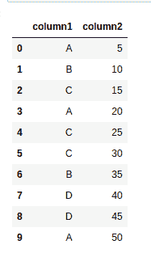
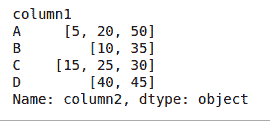
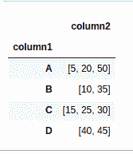
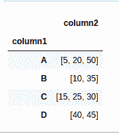

# 如何在 Pandas Groupby 中将数据帧行分组到列表中？

> 原文:[https://www . geesforgeks . org/如何分组-data frame-row-in-list-in-pandas-group by/](https://www.geeksforgeeks.org/how-to-group-dataframe-rows-into-list-in-pandas-groupby/)

假设你有一个熊猫数据框架，由 2 列组成，我们想对这些列进行分组。在这篇文章中，我们也将讨论同样的问题。第一，让；让我们创建数据帧。

## 蟒蛇 3

```py
# importing pandas as pd
import pandas as pd

# Create the data frame
df = pd.DataFrame({'column1': ['A', 'B', 'C', 'A', 'C',
                               'C', 'B', 'D', 'D', 'A'],
                   'column2': [5, 10, 15, 20, 25, 30, 
                             35, 40, 45, 50]})

# Print the dataframe
df
```

**输出:**



**示例#1:** 我们可以在第 1 列使用 [groupby()](https://www.geeksforgeeks.org/python-pandas-dataframe-groupby/) 方法，并应用该方法在每组熊猫数据框上应用一个列表。

## 蟒蛇 3

```py
# importing pandas as pd
import pandas as pd

# Create the data frame
df = pd.DataFrame({'column1': ['A', 'B', 'C', 'A', 'C',
                               'C', 'B', 'D', 'D', 'A'],
                   'column2': [5, 10, 15, 20, 25, 30, 
                             35, 40, 45, 50]})

# Use groupby method and apply
# method on the dataframe
df = df.groupby('column1')['column2'].apply(list)

# Print the dataframe again
df
```

**输出:**



**示例 2:** 我们可以使用第 1 列的 groupby()方法和 [agg()](https://www.geeksforgeeks.org/python-pandas-series-agg/) 方法对每组熊猫数据帧应用聚合，包括 [lambda](https://www.geeksforgeeks.org/python-lambda/) 函数。

## 蟒蛇 3

```py
# importing pandas as pd
import pandas as pd

# Create the dataframe
df = pd.DataFrame({'column1': ['A', 'B', 'C', 'A', 'C', 
                               'C', 'B', 'D', 'D', 'A'], 
                   'column2': [5, 10, 15, 20, 25, 30,
                               35, 40, 45, 50]})

# Use groupby method and agg method 
# with lambda function on the dataframe
df = df.groupby('column1').agg({'column2': lambda x: list(x)})

# Print the dataframe again
df
```

**输出:**



**示例#3:** 我们可以使用第 1 列的 groupby()方法和 agg()方法对每组熊猫数据帧应用聚合列表。

## 蟒蛇 3

```py
# importing pandas as pd
import pandas as pd

# Create the data frame
df = pd.DataFrame({'column1': ['A', 'B', 'C', 'A', 'C',
                               'C', 'B', 'D', 'D', 'A'],
                   'column2': [5, 10, 15, 20, 25, 30, 
                               35, 40, 45, 50]})

# Use groupby method and agg method 
# with list as argument on the dataframe
df = df.groupby('column1').agg(list)

df
```

**输出:**



**示例#4:** 我们可以在第 1 列使用 groupby()方法，通过传递“ [pd 来使用 agg()方法。系列 tolist](https://www.geeksforgeeks.org/python-pandas-series-tolist/) 作为参数。

## 蟒蛇 3

```py
# importing pandas as pd
import pandas as pd

# Create the data frame
df = pd.DataFrame({'column1': ['A', 'B', 'C', 'A', 'C', 
                               'C', 'B', 'D', 'D', 'A'], 
                   'column2': [5, 10, 15, 20, 25, 30,
                               35, 40, 45, 50]})

# Use groupby method and agg method with
# pd.Series.tolist as argument on the dataframe
df = df.groupby('column1').agg(pd.Series.tolist)

df
```

**输出:**

