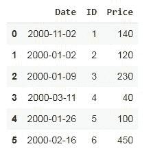
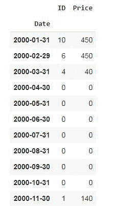

# 如何按日期和时间对熊猫数据框进行分组？

> 原文:[https://www . geesforgeks . org/如何分组-熊猫-按日期和时间划分的数据框/](https://www.geeksforgeeks.org/how-to-group-pandas-dataframe-by-date-and-time/)

在本文中，我们将讨论如何根据熊猫中的日期和时间按数据框分组。我们将看到按年、月、日等对时间序列数据帧进行分组的方法。此外，我们还将看到按时间对象(如分钟)分组的方法。

[Pandas GroupBy](https://www.geeksforgeeks.org/pandas-groupby/) 允许我们为一个对象指定 GroupBy 指令。该指定指令将通过 grouper 函数的关键参数以及级别和/或轴参数(如果给定)选择一列，目标对象/列的索引级别。

> **语法:**熊猫。群组(键=无，级别=无，频率=无，轴=0，排序=假)

下面是一些例子，描述了如何使用熊猫石斑鱼类根据日期和时间按数据帧分组。

**例 1:** 按月分组

## 蟒蛇 3

```
# importing modules
import pandas as pd

# creating a dataframe df
df = pd.DataFrame(
    {
        "Date": [
            pd.Timestamp("2000-11-02"),
            pd.Timestamp("2000-01-02"),
            pd.Timestamp("2000-01-09"),
            pd.Timestamp("2000-03-11"),
            pd.Timestamp("2000-01-26"),
            pd.Timestamp("2000-02-16")
        ],
        "ID": [1, 2, 3, 4, 5, 6],
        "Price": [140, 120, 230, 40, 100, 450]
    }
)

# show df
display(df)

# applying the groupby function on df
df.groupby(pd.Grouper(key='Date', axis=0, 
                      freq='M')).sum()
```

**输出:**

 

在上面的示例中，数据框按日期列分组。由于我们已经提供了 freq = 'M '的意思是月，所以数据是按月分组的，直到每个月的最后一天，并提供了价格总和栏。我们没有提供所有月份的值，那么 groupby 函数也会显示所有月份的数据，并为其他月份分配值 0。

**例 2:** 分组天数

## 蟒蛇 3

```
# importing modules
import pandas as pd

# creating a dataframe df
df = pd.DataFrame(
    {
        "Date": [
            pd.Timestamp("2000-11-02"),
            pd.Timestamp("2000-01-02"),
            pd.Timestamp("2000-01-09"),
            pd.Timestamp("2000-03-11"),
            pd.Timestamp("2000-01-26"),
            pd.Timestamp("2000-02-16")
        ],
        "ID": [1, 2, 3, 4, 5, 6],
        "Price": [140, 120, 230, 40, 100, 450]
    }
)

# display dataframe
display(df)

# applying groupby
df.groupby(pd.Grouper(key='Date', axis=0, 
                      freq='2D', sort=True)).sum()
```