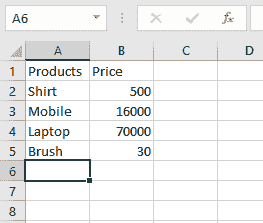
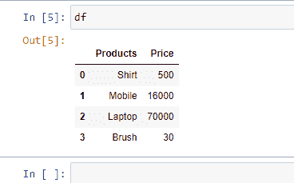
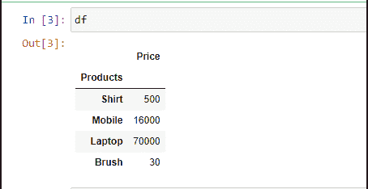
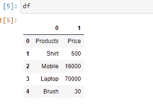
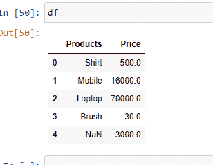
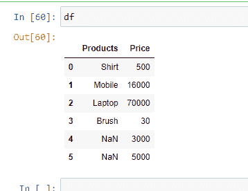

# 如何使用 Pandas 将 excel 文件导入 Python？

> 原文:[https://www . geesforgeks . org/如何使用 pandas 将 excel 文件导入 python/](https://www.geeksforgeeks.org/how-to-import-an-excel-file-into-python-using-pandas/)

以 CSV 格式获取数据集并不总是可能的。因此， [**【熊猫】**](https://www.geeksforgeeks.org/pandas-tutorial/) 为我们提供了将其他格式的数据集转换为数据框的功能。excel 文件有一个“”。“xlsx”格式。

在开始之前，我们需要安装几个库。

```
pip install pandas
pip install xlrd

```

要使用 Pandas 将 Excel 文件导入 Python，我们必须使用[**Pandas . read _ Excel()**](https://www.geeksforgeeks.org/working-with-excel-files-using-pandas/)函数。

> **语法:** pandas.read_excel( *io* ， *sheet_name=0* ， *header=0* ，*name = None*，…。)
> 
> **返回:**数据帧或数据帧字典。

假设 Excel 文件如下所示:



现在，我们可以深入研究代码。

**例 1:** 读取 Excel 文件。

## 蟒蛇 3

```
import pandas as pd

df = pd.read_excel("sample.xlsx")
print(df)
```

**输出:**



**示例 2:** 要选择特定的列，我们可以传递一个参数“ **index_col** ”。

## 蟒蛇 3

```
import pandas as pd

# Here 0th column will be extracted
df = pd.read_excel("sample.xlsx",
                   index_col = 0)  

print(df)
```

**输出:**



**示例 3:** 如果您不喜欢列的初始标题，可以使用参数“**标题”将其更改为索引。**

## 蟒蛇 3

```
import pandas as pd

df = pd.read_excel('sample.xlsx',
                   header = None)
print(df)
```

**输出:**



**示例 4:** 如果要更改特定列的数据类型，可以使用参数“ **dtype** ”来完成。

## 蟒蛇 3

```
import pandas as pd

df = pd.read_excel('sample.xlsx', 
                   dtype = {"Products": str,
                            "Price":float})
print(df)
```

**输出:**



**示例 5:** 如果您有未知值，那么您可以使用参数“ **na_values** 来处理它。它会将上述未知值转换为“ **NaN**

## 蟒蛇 3

```
import pandas as pd
df = pd.read_excel('sample.xlsx', 
                   na_values =['item1', 
                               'item2'])
print(df)
```

**输出:**

