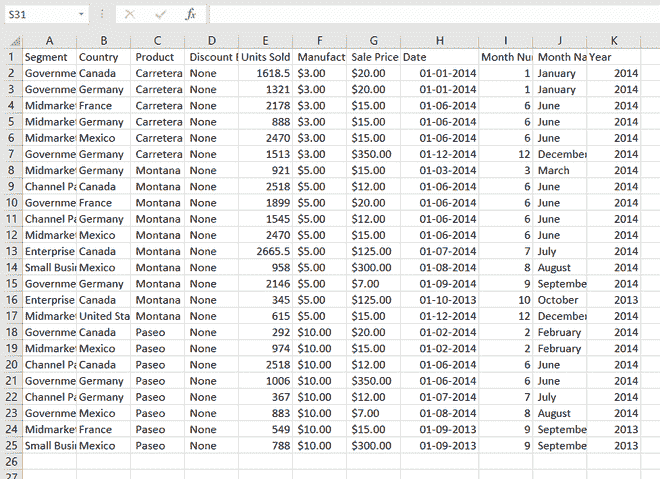
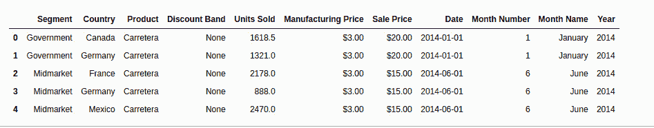
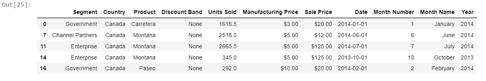
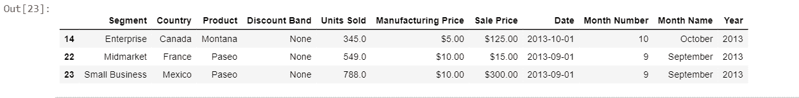

# 如何使用 Pandas 导入 excel 文件并查找特定列？

> 原文:[https://www . geesforgeks . org/如何导入-excel-file-and-find-a-specific-column-use-pandas/](https://www.geeksforgeeks.org/how-to-import-excel-file-and-find-a-specific-column-using-pandas/)

在本文中，我们将学习如何将 excel 文件导入数据框并找到特定的列。假设我们的 excel 文件是这样的。



Sample_data.xlsx

Excel 工作表链接:[https://drive . Google . com/file/d/1x-S0z-gTo–h8by n12 _ mwlawllcxfmzkm/view？usp =共享](https://drive.google.com/file/d/1x-S0z-gTo--H8byN12_MWLawlCXfMZkm/view?usp=sharing)

**进场:**

*   进口熊猫计划
*   创建数据框
*   将 Excel 数据存储到数据框中
*   使用 head()功能检查特定的列和显示

**下面是实现。**

**第一步:**导入 excel 文件。

## 蟒蛇 3

```py
# importing module
import pandas as pd

# creating dataframe
# importing excel file
df = pd.read_excel('Sample_data.xlsx')  
df.head()
```

**输出:**



**第二步:**检查具体列，用表头()显示最上面的 5 个值

## 蟒蛇 3

```py
df[df["Country"] == 'Canada'].head()
```

**输出:**



另一列用同样的方法。

## 蟒蛇 3

```py
df[df["Year"] == 2013].head()
```

**输出:**



另一列用同样的方法。

## 蟒蛇 3

```py
df[df["Segment"]=='Government'].head()
```

**输出:**

