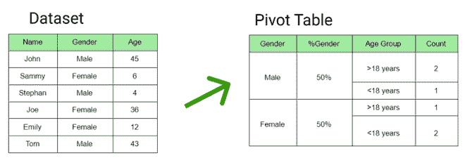
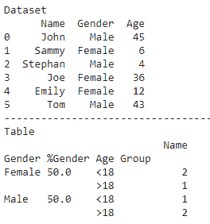
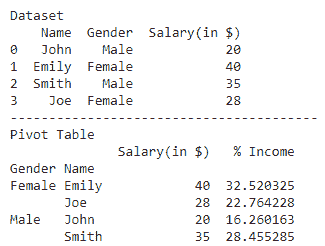

# 如何在熊猫的透视表中包含百分比？

> 原文:[https://www . geeksforgeeks . org/如何将百分比包含在数据透视表中熊猫/](https://www.geeksforgeeks.org/how-to-include-percentage-in-pivot-table-in-pandas/)

[Seaborn](https://www.geeksforgeeks.org/introduction-to-seaborn-python/) 是一个神奇的可视化库，用于在 Python 中绘制统计图形。它提供了漂亮的默认样式和调色板，使统计图更有吸引力。它建立在 *matplotlib* 库的基础上，也与*熊猫*的数据结构紧密结合。

[透视表](https://www.geeksforgeeks.org/python-pandas-pivot_table/)用于汇总包含各种统计概念的数据。为了计算数据透视表中类别的百分比，我们计算类别计数与总计数的比率。以下是一些描述如何在透视表中包含百分比的示例:

**例 1:**

在下图中，为计算性别百分比的给定数据集创建了数据透视表。



## 蟒蛇 3

```py
# importing pandas library
import pandas as pd

# creating dataframe
df = pd.DataFrame({'Name': ['John', 'Sammy', 'Stephan', 'Joe', 'Emily', 'Tom'],
                   'Gender': ['Male', 'Female', 'Male',
                              'Female', 'Female', 'Male'],
                   'Age': [45, 6, 4, 36, 12, 43]})
print("Dataset")
print(df)
print("-"*40)

# categorizing in age groups
def age_bucket(age):
    if age <= 18:
        return "<18"
    else:
        return ">18"

df['Age Group'] = df['Age'].apply(age_bucket)

# calculating gender percentage
gender = pd.DataFrame(df.Gender.value_counts(normalize=True)*100).reset_index()
gender.columns = ['Gender', '%Gender']
df = pd.merge(left=df, right=gender, how='inner', on=['Gender'])

# creating pivot table
table = pd.pivot_table(df, index=['Gender', '%Gender', 'Age Group'], 
                       values=['Name'], aggfunc={'Name': 'count',})

# display table
print("Table")
print(table)
```

**输出:**



**例 2:**

下面是另一个示例，描述了如何计算特定列中变量占其总和的百分比:

## 蟒蛇 3

```py
# importing required libraries
import pandas as pd
import matplotlib.pyplot as plt

# creating dataframe
df = pd.DataFrame({
    'Name': ['John', 'Emily', 'Smith', 'Joe'],
    'Gender': ['Male', 'Female', 'Male', 'Female'],
    'Salary(in $)': [20, 40, 35, 28]})

print("Dataset")
print(df)
print("-"*40)

# creating pivot table
table = pd.pivot_table(df, index=['Gender', 'Name'])

# calculating percentage
table['% Income'] = (table['Salary(in $)']/table['Salary(in $)'].sum())*100

# display table
print("Pivot Table")
print(table)
```

**输出:**

