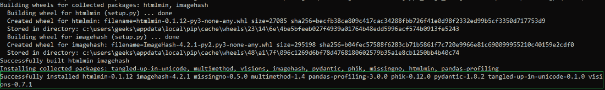
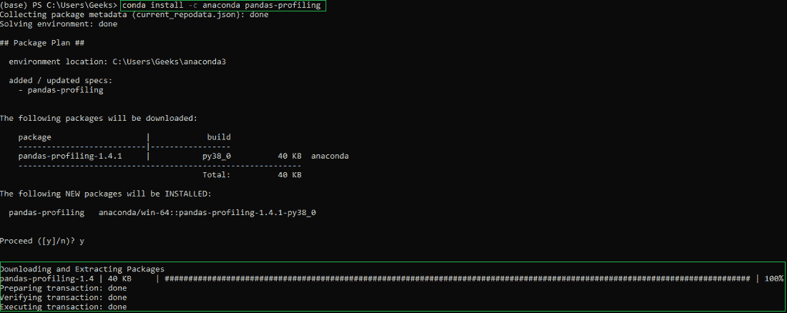
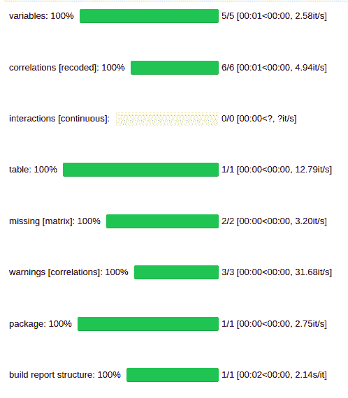

# 如何在 Windows 上安装 Pandas-Profiling？

> 原文:[https://www . geeksforgeeks . org/how-install-pandas-profiling-on-windows/](https://www.geeksforgeeks.org/how-to-install-pandas-profiling-on-windows/)

在本文中，我们将研究如何在 Python 中安装 [Pandas Profiling](https://www.geeksforgeeks.org/pandas-profiling-in-python/) 包。

### 先决条件:

*   [蟒蛇](https://www.geeksforgeeks.org/how-to-install-pip-on-windows/)
*   PIP 或 Conda(取决于偏好)

### 对于画中画用户:

Pip 用户只需打开命令提示符，使用下面的命令在 python 中安装 Pandas 分析包:

```
pip install pandas-profiling
```

安装完成后，将显示以下消息:



### 对于康达用户:

Conda 用户可以打开 Anaconda Power Shell 提示符，并使用以下命令在 python 中安装 pandas 分析包:

```
conda install -c anaconda pandas-profiling 
```

安装完成后，将显示以下消息:



### 验证安装:

您可以使用下面的代码来验证您的安装。确保添加样本。csv 文件包含一些数据，用于检查安装并替换下面代码中的 Geeks.csv 文件。

## 蟒蛇 3

```
#import the packages
import pandas as pd
import pandas_profiling

# read the file
df = pd.read_csv('Geeks.csv')

# run the profile report
profile = df.profile_report(title='Pandas Profiling Report')
```

**输出:**

