# 如何在 Windows 和 Linux 上安装 Python 熊猫？

> 原文:[https://www . geesforgeks . org/如何安装-python-pandas-on-windows-and-Linux/](https://www.geeksforgeeks.org/how-to-install-python-pandas-on-windows-and-linux/)

Python 中的 Pandas 是一个为数据分析和操作而编写的包。熊猫提供各种操作和数据结构来执行数字数据操作和时间序列。熊猫是一个建立在 Numpy 图书馆之上的开源图书馆。熊猫图书馆以其高生产率和高性能而闻名。熊猫之所以受欢迎，是因为它让导入和分析数据变得更加容易。

熊猫程序可以写在任何纯文本编辑器上，如**记事本、记事本++、**或任何类似的东西上，并用**保存。py** 分机。首先，编写熊猫代码并执行各种有趣而有用的操作，必须在他们的系统上安装 Python。这可以通过遵循下面提供的逐步说明来完成:

#### 如果 Python 已经存在了呢？让我们检查一下

要检查您的设备是否预装了 Python，只需进入**命令行**(在运行对话框中搜索**cmd**(<link rel="stylesheet" href="https://maxcdn.bootstrapcdn.com/font-awesome/4.6.1/css/font-awesome.min.css">***+R**)。
现在运行以下命令:*

```
*python --version* 
```

*如果已经安装了 Python，它将生成一条消息，其中包含可用的 Python 版本。
*

*要安装 Python，请访问:**如何在 [Windows](https://www.geeksforgeeks.org/how-to-install-python-on-windows/) 或 [Linux](https://www.geeksforgeeks.org/how-to-install-python-on-linux/) 上安装 Python？***

#### *下载和安装熊猫*

*熊猫可以通过多种方式安装在 Windows 和 Linux 上。下面列出了各种不同的方法:*

#### *Windows 操作系统*

*Python 熊猫可以通过两种方式安装在 Windows 上:*

*   *使用 pip*
*   *使用蟒蛇*

#### *使用画中画安装熊猫*

*PIP 是一个包管理系统，用于安装和管理用 Python 编写的软件包/库。这些文件存储在一个被称为 Python 包索引(PyPI)的大型“在线存储库中”。
熊猫可以通过使用以下命令使用 PIP 安装:*

```
*pip install pandas*
```

*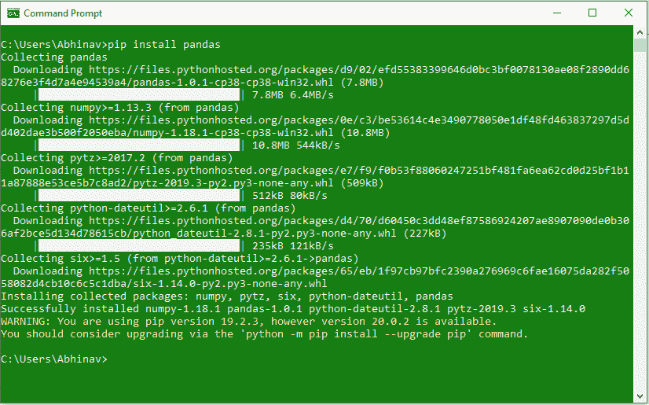*

#### *使用蟒蛇安装熊猫*

*Anaconda 是开源软件，包含 Jupyter、spyder 等，用于大型数据处理、数据分析、重型科学计算。如果你的系统没有预装 Anaconda Navigator，可以学习**如何在 [Windows](https://www.geeksforgeeks.org/how-to-install-anaconda-on-windows/) 或者 [Linux](https://www.geeksforgeeks.org/how-to-install-anaconda-on-linux/) 上安装 Anaconda Navigator？**

**使用 Anaconda Navigator 安装熊猫的步骤:**

**第一步:**在开始菜单中搜索 **Anaconda Navigator** 并打开。


**第二步:**点击**环境选项卡**然后点击**创建**按钮创建新的熊猫环境。
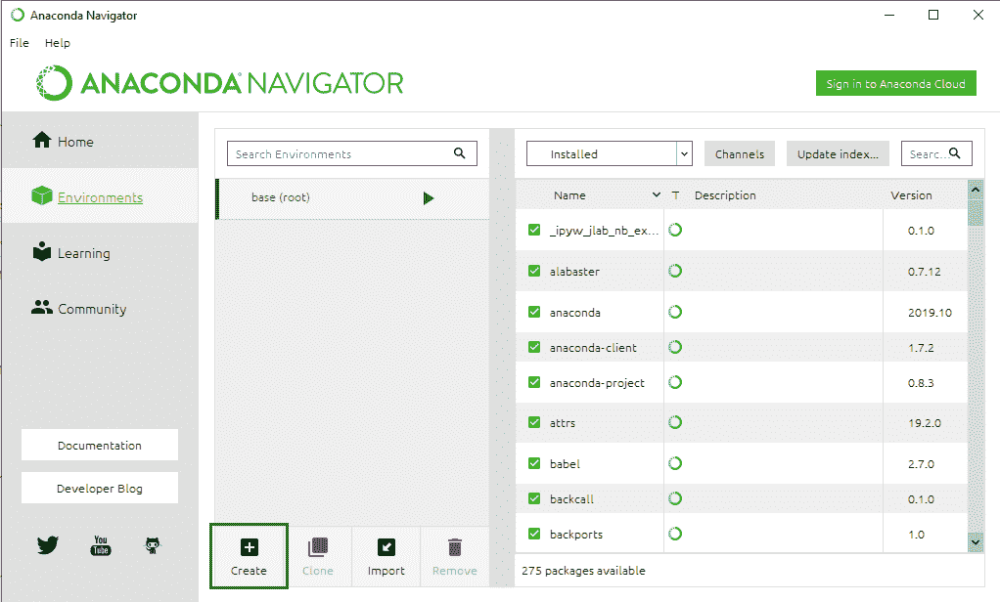

**第三步:**给你的环境起一个名字，比如熊猫，然后选择一个 python 版本在环境中运行。现在点击**创建**按钮创建熊猫环境。
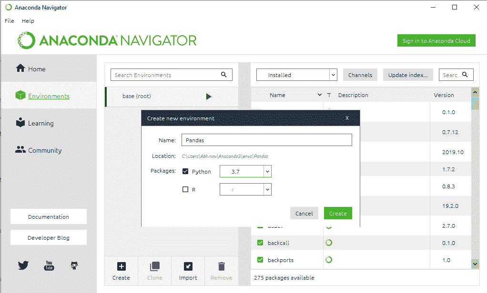

**第四步:**现在点击**熊猫环境**创建激活它。
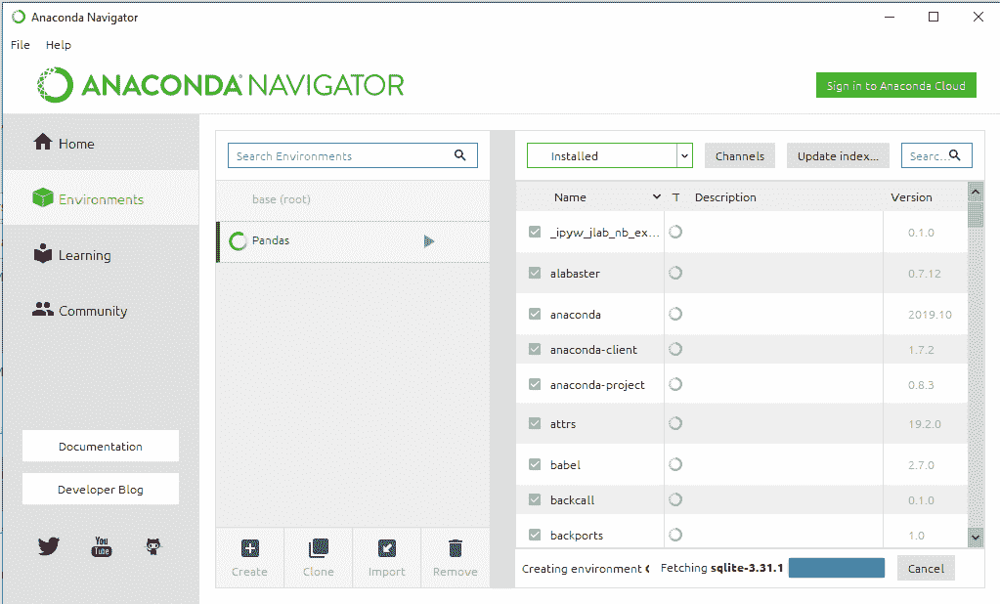

**第五步:**在以上包名列表中，选择**全部**过滤所有包。
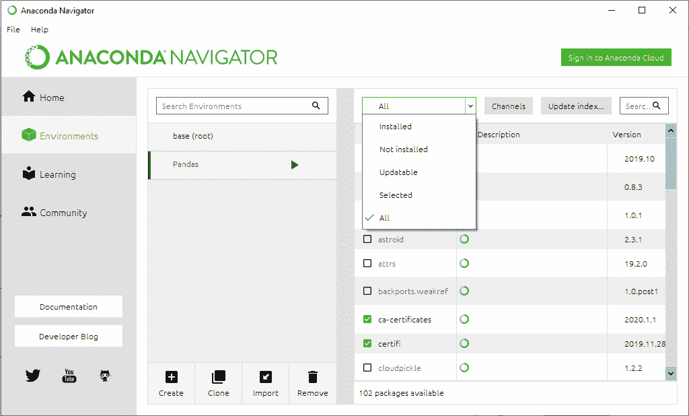

**第六步:**现在在搜索栏中，寻找“**熊猫**”。选择**熊猫套装**进行安装。
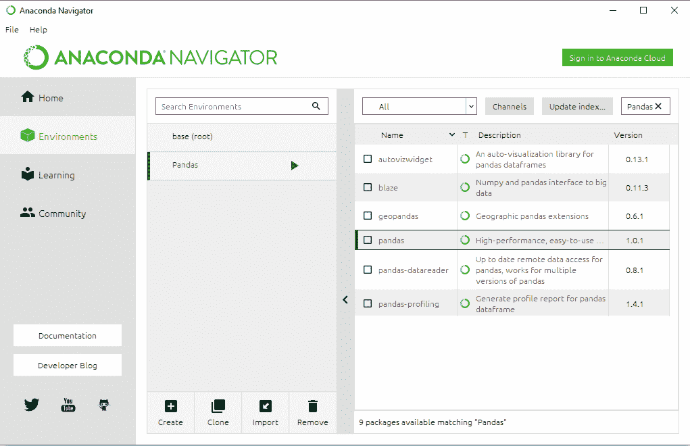

**第 7 步:**现在右键单击软件包名称前给出的复选框，然后转到“**标记特定版本安装**”。现在选择您想要安装的版本。
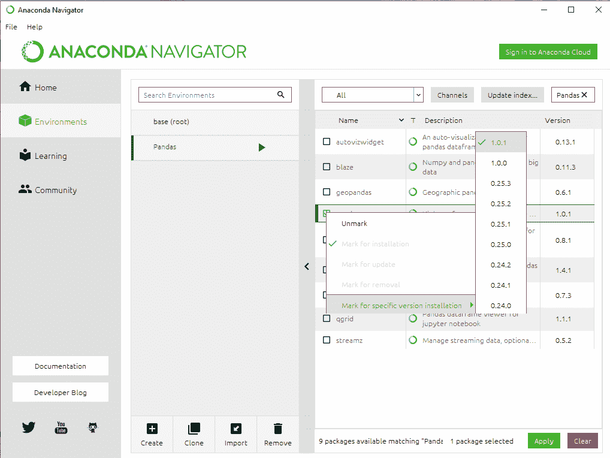

**第八步:**点击**应用**按钮安装熊猫套装。
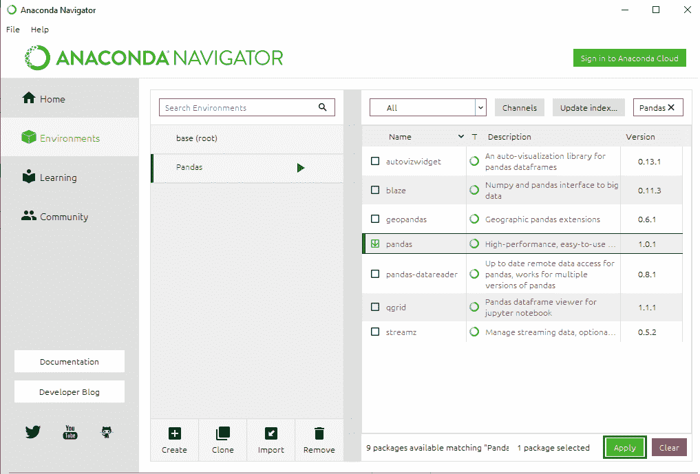

**第九步:**点击**应用**按钮完成安装过程。
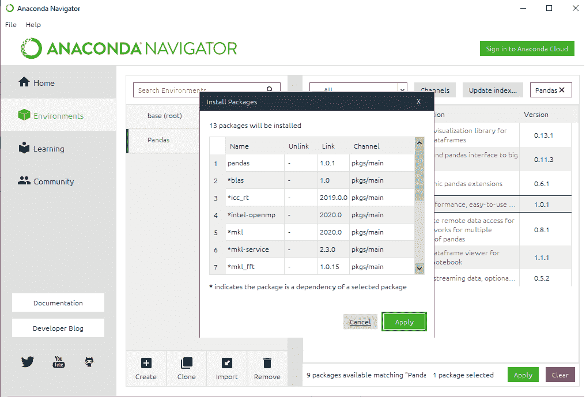

**第 10 步:**现在打开 Pandas 环境，点击包名右侧的**绿色箭头**，选择你想要开始 Pandas 编程的控制台。
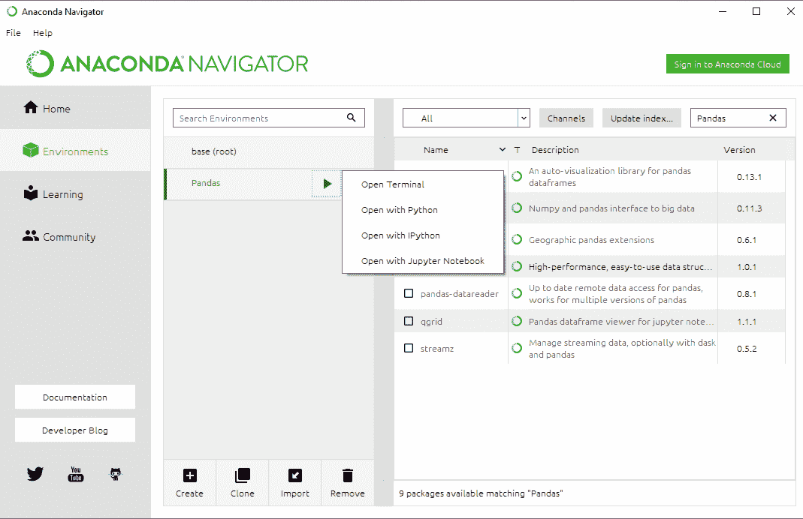

**熊猫终端窗口:**
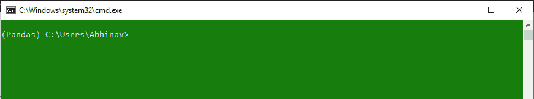*

#### *Linux 操作系统*

*要在 Linux 上安装 Pandas，只需在终端窗口中键入以下命令，然后按回车键。Linux 将自动下载并安装在 Python 中运行熊猫环境所需的包和文件:*

```
*pip3 install pandas* 
```

*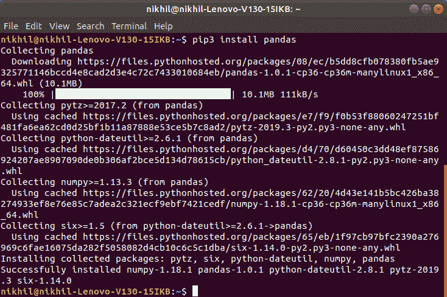*