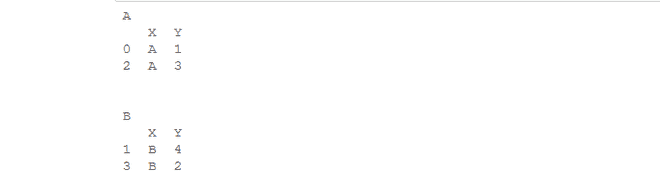
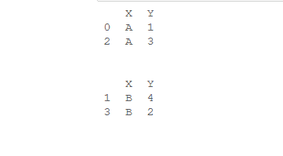

# 如何迭代 Python 中的数据帧组——熊猫？

> 原文:[https://www . geesforgeks . org/如何迭代数据框架-python 中的组-pandas/](https://www.geeksforgeeks.org/how-to-iterate-over-dataframe-groups-in-python-pandas/)

在本文中，我们将看到如何迭代数据帧被划分的组。所以，让我们看看完成这项任务的不同方法。

首先，让我们创建一个数据帧:

**代码:**

## 蟒蛇 3

```py
# import pandas library
import pandas as pd

# dictionary
dict = {'X': ['A', 'B', 'A', 'B'],
        'Y': [1, 4, 3, 2]}

# create a dataframe
df = pd.DataFrame(dict)

# show the dataframe
df
```

**输出:**


**方法 1:** 使用**[**data frame . group by()**](https://www.geeksforgeeks.org/python-pandas-dataframe-groupby/)**。****

**此功能用于根据某些标准将数据分成组。**

****示例:**我们将简单地迭代所有创建的组。**

## **蟒蛇 3**

```py
# import pandas library
import pandas as pd

# dictionary
dict = {'X': ['A', 'B', 'A', 'B'],
        'Y': [1, 4, 3, 2]}

# create a dataframe
df = pd.DataFrame(dict)

# group by 'X' column
groups = df.groupby("X")

for name, group in groups:
    print(name)
    print(group)
    print("\n")
```

****输出:****

****

**在上面的例子中，我们已经根据“X”列进行了分组。因为在“X”列下有两个不同的值，所以我们的数据框将被分成两组。那么我们的 for 循环将运行 2 次，因为数字组是 2。“name”代表组名,“group”代表实际分组的数据帧。** 

****方法二:**将**数据框. groupby()** 和**group by _ object . groups . keys()**一起使用。**

**Groupby_object.groups.keys()方法将返回组的键。**

****示例:**我们将迭代这些键。**

## **蟒蛇 3**

```py
# import pandas library
import pandas as pd

# dictionary
dict = {'X': ['A', 'B', 'A', 'B'],
        'Y': [1, 4, 3, 2]}

# create a dataframe
df = pd.DataFrame(dict)

# group by "X" column
groups = df.groupby('X')

# extract keys from groups
keys = groups.groups.keys()

for i in keys:
    print(groups.get_group(i))
    print('\n')
```

****输出:****

****

**在上面的例子中，我们将使用函数 **groups.get_group()** 来获取所有的组。首先我们将获取该组的所有键，然后遍历该组，然后为每个键调用 **get_group()** 方法。 **get_group()** 方法会返回组合键对应的组。**