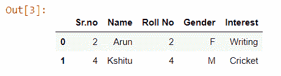
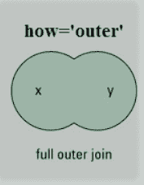
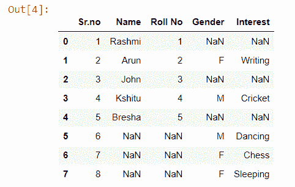
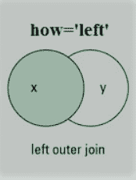
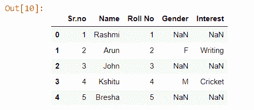
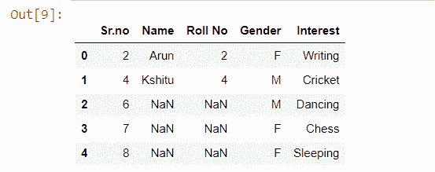

# 如何使用合并加入熊猫数据帧？

> 原文:[https://www . geeksforgeeks . org/如何加入-pandas-data frames-使用-merge/](https://www.geeksforgeeks.org/how-to-join-pandas-dataframes-using-merge/)

加入和合并数据框架是从数据分析和机器学习任务开始的核心过程。这是每个数据分析师或数据科学家都应该掌握的工具包之一，因为在大多数情况下，数据来自多个来源和文件。在本教程中，您将学习如何使用合并技术来连接熊猫中的数据帧。更具体地说，我们将练习沿着行和列串联数据帧。

## 入门指南

与数据帧相关的最广泛使用的操作是合并操作。两个数据帧可能包含关于同一个实体的不同类型的信息，并且它们可能有一些相同的列，因此我们需要将两个数据帧组合成熊猫，以获得更好的可靠性代码。为了连接这些数据帧，pandas 提供了各种函数，如 join()，concat()，merge()，等。在本节中，您将练习使用 pandas 的 merge()函数。

基本上有四种合并方法:

*   内部连接
*   外部连接
*   右连接
*   左连接

### 内部连接

从名称本身来看，很明显内部连接保留了合并“on”值存在于左右数据框中的行。


现在让我们创建两个数据帧，然后尝试使用 inner 合并它们。

```py
import numpy as np
import pandas as pd

left = pd.DataFrame({'Sr.no': ['1', '2', '3', '4', '5'], 
                    'Name': ['Rashmi', 'Arun', 'John', 
                             'Kshitu', 'Bresha'], 
                    'Roll No': ['1', '2', '3', '4', '5']}) 

right = pd.DataFrame({'Sr.no': ['2', '4', '6', '7', '8'], 
                    'Gender': ['F', 'M', 'M', 'F', 'F'], 
                    'Interest': ['Writing', 'Cricket', 'Dancing',
                                 'Chess', 'Sleeping']}) 

# Merging the dataframes                     
pd.merge(left, right, how ='inner', on ='Sr.no') 
```

**输出:**


### 外部连接

外部联接返回左侧数据框中的所有行，右侧数据框中的所有行，并在可能的情况下将行与其他地方的 NaNs 进行匹配。但是如果数据帧是完整的，那么我们会得到相同的输出。



```py
import numpy as np
import pandas as pd

left = pd.DataFrame({'Sr.no': ['1', '2', '3', '4', '5'], 
                    'Name': ['Rashmi', 'Arun', 'John',
                             'Kshitu', 'Bresha'], 
                    'Roll No': ['1', '2', '3', '4', '5']}) 

right = pd.DataFrame({'Sr.no': ['2', '4', '6', '7', '8'], 
                    'Gender': ['F', 'M', 'M', 'F', 'F'], 
                    'Interest': ['Writing', 'Cricket', 'Dancing', 
                                 'Chess', 'Sleeping']}) 

# Merging the dataframes                     
pd.merge(left, right, how ='outer', on ='Sr.no')
```

**输出:**


### 左连接

使用左连接，将显示第一个数据框中的所有记录，而不管第一个数据框中的键是否可以在第二个数据框中找到。而对于第二个数据帧，将只显示在第一个数据帧中可以找到的第二个数据帧中具有关键字的记录。



```py
import numpy as np
import pandas as pd

left = pd.DataFrame({'Sr.no': ['1', '2', '3', '4', '5'], 
                    'Name': ['Rashmi', 'Arun', 'John', 
                             'Kshitu', 'Bresha'], 
                    'Roll No': ['1', '2', '3', '4', '5']}) 

right = pd.DataFrame({'Sr.no': ['2', '4', '6', '7', '8'], 
                    'Gender': ['F', 'M', 'M', 'F', 'F'], 
                    'Interest': ['Writing', 'Cricket', 
                                 'Dancing', 'Chess', 
                                 'Sleeping']}) 

# Merging the dataframes                     
pd.merge(left, right, how ='left', on ='Sr.no')
```

**输出:**

注意输出。

### 右连接

对于右连接，将显示第二个数据框中的所有记录。但是，将只显示第一个数据框中的关键字在第二个数据框中的记录。


```py
import numpy as np
import pandas as pd

left = pd.DataFrame({'Sr.no': ['1', '2', '3', '4', '5'], 
                    'Name': ['Rashmi', 'Arun', 'John',
                             'Kshitu', 'Bresha'], 
                    'Roll No': ['1', '2', '3', '4', '5']}) 

right = pd.DataFrame({'Sr.no': ['2', '4', '6', '7', '8'], 
                    'Gender': ['F', 'M', 'M', 'F', 'F'], 
                    'Interest': ['Writing', 'Cricket', 'Dancing', 
                                 'Chess', 'Sleeping']}) 

# Merging the dataframes                     
pd.merge(left, right, how ='right', on ='Sr.no') 
```

**输出:**
