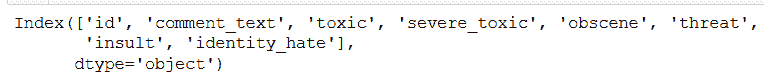
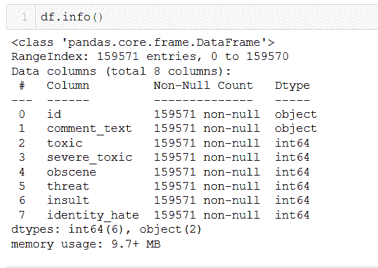
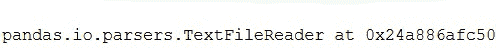
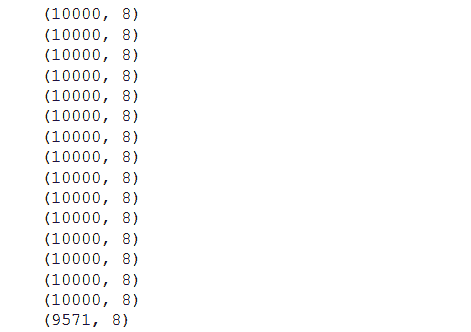
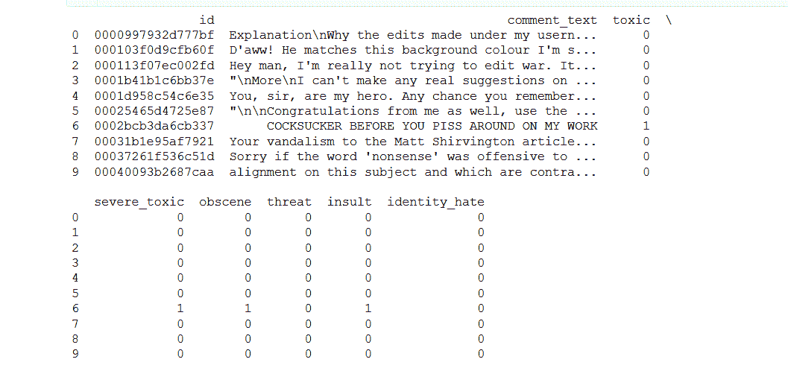

# 如何在 Pandas 中将海量文件加载为小块？

> 原文:[https://www . geeksforgeeks . org/如何将海量文件加载为熊猫小块/](https://www.geeksforgeeks.org/how-to-load-a-massive-file-as-small-chunks-in-pandas/)

**Pandas** 中灵活易用的开源数据分析工具构建在 python 之上，使得导入和可视化不同格式的数据像。 *csv* ，。 *tsv* ，。 *txt* 甚至*。db* 文件。

对于下面的例子，我们将只考虑。 *csv* 文件，但其他文件类型的过程类似。用来读取 CSV 文件的方法是*T3【read _ CSV()T5**T7】***

> **参数:**
> 
> **filepath_or_bufferstr :** 任何有效的字符串路径都是可以接受的。该字符串可以是一个网址。有效的网址方案包括 http、ftp、s3、gs 和 file。对于文件 URL，需要一个主机。本地文件可以是:file://localhost/path/to/table . CSV。
> 
> **iterator tool:**默认为 False 使用 get_chunk()返回迭代或获取块的 TextFileReader 对象。
> 
> **chunksize :** int，可选 Return TextFileReader 对象进行迭代。有关迭代器和块大小的更多信息，请参见输入输出工具文档。

*read_csv()* 方法有很多参数，但是我们感兴趣的是 *chunksize* 。从技术上讲，熊猫一次在文件中读取的行数被称为 *chunksize* 。假设*块大小*为 100，那么熊猫将装载前 100 行。返回的对象不是数据帧，而是 *TextFileReader* ，需要迭代才能得到数据。

**例 1:** 正常加载海量数据。

在下面的程序中，我们将使用超过 **10000** 行的毒性分类数据集。这并不多，但足以作为我们的例子。

## 蟒蛇 3

```py
import pandas as pd
from pprint import pprint

df = pf.read_csv('train/train.csv')

df.columns
```

**输出:**



首先让我们加载数据集并检查不同的列数。此数据集有 8 列。

让我们进一步了解数据类型和数据集中的行数。

## 蟒蛇 3

```py
df.info()
```

**输出:**



我们总共有 **159571** 个非空行。

**示例 2:** 使用 *chunksize* 参数加载大量数据。

## 蟒蛇 3

```py
df = pd.read_csv("train/train.csv", chunksize=10000)
print.print(df)
```

**输出:**



这里我们通过传递 *chunksize* 参数来创建大小为 10000 的块。返回的对象不是一个数据框，而是一个迭代器，要获取数据需要遍历这个对象。

## 蟒蛇 3

```py
for data in df:
    pprint(data.shape)
```

**输出:**



现在，计算块的数量-

## 蟒蛇 3

```py
df = pd.read_csv("train/train.csv", chunksize=10)

for data in df:
    pprint(data)
    break
```

**输出:**



在上例中，返回的每个元素/块的大小为 **10000** 。记得我们有 **159571。**因此，组块数为 159571/10000 ~ 15 个组块，剩余的 9571 个例子构成第 16 个组块。

每个区块的列数是 8。因此，分块不会影响列。现在我们了解了如何使用*块大小*并获取数据，让我们对数据进行最后一次可视化，出于可见性的目的，块大小被分配给 *10* 。