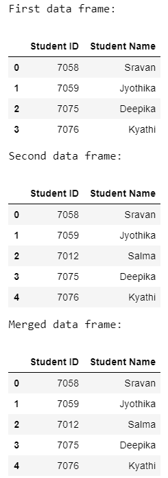
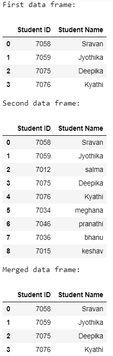

# 如何合并熊猫体内不同长度的数据帧？

> 原文:[https://www . geeksforgeeks . org/如何合并不同长度熊猫的数据帧/](https://www.geeksforgeeks.org/how-to-merge-dataframes-of-different-length-in-pandas/)

在本文中，我们将讨论如何在熊猫中合并两个不同长度的数据帧。可以使用 [merge()](https://www.geeksforgeeks.org/joining-two-pandas-dataframes-using-merge/) 方法完成。

**语法:**

> *数据帧合并(参数)*

以下是一些描述如何使用上述方法合并不同长度的数据帧的示例:

**例 1:**

下面是一个合并两个不同长度的学生数据帧的程序。

## 蟒蛇 3

```py
# importing pandas module

import pandas as pd

# create a list that contains 
# student id of subject 1
list1 = [7058, 7059, 7075, 7076]

# create a list that contains
# student id of subject 2
list2 = [7058, 7059, 7012, 7075, 7076]

# create a list that contains 
# student names of subject 1
list11 = ["Sravan", "Jyothika", "Deepika",
          "Kyathi"]

# create a list that contains 
# student names of subject 2
list22 = ["Sravan", "Jyothika", "Salma", 
          "Deepika", "Kyathi"]

# pass list1 and list11 to the
# dataframe1
dataframe1 = pd.DataFrame(
  {"Student ID": list1, "Student Name": list11})
print('First data frame:')
display(dataframe1)

# pass list2 and list22 to the
# dataframe1
dataframe2 = pd.DataFrame(
  {"Student ID": list2, "Student Name": list22})
print('Second data frame:')
display(dataframe2)

# apply merge function to merge the
# two dataframes
mergedf = dataframe2.merge(dataframe1, how='left')
print('Merged data frame:')
display(mergedf)
```

**输出:**



**例 2:**

这是另一个合并长度为 4 的一个数据帧和长度为 9 的另一个数据帧的程序。

## 蟒蛇 3

```py
# importing pandas module
import pandas as pd

# create a list that contains
# student id of subject 1
list1 = [7058, 7059, 7075, 7076]

# create a list that contains
# student id of subject 2
list2 = [7058, 7059, 7012, 7075, 7076,
         7034, 7046, 7036, 7015]

# create a list that contains
# student names of subject 1
list11 = ["Sravan", "Jyothika", "Deepika",
          "Kyathi"]

# create a list that contains
# student names of subject 2
list22 = ["Sravan", "Jyothika", "salma", 
          "Deepika", "Kyathi", "meghana",
          "pranathi", "bhanu", "keshav"]

# pass list1 and list11 to the
# dataframe1
dataframe1 = pd.DataFrame(
  {"Student ID": list1, "Student Name": list11})
print('First data frame:')
display(dataframe1)

# pass list2 and list22 to the 
# dataframe1
dataframe2 = pd.DataFrame(
  {"Student ID": list2, "Student Name": list22})
print('Second data frame:')
display(dataframe2)

# apply merge function to merge
# the two dataframes
mergedf = dataframe2.merge(dataframe1, how='inner')
print('Merged data frame:')
display(mergedf)
```

**输出:**

