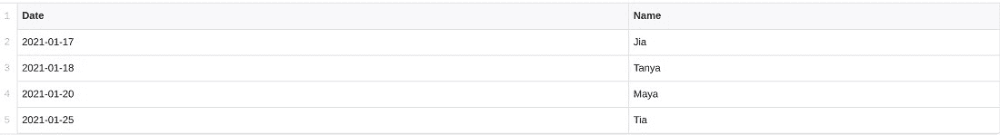
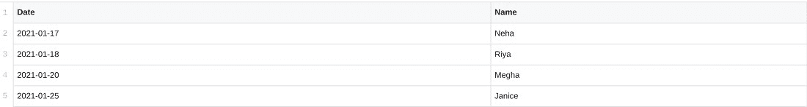
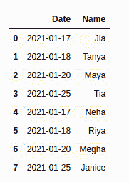
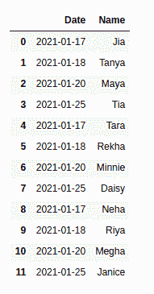

# 如何将多个 CSV 文件合并成一个 Pandas 数据帧？

> 原文:[https://www . geeksforgeeks . org/如何将多个-CSV-文件合并为单个-pandas-dataframe/](https://www.geeksforgeeks.org/how-to-merge-multiple-csv-files-into-a-single-pandas-dataframe/)

在数据分析过程中处理 CSV 文件时，我们经常需要处理大型数据集。有时，单个 CSV 文件可能不包含您需要的所有数据。在这种情况下，需要将这些文件合并到一个数据框中。幸运的是，熊猫库为我们提供了各种方法，如合并、串联和连接，使这成为可能。通过下面给出的例子，我们将学习如何使用 Pandas 组合 CSV 文件。

**使用的文件:**

**第一个猪瘟病毒–**



**第二个猪瘟病毒–**



**第三种猪瘟病毒–**


### **方法 1:按名称合并**

让我们首先了解上面给出的程序中使用的每种方法:

*   [**PD . concat():**](https://www.geeksforgeeks.org/pandas-concat-function-in-python/)**该方法沿行轴或列轴缝合提供的数据集。它将 dataframe 对象作为参数。除此之外，它还可以采用其他参数，如 axis、ignore_index 等。**
*   **[**map(function，iterable):**](https://www.geeksforgeeks.org/python-map-function/) 它为 iterable 中的每个项目执行指定的函数。在上面的例子中， *pd.read_csv()* 函数被应用于给定列表中的所有 csv 文件。**

****进场:****

*   **首先，我们进口熊猫。**
*   **使用 **pd.read_csv()** *(函数)，*map 函数读取我们已经通过的所有 csv 文件*(ITER ables)*。现在， **pd.concat()** 将这些映射的 CSV 文件作为参数，并沿着行轴将它们缝合在一起(默认)。如果我们希望沿着列水平合并它们，我们可以通过*轴=1* 。此外，*忽略 _ 索引=真*为合并的数据帧设置连续的索引值。**
*   **下面给出的图像显示了 mydata.csv、mydata1.csv 和合并的 dataframe。**

****示例:****

## **蟒蛇 3**

```
# importing pandas
import pandas as pd

# merging two csv files
df = pd.concat(
    map(pd.read_csv, ['mydata.csv', 'mydata1.csv']), ignore_index=True)
print(df)
```

****输出:****

****

### ****方法二:合并所有****

****进场:****

*   **[os.path.join()](https://www.geeksforgeeks.org/python-os-path-join-method/) 以文件路径为第一个参数，以要连接的路径组件为第二个参数。”*我的数据*。csv* 有助于返回*主目录*中以“mydata”开头和结尾的每个文件。CSV(使用通配符*)。**
*   ****glob.glob()** 获取这些连接的文件名，并返回所有这些文件的列表。在本例中，返回 *mydata.csv* 、 *mydata1.csv* 、*、*和 *mydata2.csv* 。**
*   **现在，就像前面的例子一样，这个文件列表被映射然后连接。**

**我们可以简单地将这三行代码写成:**

> **df = pd.concat(map(pd.read_csv，glob.glob(os.path.join("/home "，" mydata*)。csv "))、忽略 _ 索引=真)**

****示例:****

## **蟒蛇 3**

```
# importing libraries
import pandas as pd
import glob
import os

# merging the files
joined_files = os.path.join("/home", "mydata*.csv")

# A list of all joined files is returned
joined_list = glob.glob(joined_files)

# Finally, the files are joined
df = pd.concat(map(pd.read_csv, joined_list), ignore_index=True)
print(df)
```

****输出:****

****