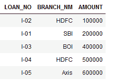
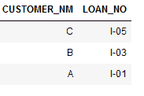
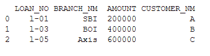
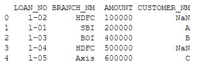
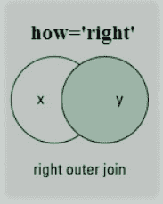

# 如何使用 Python 中的 Pandas 按特定列合并两个 csv 文件？

> 原文:[https://www . geesforgeks . org/如何按特定列合并两个 csv 文件-使用 python 熊猫/](https://www.geeksforgeeks.org/how-to-merge-two-csv-files-by-specific-column-using-pandas-in-python/)

在本文中，我们将讨论如何合并两个 CSV 文件熊猫库中有一个函数 *pandas.merge()* 。合并只意味着根据公共属性或列将两个数据集合并成一个数据集。

> **语法:** pandas.merge()
> 
> ***参数:***
> 
> *   **数据 1、数据 2:** 用于合并的数据帧。
> *   ***如何:** { '左'，'右'，'外'，'内' }，默认'内'*
> *   ***开:**标签或列表*
> 
> ***返回:*** *两个合并对象的数据帧。*

### 合并有 4 种类型。

*   内部的
*   左边的
*   对吧
*   外面的

我们将使用以下两个 csv 文件，即[贷款. csv](https://drive.google.com/file/d/18ZiMzAUjdR5lwhI3ilq_TKhp_XS86x6t/view) 和[借款人. csv](https://drive.google.com/file/d/1C8daCIiqCy5891r39yoO22NWkvsZ0nAj/view) 来执行所有操作:

 

### 内部连接

通过设置 *how=“内部*”，它将根据指定的列合并两个数据帧，然后返回新的数据帧，该数据帧只包含在两个原始数据帧中具有匹配值的行。


**代码:**

## 蟒蛇 3

```py
import pandas as pd

# reading two csv files
data1 = pd.read_csv('datasets/loan.csv')
data2 = pd.read_csv('datasets/borrower.csv')

# using merge function by setting how='inner'
output1 = pd.merge(data1, data2, 
                   on='LOAN_NO', 
                   how='inner')

# displaying result
print(output1)
```

**输出:**



### 左外连接

通过设置 *how='left'* ，它将基于指定的列合并两个数据帧，然后返回包含左数据帧中所有行的新数据帧，包括那些在右数据帧中也没有值的行，并将右数据帧列值设置为 NAN。


**代码:**

## 蟒蛇 3

```py
import pandas as pd

# reading csv files
data1 = pd.read_csv('datasets/loan.csv')
data2 = pd.read_csv('datasets/borrower.csv')

# using merge function by setting how='left'
output2 = pd.merge(data1, data2, 
                   on='LOAN_NO', 
                   how='left')

# displaying result
print(output2)
```

**输出:**



### 右外连接

通过设置 how='right '，它将根据指定的列合并两个数据帧，然后返回包含来自右侧数据帧的所有行的新数据帧，包括那些在左侧数据帧中没有值的行，并将左侧数据帧的列值设置为 NAN。



**代码:**

## 蟒蛇 3

```py
import pandas as pd

# reading csv files
data1 = pd.read_csv('datasets/loan.csv')
data2 = pd.read_csv('datasets/borrower.csv')

# using merge function by setting how='right'
output3 = pd.merge(data1, data2,
                   on='LOAN_NO',
                   how='right')

# displaying result
print(output3)
```