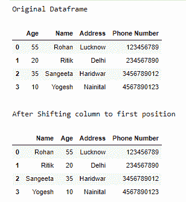
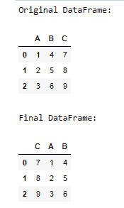

# 如何在熊猫数据框中将一列移动到第一位置？

> 原文:[https://www . geesforgeks . org/如何将一列移动到熊猫第一位置-数据框/](https://www.geeksforgeeks.org/how-to-move-a-column-to-first-position-in-pandas-dataframe/)

**先决条件** : [熊猫](https://www.geeksforgeeks.org/pandas-tutorial/)

移动 pandas 数据框中的一列的基本思想是将该列从其当前位置移除，并将其插入所需位置。熊猫库提供了很多有用的功能，比如 [pop()](https://www.geeksforgeeks.org/python-pandas-dataframe-pop/) 和 [insert()](https://www.geeksforgeeks.org/python-pandas-dataframe-insert/) 。我们将利用这两个函数来操纵我们的数据帧。

**使用的功能:**

*   熊猫 **Pop()** 方法在大部分数据结构中都很常见，但是 *pop()* 方法与其他方法略有不同。在堆栈中，pop 不需要任何参数，每次都会弹出最后一个元素。但是 pandas pop 方法可以从数据框中输入一列，然后直接弹出。

> ***语法:**数据框. pop(项目)*
> 
> ***参数:***
> 
> *   ***项:**字符串中要弹出的列名*
> 
> ***返回类型:**以熊猫系列*的形式弹出列

*   Pandas insert()方法允许用户在数据框或系列(一维数据框)中插入一列。

> **语法:**
> 
> DataFrameName.insert(loc，列，值，allow_duplicates = False)
> 
> **参数:**
> 
> *   ***loc:** loc 是一个整数，它是我们要插入新列的列的位置。这会将该位置的现有列向右移动。*
> *   ***列:**列是一个字符串，是要插入的列的名称。*
> *   ***值:**值就是要插入的值。它可以是 int、string、float 或任何东西，甚至可以是值的序列/列表。仅提供一个值将为所有行设置相同的值。*
> *   ***Allow _ duplicates:**Allow _ duplicates 是一个布尔值，它检查同名列是否已经存在。*

**进场:**

*   导入模块
*   创建或加载数据帧
*   使用 pop()函数删除数据框中需要移到第一个位置的列。
*   使用 Insert()函数在第一个位置插入列。
*   打印数据帧。

让我们通过下面的例子来理解上面的方法:

**例 1:**

## 蟒蛇 3

```py
import pandas as pd

# define data
data = {'Age': [55, 20, 35, 10], 'Name': ['Rohan', 'Ritik', 'Sangeeta', 'Yogesh'], 
        'Address': ['Lucknow', 'Delhi', 'Haridwar', 'Nainital'], 
        'Phone Number': [123456789, 234567890, 3456789012, 4567890123]}

# create dataframe
df = pd.DataFrame(data)

# print original dataframe
print("Original Dataframe")
display(df)

# shift column 'Name' to first position
first_column = df.pop('Name')

# insert column using insert(position,column_name,
# first_column) function
df.insert(0, 'Name', first_column)

print()
print("After Shifting column to first position")
display(df)
```

**输出:**



**例 2:**

## 蟒蛇 3

```py
import pandas as pd

# define data
data = {'A': [1, 2, 3], 'B': [4, 5, 6], 'C': [7, 8, 9]}

# create dataframe
df = pd.DataFrame(data)

print("Original DataFrame:")
display(df)

# shift column 'C' to first position
first_column = df.pop('C')

# insert column using insert(position,column_name,first_column) function
df.insert(0, 'C', first_column)

print()
print("Final DataFrame")
display(df)
```

**输出:**

