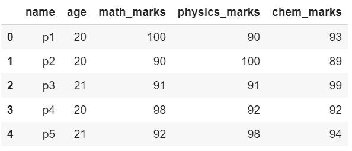
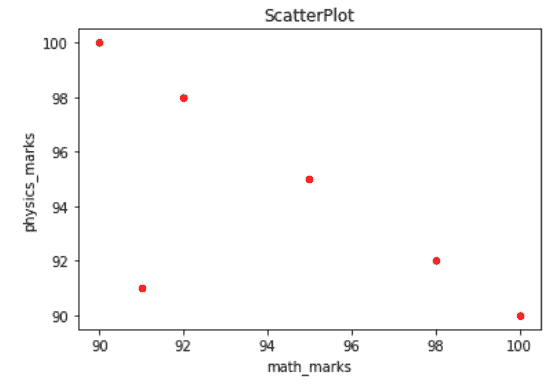
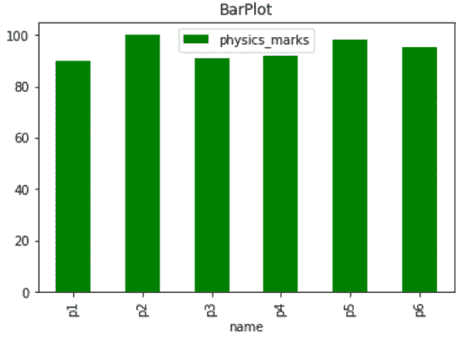
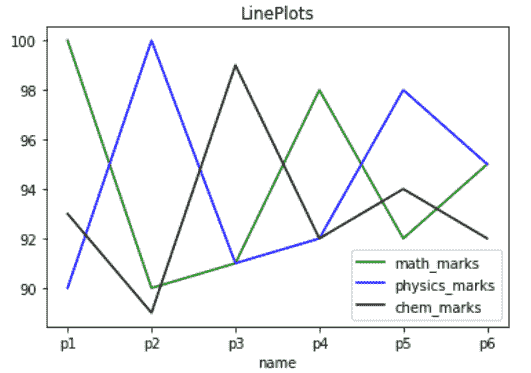

# 如何使用熊猫绘制数据帧？

> 原文:[https://www . geeksforgeeks . org/如何使用熊猫绘制数据框/](https://www.geeksforgeeks.org/how-to-plot-a-dataframe-using-pandas/)

[**熊猫**](https://www.geeksforgeeks.org/introduction-to-pandas-in-python/) 是数据科学中使用的最流行的 Python 包之一。熊猫提供了强大而灵活的数据结构(**数据框架&系列**)来操作和分析数据。可视化是解释数据的最佳方式。

Python 有很多流行的绘图库，可以轻松实现可视化。其中一些是**matplotlib****seaborn**和 **plotly** 。它与 matplotlib 有很好的集成。我们可以使用**绘图()**方法绘制数据框。但我们需要一个数据框架来绘制。我们可以通过向熊猫库的 **DataFrame()** 方法传递一个字典来创建一个数据框架。

让我们创建一个简单的数据帧:

## 计算机编程语言

```
# importing required library
# In case pandas is not installed on your machine
# use the command 'pip install pandas'. 
import pandas as pd
import matplotlib.pyplot as plt

# A dictionary which represents data
data_dict = { 'name':['p1','p2','p3','p4','p5','p6'],
              'age':[20,20,21,20,21,20],
              'math_marks':[100,90,91,98,92,95],
              'physics_marks':[90,100,91,92,98,95],
              'chem_marks' :[93,89,99,92,94,92]
              }

# creating a data frame object
df = pd.DataFrame(data_dict)

# show the dataframe
# bydefault head() show 
# first five rows from top
df.head()
```

**输出:**



## 情节

有许多图表可以用来解释数据。每个图表都有其用途。一些图是条形图、散点图和直方图等。

#### 散点图:

为了获得数据帧的散点图，我们所要做的就是通过指定一些参数来调用 **plot()** 方法。

```
kind='scatter',x= 'some_column',y='some_colum',color='somecolor'

```

## 蟒蛇 3

```
# scatter plot
df.plot(kind = 'scatter',
        x = 'math_marks',
        y = 'physics_marks',
        color = 'red')

# set the title
plt.title('ScatterPlot')

# show the plot
plt.show()
```

**输出:**



有很多种方式来定制剧情这是最基本的一种。

#### 酒吧情节：

同样，我们也要为 **plot()** 方法指定一些参数，才能得到条形图。

```
kind='bar',x= 'some_column',y='some_colum',color='somecolor'

```

## 蟒蛇 3

```
# bar plot
df.plot(kind = 'bar',
        x = 'name',
        y = 'physics_marks',
        color = 'green')

# set the title
plt.title('BarPlot')

# show the plot
plt.show()
```

**输出:**



#### 线图:

单列的线图并不总是有用的，为了获得更多的见解，我们必须在同一张图上绘制多列。为此，我们必须重复使用斧头。

> kind='line '，x= 'some_column '，y = ' some _ column '，color='somecolor '，ax='someaxes'

## 蟒蛇 3

```
#Get current axis
ax = plt.gca() 

# line plot for math marks
df.plot(kind = 'line',
        x = 'name',
        y = 'math_marks',
        color = 'green',ax = ax)

# line plot for physics marks
df.plot(kind = 'line',x = 'name',
        y = 'physics_marks',
        color = 'blue',ax = ax)

# line plot for chemistry marks
df.plot(kind = 'line',x = 'name',
        y = 'chem_marks',
        color = 'black',ax = ax)

# set the title
plt.title('LinePlots')

# show the plot
plt.show()
```

**输出:**

