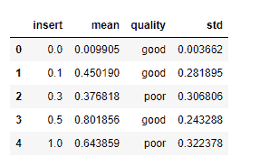

# 如何绘制熊猫的平均值和标准差？

> 原文:[https://www . geeksforgeeks . org/如何绘制熊猫平均值和标准偏差/](https://www.geeksforgeeks.org/how-to-plot-mean-and-standard-deviation-in-pandas/)

**误差线**是指数据框中包含的误差的图表，显示了一组测量值或计算值的置信度&精度。误差线有助于显示实际和准确的缺失部分，并直观地显示数据框中不同区域的误差。误差线是一种描述性的行为，它包含了关于数据差异的信息，以及进行适当更改的建议，以构建对用户更有洞察力和影响力的数据。

在这里，我们讨论如何在将数据框与特定应用条件分组后，用平均值和标准偏差绘制误差线，以便误差变得更真实，从而获得最佳结果和可视化效果。

**所需模块:**

```py
pip install numpy
pip install pandas
pip install matplotlib
```

这里是数据框，我们用平均值和标准值
来说明误差线

## 蟒蛇 3

```py
# Import the necessary libraries to read
# dataset and work on that
import pandas as pd
import numpy as np
import matplotlib.pyplot as plt

# Make the dataframe for evaluation on Errorbars
df = pd.DataFrame({
    'insert': [0.0, 0.1, 0.3, 0.5, 1.0],
    'mean': [0.009905, 0.45019, 0.376818, 0.801856, 0.643859],
    'quality': ['good', 'good', 'poor', 'good', 'poor'],
    'std': [0.003662, 0.281895, 0.306806, 0.243288, 0.322378]})

print(df)
```

**输出:**



**样本数据框**

用平均值和标准值分组子图以获得误差线:

## 蟒蛇 3

```py
# Subplots as having two types of quality
fig, ax = plt.subplots()

for key, group in df.groupby('quality'):
    group.plot('insert', 'mean', yerr='std',
               label=key, ax=ax)

plt.show()
```