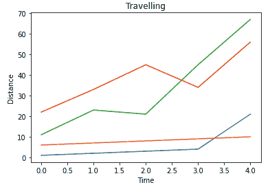
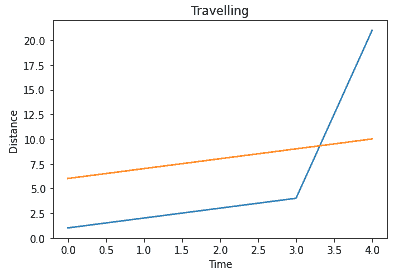

# 如何从熊猫数据帧中绘制多个系列？

> 原文:[https://www . geeksforgeeks . org/如何从一只熊猫绘制多个系列-数据框/](https://www.geeksforgeeks.org/how-to-plot-multiple-series-from-a-pandas-dataframe/)

在本文中，我们将讨论如何从熊猫的数据帧中绘制多个系列。

Series 是包含整数点的数据范围，我们可以使用 plot()函数在 pandas 数据框中绘制这些整数点

**语法**:

```
matplotlib.pyplot(dataframe['column_name'])
```

我们可以放置 n 个系列，我们必须调用 show()函数来显示该图

**示例 1** :创建四个数据帧并绘制的 Python 代码

## 蟒蛇 3

```
#import matplotlib
import matplotlib.pyplot as plt

# import pandas module
import pandas as pd

# create a dataframe with four columns
data = pd.DataFrame({'data1': [1, 2, 3, 4, 21], 
                     'data2': [6, 7, 8, 9, 10], 
                     'data3': [11, 23, 21, 45, 67],
                     'data4': [22, 33, 45, 34, 56]})

# plot one by one
plt.plot(data['data1'])
plt.plot(data['data2'])
plt.plot(data['data3'])
plt.plot(data['data4'])

# set y label
plt.ylabel('Distance')

# set x label
plt.xlabel('Time')

# set title
plt.title('Travelling')

# display plot
plt.show()
```

**输出**:



**示例 2:** 用数据框中的两列绘图

## 蟒蛇 3

```
#import matplotlib
import matplotlib.pyplot as plt

# import pandas module
import pandas as pd

# create a dataframe with two columns
data = pd.DataFrame({'data1': [1, 2, 3, 4, 21],
                     'data2': [6, 7, 8, 9, 10]})

# plot one by one
plt.plot(data['data1'])
plt.plot(data['data2'])

# set y label
plt.ylabel('Distance')

# set x label
plt.xlabel('Time')

# set title
plt.title('Travelling')

# display plot
plt.show()
```

**输出**:

