# 如何使用熊猫绘制基于时间序列的图表？

> 原文:[https://www . geeksforgeeks . org/如何使用熊猫绘制基于时间序列的图表/](https://www.geeksforgeeks.org/how-to-plot-timeseries-based-charts-using-pandas/)

在一段时间内收集的一系列按时间索引的数据点称为时间序列数据。这些观测记录在连续等间隔的时间点上。例如，心电信号、脑电信号、股票市场、天气数据等。，所有这些都是按时间索引并在一段时间内记录的。分析这些数据，并预测未来的观测结果，具有更广泛的研究范围。

在本文中，我们将看到如何使用 Python 中的熊猫库实现 EDA——探索性数据分析。我们将尝试通过使用 matplotlib.pyplot、seaborn、statsmodels 和更多包绘制各种图表来推断特定时间段内数据的性质。

为了便于理解这些图和其他函数，我们将创建一个 16 行 5 列的样本数据集，其中包括日期、A、B、C、D 和 E 列。

## 蟒蛇 3

```
import pandas as pd

# Sample data which will be used
# to create the dataframe
sample_timeseries_data = {

    'Date': ['2020-01-25', '2020-02-25',
             '2020-03-25', '2020-04-25',
             '2020-05-25', '2020-06-25',
             '2020-07-25', '2020-08-25',
             '2020-09-25', '2020-10-25',
             '2020-11-25', '2020-12-25',
             '2021-01-25', '2021-02-25',
             '2021-03-25', '2021-04-25'],

    'A': [102, 114, 703, 547,
          641, 669, 897, 994,
          1002, 974, 899, 954,
          1105, 1189, 1100, 934],

    'B': [1029, 1178, 723, 558,
          649, 669, 899, 1000,
          1012, 984, 918, 959,
          1125, 1199, 1109, 954],

      'C': [634, 422,152, 23,
         294, 1452, 891, 990,
         924, 960, 874, 548,
         174, 49, 655, 914],

      'D': [1296, 7074, 3853, 4151,
         2061, 1478, 2061, 3853,
         6379, 2751, 1064, 6263,
         2210, 6566, 3918, 1121],

    'E': [10, 17, 98, 96,
          85, 89, 90, 92,
          86, 84, 78, 73,
          71, 65, 70, 60]
}

# Creating a dataframe using pandas
# module with Date, A, B, C, D and E
# as columns.
dataframe = pd.DataFrame(
  sample_timeseries_data,columns=[
    'Date', 'A', 'B', 'C', 'D', 'E'])

# Changing the datatype of Date, from
# Object to datetime64
dataframe["Date"] = dataframe["Date"].astype("datetime64")

# Setting the Date as index
dataframe = dataframe.set_index("Date")
dataframe
```

**输出:**

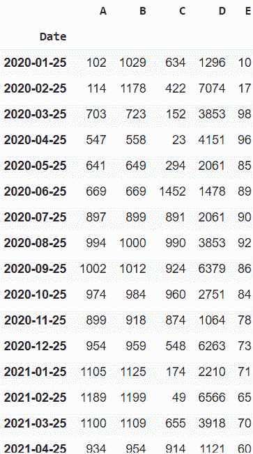

样本时间序列数据框

## **绘制时间序列数据**

### **绘制**基于时间序列的**线图:**

折线图用于表示不同轴上两个数据 X 和 Y 之间的关系。

> **语法:**PLT . PLT(x)

**例 1:** 本图为 2020 年 1 月至 2020 年 4 月 A 栏数值的变化。请注意，总体而言，这些值呈积极趋势，但在整个过程中会有起伏。

## 蟒蛇 3

```
import matplotlib.pyplot as plt

# Using a inbuilt style to change
# the look and feel of the plot
plt.style.use("fivethirtyeight")

# setting figure size to 12, 10
plt.figure(figsize=(12, 10))

# Labelling the axes and setting
# a title
plt.xlabel("Date")
plt.ylabel("Values")
plt.title("Sample Time Series Plot")

# plotting the "A" column alone
plt.plot(dataframe["A"])
```

**输出:**

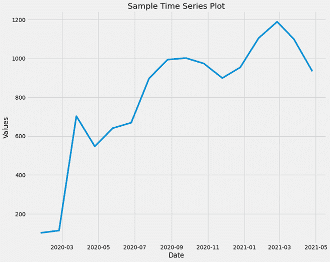

样本时间序列图

**示例 2:** 绘制所有变量。

## 蟒蛇 3

```
plt.style.use("fivethirtyeight")
dataframe.plot(subplots=True, figsize=(12, 15))
```

**输出:**

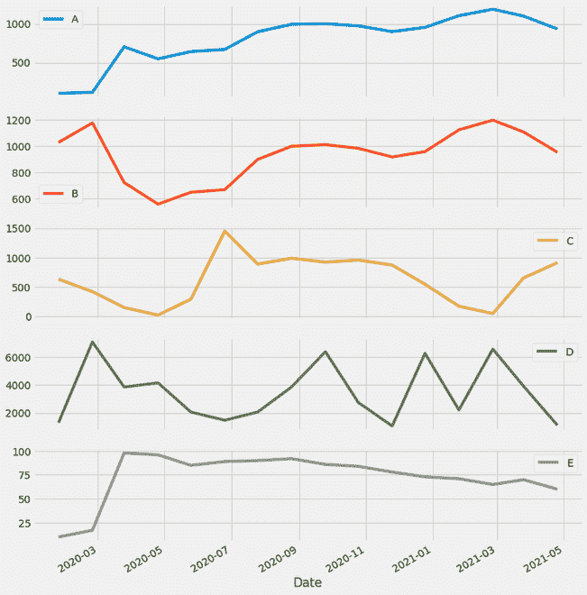

绘制所有时间序列数据列

### **绘制**基于时间序列的**条形图:**

条形图或条形图是一种用矩形条表示数据类别的图形，矩形条的长度和高度与它们所表示的值成比例。条形图可以水平或垂直绘制。条形图描述了离散类别之间的比较。图中的一个轴代表被比较的特定类别，而另一个轴代表对应于这些类别的测量值。

> **语法:** plt.bar(x，高度，宽度，底部，对齐)

该条形图表示“A”列值的变化。这可以用来比较未来值和快速值。

## 蟒蛇 3

```
import matplotlib.pyplot as plt

# Using a inbuilt style to change
# the look and feel of the plot
plt.style.use("fivethirtyeight")

# setting figure size to 12, 10
plt.figure(figsize=(15, 10))

# Labelling the axes and setting a
# title
plt.xlabel("Date")
plt.ylabel("Values")
plt.title("Bar Plot of 'A'")

# plotting the "A" column alone
plt.bar(dataframe.index, dataframe["A"], width=5)
```

**输出:**

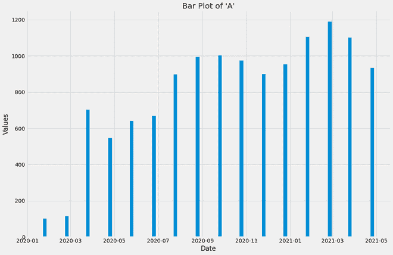

“A”列的条形图

### **绘制**基于时间序列的**滚动平均值图:**

从数据帧的开头滑动到结尾的 n 尺寸窗口的平均值称为滚动平均值。如果窗口没有 n 个观察值，则返回 NaN。

> **语法:**熊猫。DataFrame.rolling(n)。平均值()

**示例:**

## 蟒蛇 3

```
dataframe.rolling(window = 5).mean()
```

**输出:**

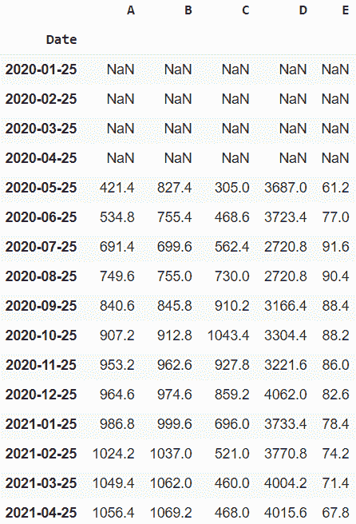

数据帧的滚动方式

**在这里，我们用滚动的方式绘制时间序列图:**

## 蟒蛇 3

```
import matplotlib.pyplot as plt

# Using a inbuilt style to change
# the look and feel of the plot
plt.style.use("fivethirtyeight")

# setting figure size to 12, 10
plt.figure(figsize=(12, 10))

# Labelling the axes and setting
# a title
plt.xlabel("Date")
plt.ylabel("Values")
plt.title("Values of 'A' and Rolling Mean (2) Plot")

# plotting the "A" column and "A" column
# of Rolling Dataframe (window_size  = 20)
plt.plot(dataframe["A"])
plt.plot(dataframe.rolling(
  window=2, min_periods=1).mean()["A"])
```

**输出:**

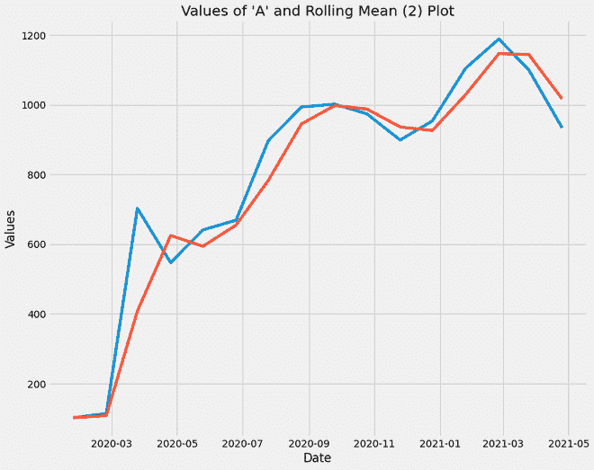

滚动平均图

**说明:**

*   蓝色绘图线代表原始“A”列值，而红色绘图线代表窗口大小= 2 的“A”列值的滚动平均值
*   通过这个图，我们推断时间序列数据的滚动平均值返回的值波动较小。情节的趋势被保留，但不重要的不必要的起伏被丢弃。
*   用于绘制时间序列数据的分解图、箱线图分析等。，最好使用滚动平均值数据框，这样波动就不会影响分析，尤其是在预测趋势时。

### **时间序列分解:**

它在同一个图中显示了观察结果和这四个元素:

*   **趋势成分:**它显示了跨越不同季节的数据模式。它代表 2 年期间“A”值的变化，没有波动。
*   **季节成分:**该图显示了‘A’值的起伏，即反复出现的正常变化。
*   **剩余成分:**这是将‘A’值数据分解为趋势和季节成分后的剩余成分。
*   **观测分量:**该趋势和一个季节分量可用于研究各种目的的数据。

**示例:**

## 蟒蛇 3

```
import statsmodels.api as sm
from pylab import rcParams
import pandas as pd
import matplotlib.pyplot as plt
import seaborn as sns

# Separating the Date Component into
# Year and Month
dataframe['Date'] = dataframe.index
dataframe['Year'] = dataframe['Date'].dt.year
dataframe['Month'] = dataframe['Date'].dt.month

# using inbuilt style
plt.style.use("fivethirtyeight")

# Creating a dataframe with "Date" and "A"
# columns only. This dataframe is date indexed
decomposition_dataframe = dataframe[['Date', 'A']].copy()
decomposition_dataframe.set_index('Date', inplace=True)
decomposition_dataframe.index = pd.to_datetime(decomposition_dataframe.index)

# using sm.tsa library, we are plotting the
# seasonal decomposition of the "A" column
# Multiplicative Model : Y[t] = T[t] * S[t] * R[t]
decomposition = sm.tsa.seasonal_decompose(decomposition_dataframe,
                                          model='multiplicative', freq=5)
decomp = decomposition.plot()
decomp.suptitle('"A" Value Decomposition')

# changing the runtime configuration parameters to
# have a desired plot of desired size, etc
rcParams['figure.figsize'] = 12, 10
rcParams['axes.labelsize'] = 12
rcParams['ytick.labelsize'] = 12
rcParams['xtick.labelsize'] = 12
```

**输出:**

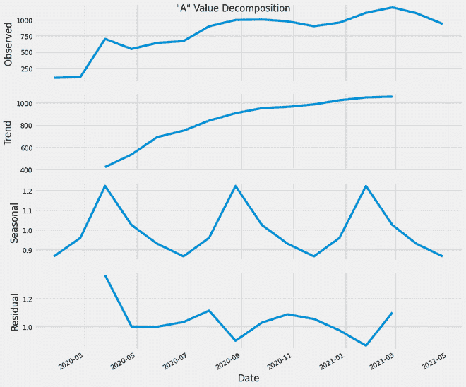

价值分解

### **绘制**基于时间序列的**自相关图:**

它是一种常用的工具，用于检查数据集中的随机性。这种随机性是通过计算不同时滞下数据值的自相关来确定的。它显示了一种称为时间序列的数据类型的属性。大多数通用统计软件程序中都有这些图。可以使用 pandas . ploting .自相关 _plot()来绘制。

> **语法:**pandas . ploting .自相关 _plot(series，ax=None，**kwargs)
> 
> **参数:**
> 
> *   系列:此参数是用于绘图的时间系列。
> *   ax:该参数是 matplotlib axes 对象。其默认值为“无”。
> 
> **返回:**该函数返回 matplotlip.axis.Axes 类的对象

考虑到趋势、季节性、周期性和残差，该图显示了时间序列数据的当前值与先前值的关系。我们可以看到，很大一部分线显示出与时间的有效相关性，我们可以使用这样的相关性图来研究时间序列数据的内部相关性。

**代码:**

## 蟒蛇 3

```
from pandas.plotting import autocorrelation_plot

autocorrelation_plot(dataframe['A'])
```

**输出:**

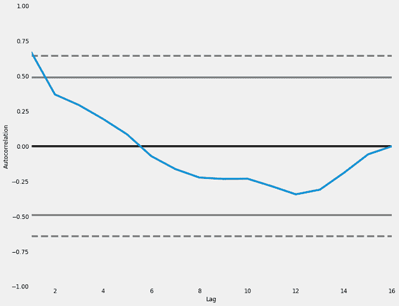

自相关图

### **绘制**基于时间序列的**方框图:**

箱线图是通过四分位数描绘数字数据组的视觉表示。Boxplot 也用于检测数据集中的异常值。它通过一个简单的方框和触须高效地捕获数据摘要，并允许我们轻松地跨组进行比较。Boxplot 使用第 25 个、第 50 个和第 75 个百分位数汇总样本数据。

> **语法:**seaborn . box plot(x =无，y =无，色相=无，数据=无，顺序=无，色相 _ 顺序=无，方向=无，颜色=无，调色板=无，饱和度=0.75，宽度=0.8，减淡=真，飞度=5，线宽=无，whis=1.5，ax =无，**kwargs)
> 
> **参数:**
> **x，y，色相:**用于绘制长格式数据的输入。
> **数据:**用于绘图的数据集。如果 x 和 y 不存在，这被解释为宽形。
> **颜色:**所有元素的颜色。
> 
> **返回:**返回绘制了绘图的坐标轴对象。

在这里，通过这些图，我们将能够获得对每年(按年方框图)和每月(按月方框图)的“A”值范围的直觉。此外，通过逐月箱线图，我们可以观察到，与其他月份相比，1 月和 2 月的值范围略高。

## 蟒蛇 3

```
# Splitting the plot into (1,2) subplots
# and initializing them using fig and ax
# variables
fig, ax = plt.subplots(nrows=1, ncols=2,
                       figsize=(15, 6))

# Using Seaborn Library for Box Plot
sns.boxplot(dataframe['Year'],
            dataframe["A"], ax=ax[0])

# Defining the title and axes names
ax[0].set_title('Year-wise Box Plot for A',
                fontsize=20, loc='center')
ax[0].set_xlabel('Year')
ax[0].set_ylabel('"A" values')

# Using Seaborn Library for Box Plot
sns.boxplot(dataframe['Month'],
            dataframe["A"], ax=ax[1])

# Defining the title and axes names
ax[1].set_title('Month-wise Box Plot for A',
                fontsize=20, loc='center')
ax[1].set_xlabel('Month')
ax[1].set_ylabel('"A" values')

# rotate the ticks and right align them
fig.autofmt_xdate()
```

**输出:**

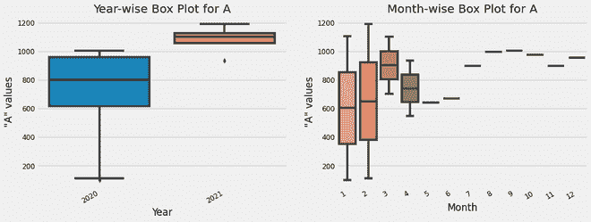

“A”列值的箱线图分析

### **班次分析:**

该图通过将“A”列的当前值除以“A”列的偏移值来实现。默认偏移是一个值。该图用于分析每日的价值稳定性。

## 蟒蛇 3

```
dataframe['Change'] = dataframe.A.div(dataframe.A.shift())
dataframe['Change'].plot(figsize=(15, 10),
                         xlabel = "Date",
                         ylabel = "Value Difference",
                         title = "Shift Plot")
```

**输出:**

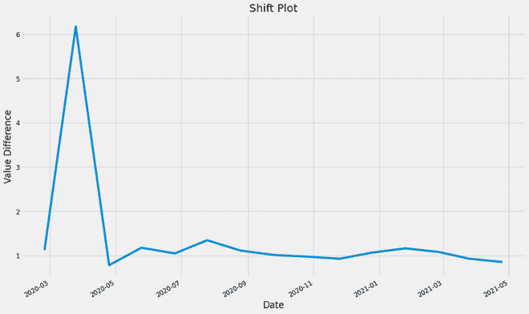

“A”值的移位图

### **绘制**基于时间序列的**热图:**

我们可以解释“A”列值在 12 个月内抽样年份的趋势，不同年份值的变化等。我们还可以从平均值推断出这些值是如何变化的。这张热图非常有用。这张热图显示了不同年份和月份的温度变化，用彩色图进行了区分。

## 蟒蛇 3

```
import calendar
import seaborn as sns
import pandas as pd

dataframe['Date'] = dataframe.index

# Splitting the Date into Year and Month
dataframe['Year'] = dataframe['Date'].dt.year
dataframe['Month'] = dataframe['Date'].dt.month

# Creating a Pivot Table with "A"
# column values and is Month indexed.
table_df = pd.pivot_table(dataframe, values=["A"],
                                   index=["Month"],
                                   columns=["Year"],
                                   fill_value=0,
                                   margins=True)

# Naming the index, can be generated
# using calendar.month_abbr[i]
mon_name = [['Jan', 'Feb', 'Mar', 'Apr',
             'May', 'Jun', 'Jul', 'Aug',
             'Sep','Oct', 'Nov', 'Dec', 'All']]

# Indexing using Month Names
table_df = table_df.set_index(mon_name)

# Creating a heatmap using sns with Red,
# Yellow & Green Colormap.
ax = sns.heatmap(table_df, cmap='RdYlGn_r',
                 robust=True, fmt='.2f',
                 annot=True, linewidths=.6,
                 annot_kws={'size':10},
                 cbar_kws={'shrink':.5,
                           'label':'"A" values'})                      

# Setting the Tick Labels, Title and x & Y labels
ax.set_yticklabels(ax.get_yticklabels())
ax.set_xticklabels(ax.get_xticklabels())
plt.title('"A" Value Analysis', pad=14)
plt.xlabel('Year')
plt.ylabel('Months')
```

**输出:**

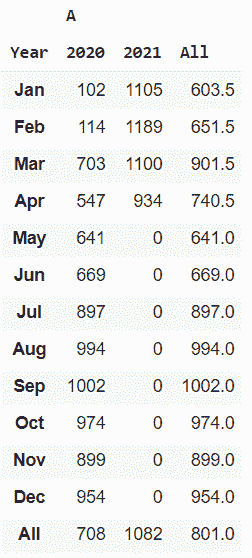

“A”列的热图表

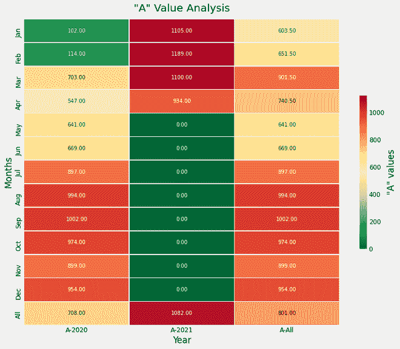

“A”列值的热图图