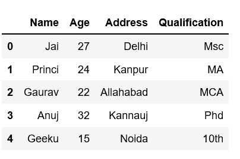

# 如何从熊猫数据框中随机选择行

> 原文:[https://www . geeksforgeeks . org/如何从熊猫数据框中随机选择行/](https://www.geeksforgeeks.org/how-to-randomly-select-rows-from-pandas-dataframe/)

我们来讨论一下如何从熊猫[数据框](https://www.geeksforgeeks.org/python-pandas-dataframe/)中随机选择行。从数据框中随机选择行可以通过不同的方式实现。
用列表字典创建一个简单的数据框架。

## 蟒蛇 3

```
# Import pandas package
import pandas as pd

# Define a dictionary containing employee data
data = {'Name':['Jai', 'Princi', 'Gaurav', 'Anuj', 'Geeku'],
        'Age':[27, 24, 22, 32, 15],
        'Address':['Delhi', 'Kanpur', 'Allahabad', 'Kannauj', 'Noida'],
        'Qualification':['Msc', 'MA', 'MCA', 'Phd', '10th']}

# Convert the dictionary into DataFrame
df = pd.DataFrame(data)

# select all columns
df
```



**方法#1:使用** [**样本()**](https://www.geeksforgeeks.org/python-pandas-dataframe-sample/) **方法**

> Sample 方法从一个对象轴返回一个随机的项目样本，这个对象与调用者的类型相同。

**例 1:**

## 蟒蛇 3

```
# Selects one row randomaly using sample()
# without give any parameters.

# Import pandas package
import pandas as pd

# Define a dictionary containing employee data
data = {'Name':['Jai', 'Princi', 'Gaurav', 'Anuj', 'Geeku'],
        'Age':[27, 24, 22, 32, 15],
        'Address':['Delhi', 'Kanpur', 'Allahabad', 'Kannauj', 'Noida'],
        'Qualification':['Msc', 'MA', 'MCA', 'Phd', '10th']}

# Convert the dictionary into DataFrame
df = pd.DataFrame(data)

# Select one row randomaly using sample()
# without give any parameters
df.sample()
```

**输出:**


**例 2:** 使用参数 *n* ，随机选择 *n* 行数。
使用样本(n)或样本(n=n)随机选择 *n* 个行数。每次运行这个，你会得到 n 个不同的行。

## 蟒蛇 3

```
# To get 3 random rows
# each time it gives 3 different rows

# df.sample(3) or
df.sample(n = 3)
```