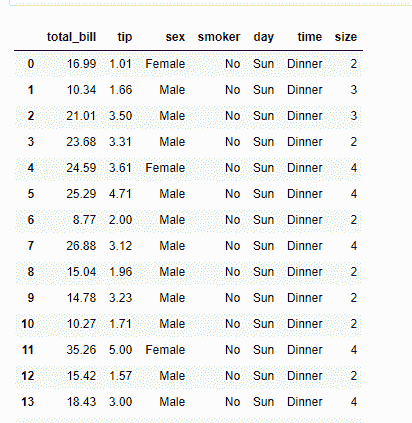

# 如何将 CSV 文件读入熊猫自定义分隔符的数据帧？

> 原文:[https://www . geesforgeks . org/how-read-a-CSV-file-to-a-data frame-带自定义分隔符的熊猫/](https://www.geeksforgeeks.org/how-to-read-a-csv-file-to-a-dataframe-with-custom-delimiter-in-pandas/)

由于以数据为中心的 Python 包的惊人生态系统，python 是进行数据分析的好语言。[熊猫](https://www.geeksforgeeks.org/python-pandas-dataframe/)包就是其中之一，让导入和分析数据变得容易多了。
在这里，我们将讨论如何将 csv 文件加载到 Dataframe 中。这是用的方法完成的。我们要导入**熊猫**库才能使用这个方法。

> **语法:**PD . read _ CSV(file path _ or _ buffer，sep= '，'，分隔符=无，标头= '推断'，名称=无，index _ col =无，usecols =无，挤压=假，前缀=无，mangle _ dupe _ cols =真，dtype =无，引擎=无，转换器=无，true _ values =无，false _ values =无，skipinitialspace =假，skiprows =无，nrows =无，na _ values =无，keep_default_na，lineterminator =无，quotechar= ' " '，引号=0，转义符=无，注释=无，编码=无，方言=无，tupleize _ cols =无，error _ bad _ lines =真，warn _ bad _ lines =真，skipfooter=0，doublequote =真，delim _ 空白=假，low _ memory =真，memory _ map =假，float _ precision =无 **)**

下面给出了一些有用的参数:

<figure class="table">

| 参数 | 使用 |
| --- | --- |
| 文件路径或缓冲区 | 文件的网址或目录位置 |
| 九月 | 代表分隔符，默认值为'，'，如 csv 格式(逗号分隔值) |
| 索引 _ 列 | 此参数用于将传递列作为索引，而不是 0，1，2，3…r |
| 页眉 | 此参数用于将传递行[int/int list]作为标题 |
| 使用 _cols | 此参数是仅使用传递的列[字符串列表]来制作数据框 |
| 挤压 | 如果为真，并且只传递了一列，则返回熊猫系列 |
| skip prows | 此参数用于跳过新数据框中传递行 |
| 滑雪运动员 | 该参数用于跳过文件底部行数 |

</figure>

此方法使用逗号'，'作为默认分隔符，但我们也可以使用自定义分隔符或正则表达式作为分隔符。
下载 csv 文件[点击此处](https://drive.google.com/drive/folders/13I1uEBwx5dbq4jLP-qYMfmY5TsxQrVoZ?usp=sharing)
**示例 1 :** 使用默认分隔符即逗号(，
的 read_csv()方法

## 蟒蛇 3

```py
# Importing pandas library
import pandas as pd

# Using the function to load
# the data of example.csv
# into a Dataframe df
df = pd.read_csv('example1.csv')

# Print the Dataframe
df
```

**输出:**



**示例 2:** 使用 read_csv()方法，并使用“_”作为自定义分隔符。

## 蟒蛇 3

```py
# Importing pandas library
import pandas as pd

# Load the data of example.csv
# with '_' as custom delimiter
# into a Dataframe df
df = pd.read_csv('example2.csv',
                   sep = '_',
                   engine = 'python')

# Print the Dataframe
df
```