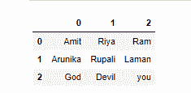

# 如何读取带有 Pandas 的没有头的 csv 文件？

> 原文:[https://www . geeksforgeeks . org/how-read-CSV-file-with-pandas-not-header/](https://www.geeksforgeeks.org/how-to-read-csv-file-with-pandas-without-header/)

**先决条件:**T2】熊猫

CSV 文件的标题是分配给每个列的值的数组。它充当数据的行标题。这篇文章讨论了如何使用 pandas 读取一个没有头文件的 csv 文件。为此，在读取文件时，应将标题属性设置为“无”。

**语法:**

> read_csv(“文件名”，标题=无)

### 方法

*   导入模块
*   读取文件
*   将标题设置为无
*   显示数据

让我们首先看看数据是如何用标题显示的，以使区别非常清楚。

**使用的数据文件:**

*   [file.csv](https://drive.google.com/file/d/1uF-7cTvBPGgmuCUF7ev5pmpnRtE8aujM/view?usp=sharing)
*   [样本 csv](https://drive.google.com/file/d/1tOaLif-41YmsX1X1z3Pv_Mx6cv8pjV9b/view?usp=sharing)

**示例 1:**

## 蟒蛇 3

```
# importing python package
import pandas as pd

# read the contents of csv file
dataset = pd.read_csv("file.csv")

# display the modified result
display(dataset)
```

**输出:**


现在让我们看看没有头的实现。

**例 2:**

## 蟒蛇 3

```
# importing python package
import pandas as pd

# read the contents of csv file
dataset = pd.read_csv("file.csv", header=None)

# display the modified result
display(dataset)
```

**输出:**


**例 3:**

## 蟒蛇 3

```
# importing python package
import pandas as pd

# read the content of csv file
dataset = pd.read_csv("sample1.csv", header=None)

# display modified csv file
display(dataset)
```

**输出:**

