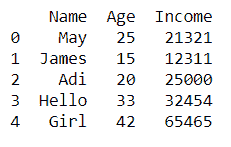
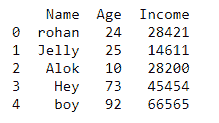

# 如何在 Python 中去除字符串中的数字——熊猫？

> 原文:[https://www . geesforgeks . org/如何从 python 字符串中删除数字-pandas/](https://www.geeksforgeeks.org/how-to-remove-numbers-from-string-in-python-pandas/)

在本文中，让我们看看如何在 Pandas 中删除字符串中的数字。目前，我们将只使用。csv 文件用于演示目的，但其他类型的文件的过程是相同的。 *read_csv()* 功能用于读取 csv 文件。

> **语法:**
> 
> 对于方法“replace()”:
> 
> str.replace(旧的、新的)

这里字符串。replace()将返回一个字符串，其中参数“old”将被参数“new”替换。现在让我们看看如何通过编码从熊猫数据帧的字符串中删除数字。

**例 1:**

## 蟒蛇 3

```
# code
import pandas as pd

# creating dataframe
df = pd.DataFrame.from_dict({'Name': ['May21', 'James',
                                      'Adi22', 'Hello',
                                      'Girl90'],

                             'Age': [25, 15, 20, 33, 42],

                             'Income': [21321, 12311, 25000,
                                        32454, 65465]})

# removing numbers from strings of speciafied 
# column, here 'Name'
df['Name'] = df['Name'].str.replace('\d+', '')

# display output with numbers removed from 
# required strings
print(df)
```

**输出:**



**例 2:**

## 蟒蛇 3

```
# code
import pandas as pd

# creating dataframe
df = pd.DataFrame.from_dict({'Name': ['rohan21', 'Jelly',
                                      'Alok22', 'Hey65',
                                      'boy92'],

                             'Age': [24, 25, 10, 73, 92],

                             'Income': [28421, 14611, 28200,
                                        45454, 66565]})

# removing numbers from strings of speciafied 
# column, here 'Name'
df['Name'] = df['Name'].str.replace('\d+', '')

# display output with numbers removed from 
# required strings
print(df)
```

**输出:**

