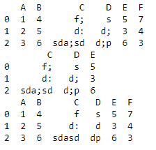
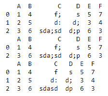
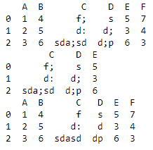

# 如何去除熊猫数据框中的随机符号？

> 原文:[https://www . geesforgeks . org/如何移除熊猫数据框中的随机符号/](https://www.geeksforgeeks.org/how-to-remove-random-symbols-in-a-dataframe-in-pandas/)

在本文中，我们将看到如何删除熊猫数据框中的随机符号。

**方法一:选列**

> **语法:**数据帧[列]。替换({符号:}，正则表达式=真)

首先，选择需要删除符号的列。并在 replace()方法中插入符号示例 replace(“h”:”)

## 蟒蛇 3

```
import pandas as pd

df = pd.DataFrame({'A': [1, 2, 3],
                   'B': [4, 5, 6],
                   'C': ['f;', 'd:', 'sda;sd'],
                   'D': ['s', 'd;', 'd;p'],
                   'E': [5, 3, 6],
                   'F': [7, 4, 3]})

print(df)

cols_to_check = ['C', 'D', 'E']
print(df[cols_to_check])

df[cols_to_check] = df[cols_to_check].replace({';': ''}, regex=True)
print(df)
```

**输出:**



**方法二:使用** [**数据框**](https://www.geeksforgeeks.org/python-extracting-rows-using-pandas-iloc/)

> **语法:**
> 
> dataframe.iloc[]。替换({字符}，正则表达式=真)

在这种方法中，您可以使用 dataframe.iloc[]来更改符号。

## 蟒蛇 3

```
import pandas as pd

df = pd.DataFrame({'A': [1, 2, 3],
                   'B': [4, 5, 6],
                   'C': ['f;', 'd:', 'sda;sd'],
                   'D': ['s', 'd;', 'd;p'],
                   'E': [5, 3, 6],
                   'F': [7, 4, 3]})

print(df)

cols_to_check = ['C', 'D', 'E']
print(df.iloc[[0, 2]])

df.iloc[[0, 2]] = df.iloc[[0, 2]].replace({';': ''}, regex=True)
print(df)
```

**输出:**



**方法三:使用**[**data frame . loc[]**](https://www.geeksforgeeks.org/python-pandas-dataframe-loc/)

> **语法:**
> 
> dataframe.loc[]。替换({字符}，正则表达式=真)

## 蟒蛇 3

```
import pandas as pd

df = pd.DataFrame({'A': [1, 2, 3],
                   'B': [4, 5, 6],
                   'C': ['f;', 'd:', 'sda;sd'],
                   'D': ['s', 'd;', 'd;p'],
                   'E': [5, 3, 6],
                   'F': [7, 4, 3]})

print(df)

cols_to_check = ['C', 'D', 'E']
print(df.loc[:, cols_to_check])

df.loc[:, cols_to_check] = df.loc[
  :, cols_to_check].replace({';': ''}, regex=True)
print(df)
```

**输出:**

