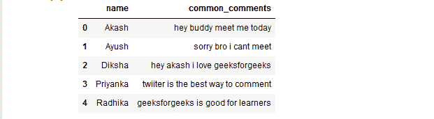
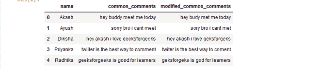

# 如何使用正则表达式从给定熊猫数据帧的单词中去除重复字符？

> 原文:[https://www . geeksforgeeks . org/如何从给定熊猫的单词中删除重复字符-data frame-use-regex/](https://www.geeksforgeeks.org/how-to-remove-repetitive-characters-from-words-of-the-given-pandas-dataframe-using-regex/)

**先决条件:**[Python 中的正则表达式](https://www.geeksforgeeks.org/regular-expression-python-examples-set-1/)

在本文中，我们将看到如何使用正则表达式从给定熊猫数据帧的给定列的单词中移除连续重复的字符。

这里，我们实际上是在寻找连续出现的重复出现的字符，因为我们已经创建了一个包含此正则表达式(\w)\1+的模式，这里\w 代表字符，1+代表出现多次的字符。

我们正在 re 库的**re sub()**函数中传递我们的模式。

> **语法:** re.sub(模式，repl，字符串，计数=0，标志=0)

函数中的“sub”代表 substring，在给定的字符串(第三个参数)中搜索某个正则表达式模式，当发现 SubString 模式被 repl(第二个参数)替换时，count 检查并维护这种情况发生的次数。

现在，让我们创建一个数据框架:

## 蟒蛇 3

```
# importing required libraries
import pandas as pd
import re

# creating Dataframe with column
# as name and common_comments
df = pd.DataFrame(
  {
    'name' : ['Akash', 'Ayush', 'Diksha',
              'Priyanka', 'Radhika'],

    'common_comments' : ['hey buddy meet me today ',
                         'sorry bro i cant meet',
                         'hey akash i love geeksforgeeks',
                         'twiiter is the best way to comment',
                         'geeksforgeeks is good for learners']
    },

    columns = ['name', 'common_comments']
)
# printing Dataframe
df
```

**输出:**



现在，从 Dataframe common_comments 列的单词中删除连续重复的字符。

## 蟒蛇 3

```
# define a function to remove
# continuously repeating character
# from the word
def conti_rep_char(str1):
    tchr = str1.group(0)
    if len(tchr) > 1:
      return tchr[0:1]

# define a function to check
# whether unique character
# is present or not
def check_unique_char(rep, sent_text):

    # regular expression for
    # repetition of characters
    convert = re.sub(r'(\w)\1+',
                     rep,
                     sent_text)

    # returning the converted word
    return convert

df['modified_common_comments'] = df['common_comments'].apply(
                                   lambda x : check_unique_char(conti_rep_char,
                                                              x))
# show Dataframe
df
```

**输出:**

