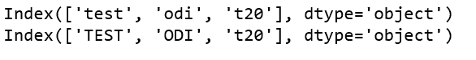
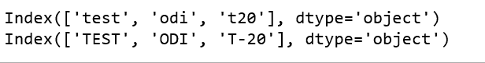

# 如何重命名熊猫数据框

中的列

> 原文:[https://www . geesforgeks . org/如何重命名-熊猫中的列-dataframe/](https://www.geeksforgeeks.org/how-to-rename-columns-in-pandas-dataframe/)

给定一个熊猫数据框架，让我们看看如何重命名列名。

**关于熊猫数据框:**
熊猫数据框是用来存储数据的矩形网格。当数据存储在数据框中时，很容易可视化和处理数据。

*   它由行和列组成。
*   每行是某个实例的度量，而列是包含某个特定属性/变量的数据的向量。
*   每个数据框列在任何特定列中都有同类数据，但数据框行在任何特定行中都可以包含同类或异类数据。
*   与二维数组不同，熊猫的数据框轴是有标签的。

**方法#1:** 使用`rename()`功能。

重命名熊猫数据框中的列的一种方法是使用`rename()`函数。当我们需要重命名一些选定的列时，这个方法非常有用，因为我们只需要为要重命名的列指定信息。

**重命名单个列。**

```py
# Import pandas package
import pandas as pd

# Define a dictionary containing ICC rankings
rankings = {'test': ['India', 'South Africa', 'England',
                            'New Zealand', 'Australia'],
              'odi': ['England', 'India', 'New Zealand',
                            'South Africa', 'Pakistan'],
               't20': ['Pakistan', 'India', 'Australia',
                              'England', 'New Zealand']}

# Convert the dictionary into DataFrame
rankings_pd = pd.DataFrame(rankings)

# Before renaming the columns
print(rankings_pd)

rankings_pd.rename(columns = {'test':'TEST'}, inplace = True)

# After renaming the columns
print("\nAfter modifying first column:\n", rankings_pd.columns)
```

**输出:**


**重命名多列。**

```py
# Import pandas package
import pandas as pd

# Define a dictionary containing ICC rankings
rankings = {'test': ['India', 'South Africa', 'England',
                            'New Zealand', 'Australia'],
              'odi': ['England', 'India', 'New Zealand',
                            'South Africa', 'Pakistan'],
               't20': ['Pakistan', 'India', 'Australia',
                              'England', 'New Zealand']}

# Convert the dictionary into DataFrame
rankings_pd = pd.DataFrame(rankings)

# Before renaming the columns
print(rankings_pd.columns)

rankings_pd.rename(columns = {'test':'TEST', 'odi':'ODI',
                              't20':'T20'}, inplace = True)

# After renaming the columns
print(rankings_pd.columns)
```

**输出:**


**方法#2:** 通过分配新列名列表

也可以通过将包含新名称的列表直接分配给我们想要重命名列的 dataframe 对象的`columns`属性来重命名列。这种方法的缺点是，我们需要为所有的列提供新的名称，即使我们只想重命名一些列。

```py
# Import pandas package
import pandas as pd

# Define a dictionary containing ICC rankings
rankings = {'test': ['India', 'South Africa', 'England',
                            'New Zealand', 'Australia'],
              'odi': ['England', 'India', 'New Zealand',
                            'South Africa', 'Pakistan'],
               't20': ['Pakistan', 'India', 'Australia',
                              'England', 'New Zealand']}

# Convert the dictionary into DataFrame
rankings_pd = pd.DataFrame(rankings)

# Before renaming the columns
print(rankings_pd.columns)

rankings_pd.columns = ['TEST', 'ODI', 'T-20']

# After renaming the columns
print(rankings_pd.columns)
```

**输出:**
