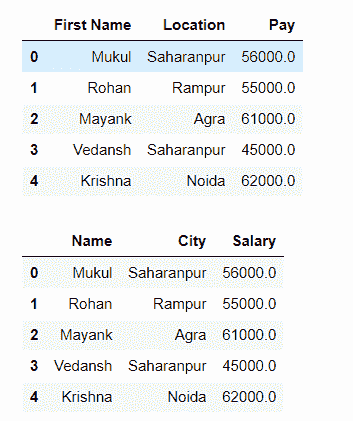
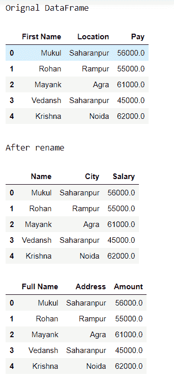

# 如何重命名熊猫数据框中的多个列标题？

> 原文:[https://www . geesforgeks . org/如何重命名-多列标题-in-a-pandas-dataframe/](https://www.geeksforgeeks.org/how-to-rename-multiple-column-headers-in-a-pandas-dataframe/)

在本文中，我们将使用 [**rename()**](https://www.geeksforgeeks.org/python-pandas-dataframe-rename/) 方法重命名多个列标题。用于重命名单个列以及一次重命名多个列的重命名方法。并传递包含新值和 inplace = true 的列作为参数。我们传递 inplace = true，因为我们只是修改工作数据帧，如果我们传递 inplace = false，那么它会返回一个新的数据帧。

**进场:**

*   进口熊猫。
*   创建具有多列的数据框。
*   创建一个字典，并将键设置为旧名称，值设置为列标题的新名称。
*   按列分配字典。
*   调用 rename 方法并传递包含 dictionary 和 inplace=true 的列作为参数。

**下面是实现:**

**例 1:**

## 计算机编程语言

```
# import pandas
import pandas as pd

# create data frame
df = pd.DataFrame({'First Name': ["Mukul", "Rohan", "Mayank",
                                  "Vedansh", "Krishna"],

                   'Location': ["Saharanpur", "Rampur", "Agra", 
                                "Saharanpur", "Noida"],

                   'Pay': [56000.0, 55000.0, 61000.0, 45000.0, 62000.0]})

# print original data frame
display(df)

# create a dictionary
# key = old name
# value = new name
dict = {'First Name': 'Name',
        'Location': 'City',
        'Pay': 'Salary'}

# call rename () method
df.rename(columns=dict,
          inplace=True)

# print Data frame after rename columns
display(df)
```

**输出:**



**例 2:**

在本例中，我们将使用相同的方法多次重命名。

## 蟒蛇 3

```
# import pandas
import pandas as pd

# create data frame
df = pd.DataFrame({'First Name': ["Mukul", "Rohan", "Mayank",
                                  "Vedansh", "Krishna"],

                   'Location': ["Saharanpur", "Rampur", 
                                "Agra", "Saharanpur", "Noida"],

                   'Pay': [56000.0, 55000.0, 61000.0, 45000.0, 62000.0]})

print("Orignal DataFrame")

# print original data frame
display(df)

# create a dictionary
# key = old name
# value = new name
dict = {'First Name': 'Name',
        'Location': 'City',
        'Pay': 'Salary'}

print("\nAfter rename")
# call rename () method
df.rename(columns=dict,
          inplace=True)

# print Data frame after rename columns
display(df)

# create a dictionary
# key = old name
# value = new name
dict = {'Name': 'Full Name',
        'City': 'Address',
        'Salary': 'Amount'}

# call rename () method
df.rename(columns=dict,
          inplace=True)

display(df)
```

**输出:**

