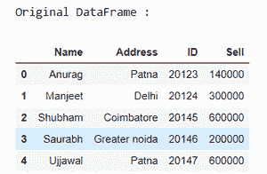
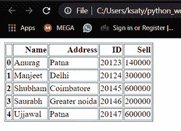
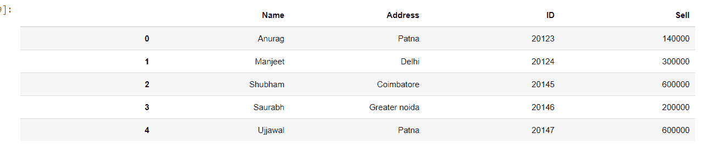

# 熊猫数据帧如何渲染成 HTML 表格？

> 原文:[https://www . geesforgeks . org/how-render-pandas-data frame-as-html-table/](https://www.geeksforgeeks.org/how-to-render-pandas-dataframe-as-html-table/)

Python 中的 Pandas 能够将 Pandas 数据帧转换为 HTML 网页中的表格。**熊猫。方法用于渲染熊猫数据帧。**

> ***语法:*****data frame . to _ html()*
> ***返回:*** *返回数据帧的 html 格式。**

*让我们用例子来理解:*

***首先**、**创建一个数据帧:***

## *蟒蛇 3*

```
*# importing pandas as pd
import pandas as pd
from IPython.display import HTML

# creating the dataframe
df = pd.DataFrame({"Name": ['Anurag', 'Manjeet', 'Shubham', 
                            'Saurabh', 'Ujjawal'],

                   "Address": ['Patna', 'Delhi', 'Coimbatore',
                               'Greater noida', 'Patna'],

                   "ID": [20123, 20124, 20145, 20146, 20147],

                   "Sell": [140000, 300000, 600000, 200000, 600000]})

print("Original DataFrame :")
display(df)*
```

***输出:***

**

***将数据框转换为 Html 表格:***

## *蟒蛇 3*

```
*result = df.to_html()
print(result)*
```

***输出:***

```
*<table border="1" class="dataframe">
  <thead>
    <tr style="text-align: right;">
      <th></th>
      <th>Name</th>
      <th>Address</th>
      <th>ID</th>
      <th>Sell</th>
    </tr>
  </thead>
  <tbody>
    <tr>
      <th>0</th>
      <td>Anurag</td>
      <td>Patna</td>
      <td>20123</td>
      <td>140000</td>
    </tr>
    <tr>
      <th>1</th>
      <td>Manjeet</td>
      <td>Delhi</td>
      <td>20124</td>
      <td>300000</td>
    </tr>
    <tr>
      <th>2</th>
      <td>Shubham</td>
      <td>Coimbatore</td>
      <td>20145</td>
      <td>600000</td>
    </tr>
    <tr>
      <th>3</th>
      <td>Saurabh</td>
      <td>Greater noida</td>
      <td>20146</td>
      <td>200000</td>
    </tr>
    <tr>
      <th>4</th>
      <td>Ujjawal</td>
      <td>Patna</td>
      <td>20147</td>
      <td>600000</td>
    </tr>
  </tbody>
</table>* 
```

***让我们编写将数据帧转换为 HTML 文件的脚本:***

## *蟒蛇 3*

```
*html = df.to_html()

# write html to file
text_file = open("index.html", "w")
text_file.write(html)
text_file.close()*
```

***注意:**将使用当前工作目录中的 HTML 数据创建 HTML 文件。*

***输出:***

**

***让我们以分条表格的形式显示 HTML 数据***

## *蟒蛇 3*

```
*HTML(df.to_html(classes='table table-striped'))*
```

***输出:***

**