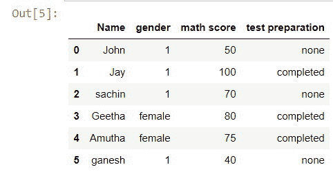
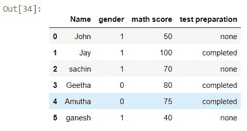
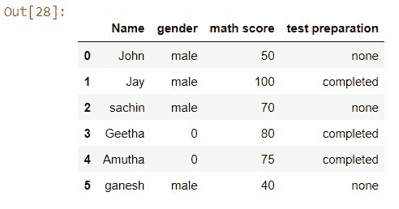

# 如何根据熊猫的条件替换列中的值？

> 原文:[https://www . geeksforgeeks . org/如何基于熊猫的条件替换列中的值/](https://www.geeksforgeeks.org/how-to-replace-values-in-column-based-on-condition-in-pandas/)

在本文中，我们将讨论用条件替换 pandas 中数据集列中的值的各种方法。这可以通过许多方法来完成，让我们详细看看所有这些方法。

## 方法 1:使用 [dataframe.loc[]](https://www.geeksforgeeks.org/python-extracting-rows-using-pandas-iloc/) 功能

使用这个方法，我们可以访问一组带有条件或布尔数组的行或列。如果我们可以访问它，我们也可以操纵这些值，是的！这是我们在 pandas 中使用 dataframe.loc[]函数的第一个方法，我们可以访问一个列，并用一个条件来更改它的值。

现在，我们将把性别栏中的所有“男性”改为 1。

> **语法:**df . loc[df[“column _ name”]= =“some _ value”，“column _ name”]=“value”
> 
> some_value =需要替换的值
> 
> 值=应该放置的值。

**注意:**也可以使用其他运算符构造条件来更改数值..

#### 示例:

## 蟒蛇 3

```py
# Importing the libraries
import pandas as pd
import numpy as np

# data
Student = {
    'Name': ['John', 'Jay', 'sachin', 'Geetha', 'Amutha', 'ganesh'],
    'gender': ['male', 'male', 'male', 'female', 'female', 'male'],
    'math score': [50, 100, 70, 80, 75, 40],
    'test preparation': ['none', 'completed', 'none', 'completed',
                         'completed', 'none'],
}

# creating a Dataframe object
df = pd.DataFrame(Student)

# Applying the condition
df.loc[df["gender"] == "male", "gender"] = 1
```

**输出:**



## 方法二:使用 [NumPy.where()](https://www.geeksforgeeks.org/numpy-where-in-python/) 函数

我们将看到的另一个方法是使用 NumPy 库。NumPy 是一个非常流行的库，用于 2d 和 3d 数组的计算。它给了我们一个非常有用的方法，在那里()用一个条件访问特定的行或列。我们还可以使用这个函数来更改列的特定值。

如果条件为真，这个 numpy.where()函数应该在条件后面加上一个值，如果条件为假，应该加上一个值。现在，我们将在性别栏中将所有的“女性”更改为 0，“男性”更改为 1。

> **语法:**df[“column _ name”]= NP . where(df[“column _ name”]= =“some _ value”，value_if_true，value_if_false)

#### 示例:

## 蟒蛇 3

```py
# Importing the libraries
import pandas as pd
import numpy as np

# data
student = {
    'Name': ['John', 'Jay', 'sachin', 'Geetha', 'Amutha', 'ganesh'],
    'gender': ['male', 'male', 'male', 'female', 'female', 'male'],
    'math score': [50, 100, 70, 80, 75, 40],
    'test preparation': ['none', 'completed', 'none', 'completed',
                         'completed', 'none'],
}

# creating a Dataframe object
df = pd.DataFrame(student)

# Applying the condition
df["gender"] = np.where(df["gender"] == "female", 0, 1)
```

**输出:**



## 方法三:使用熊猫[屏蔽](https://www.geeksforgeeks.org/python-pandas-dataframe-mask/#:~:text=mask()%20function%20return%20an,of%20the%20if%2Dthen%20idiom.)功能

Pandas 掩蔽功能用于用条件替换任何行或列的值。现在使用这个掩蔽条件，我们将把性别列中的所有“女性”都改为 0。

> **语法:** df['column_name']。掩码(df['column_name'] == 'some_value '，值，inplace=True)

#### 示例:

## 蟒蛇 3

```py
# Importing the libraries
import pandas as pd
import numpy as np

# data
student = {
    'Name': ['John', 'Jay', 'sachin', 'Geetha', 'Amutha', 'ganesh'],
    'gender': ['male', 'male', 'male', 'female', 'female', 'male'],
    'math score': [50, 100, 70, 80, 75, 40],
    'test preparation': ['none', 'completed', 'none', 'completed', 
                         'completed', 'none'],
}

# creating a Dataframe object
df = pd.DataFrame(student)

# Applying the condition
df['gender'].mask(df['gender'] == 'female', 0, inplace=True)

# Try this too
#df['math score'].mask(df['math score'] >=60 ,'good', inplace=True)
```

**输出:**

